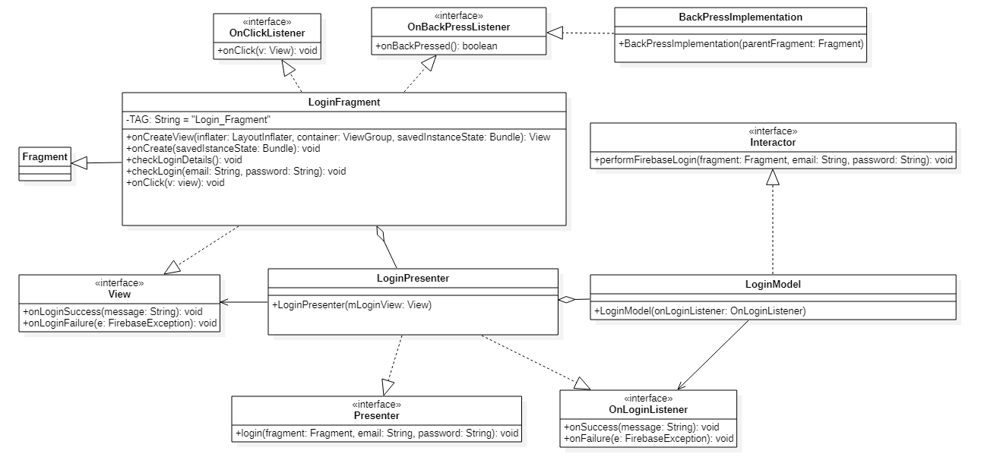
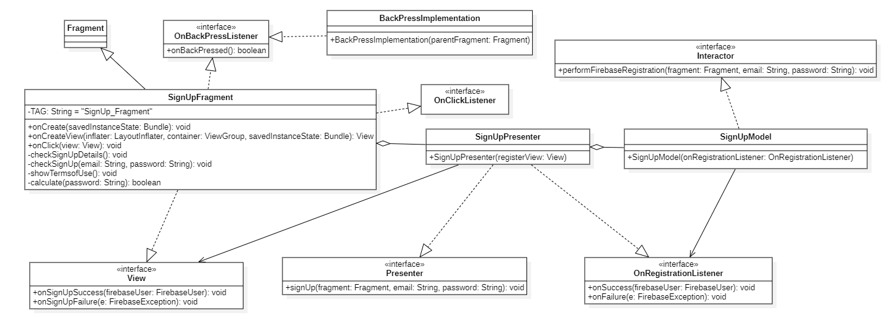
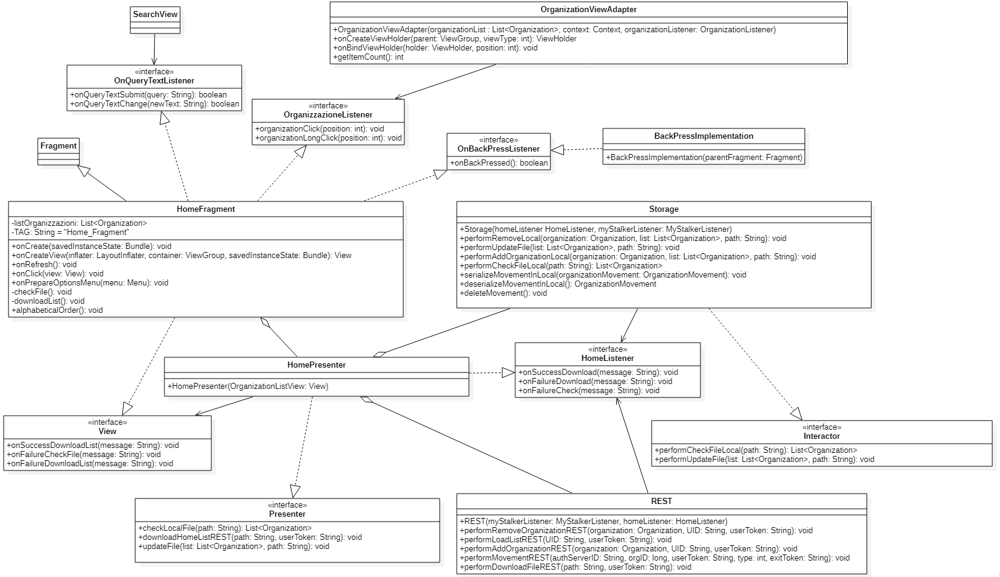
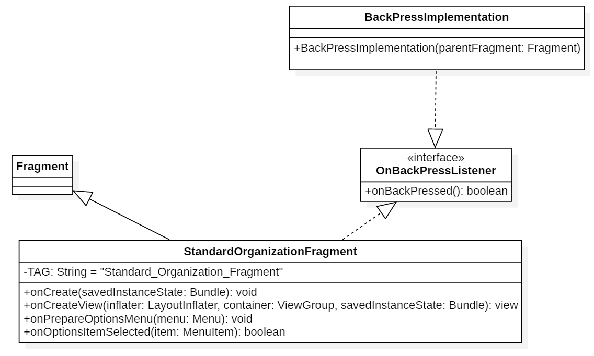
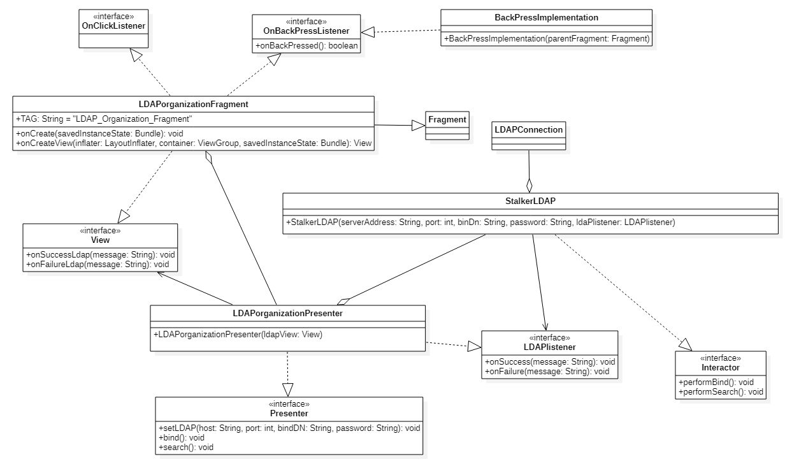

# Diagrammi delle classi
Vengono presentati qui di seguito i diagrammi UML delle classi relativi all'applicazione.  

## Authentication 

<figcaption> <em> Diagramma delle classi di Authentication </em> </figcaption>

___
## Login

<figcaption> <em> Diagramma delle classi del Login </em> </figcaption>

___
## SignUp

<figcaption> <em> Diagramma delle classi del SignUp </em> </figcaption>

___
## Action Tab

<figcaption> <em> Diagramma delle classi del Action Tab </em> </figcaption>

___
## Home Fragment 

<figcaption> <em> Diagramma delle classi di Home </em> </figcaption>

___
## My Stalker List 

<figcaption> <em> Diagramma delle classi di My Stalker List </em> </figcaption>

___
## Standard Organization

<figcaption> <em> Diagramma delle classi del Standard Organization</em> </figcaption>

___
## LDAP Organization

<figcaption> <em> Diagramma delle classi del LDAP Organization </em> </figcaption>