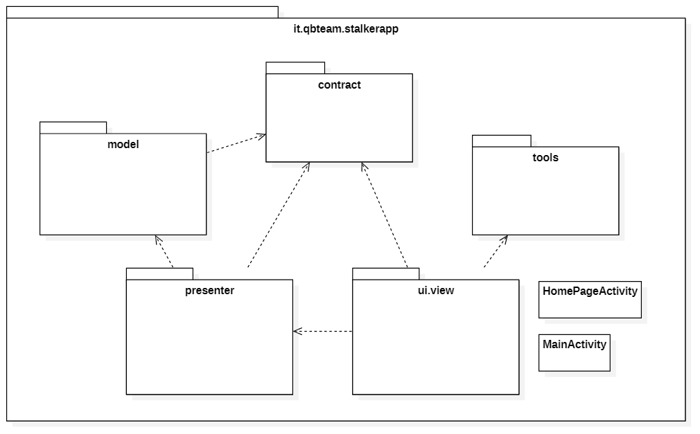
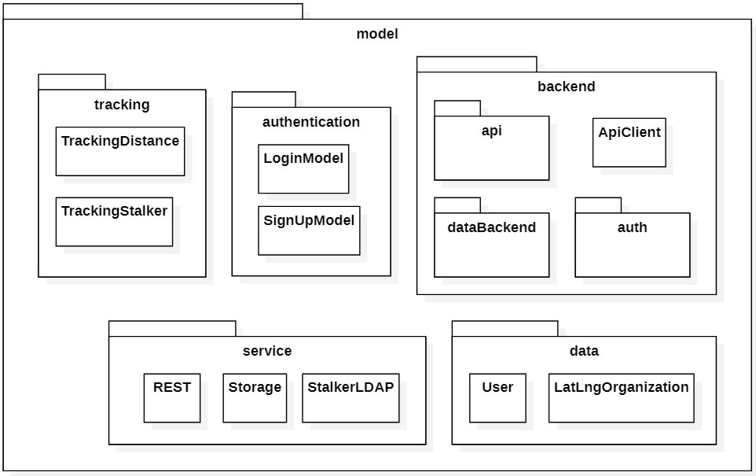
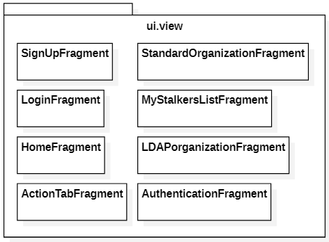
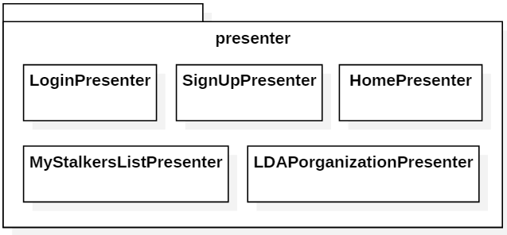
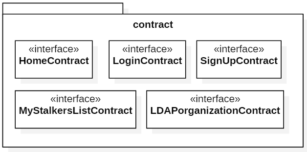
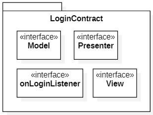
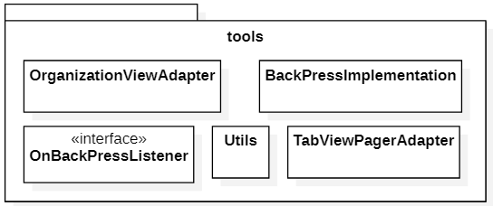

# Diagrammi dei package
Vengono presentati qui di seguito i diagrammi UML dei package relativi alla applicazione Android.

## Visione generale delle dipendenze tra package

<figcaption align="center"> <em> Diagramma dei package - Visione delle dipendenze </em> </figcaption>

## Model

<figcaption align="center"> <em> Diagramma del package - Package del Model </em> </figcaption>

## View

<figcaption align="center"> <em> Diagramma del package - Package del View </em> </figcaption>

## Presenter

<figcaption align="center"> <em> Diagramma del package - Package del Presenter </em> </figcaption>

## Contract

<figcaption align="center"> <em> Diagramma del package - Package del Contract </em> </figcaption>

## Esempio di composizione di un Contract

<figcaption align="center"> <em> Diagramma del package - Package del LoginContract </em> </figcaption>

## Tool

<figcaption align="center"> <em> Diagramma del package - Package del Tool </em> </figcaption>

