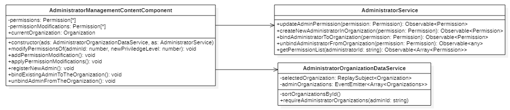
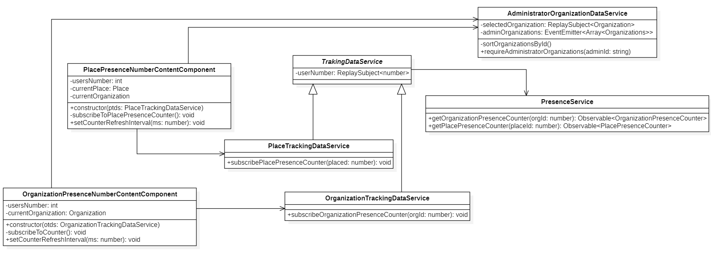
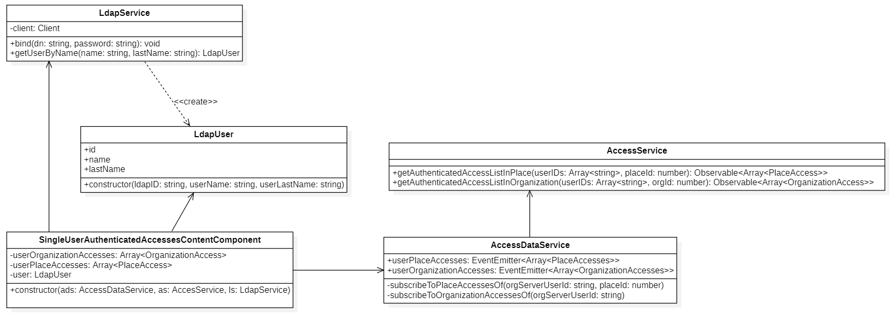
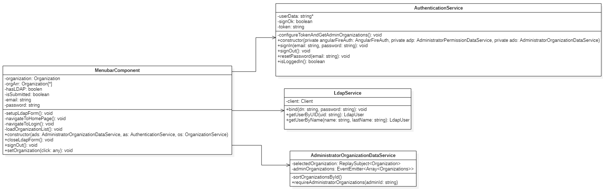
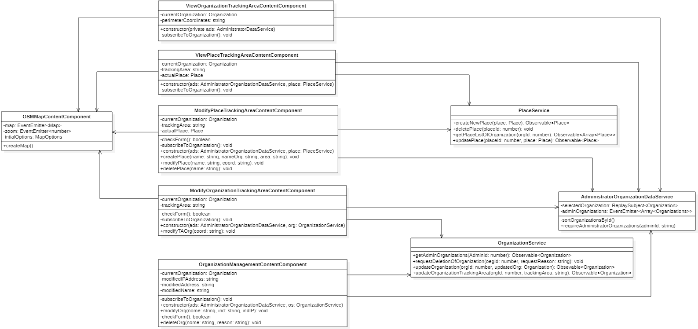

Vengono presentati qui di seguito i diagrammi UML delle classi relativi alla applicazione web:

-   Administrator management;

-   Anonymous tracking;

-   Recognized tracking;

-   Authentication;

-   Menubar;

-   Organization management.

!!! info
    Per redente ogni componente riutilizzabile, mantenibile e facile da testare, si è cercato di progettare componenti che abbiano al loro interno poche responsabilità e che siano il più coese possibili, tenendo pero sotto controllo il numero di dipendenze.

## Administrator management

<figcaption align=center> <em> Diagramma delle classi - Administrator </em> </figcaption>

Nel precedente diagramma viene illustrato come sono state progettate le funzionalità per la gestione degli amministratori.

## Anonymous tracking

<figcaption align=center> <em> Diagramma delle classi - Anonymous tracking </em> </figcaption>

Nel precedente diagramma viene illustrato come sono state progettate le funzionalità per il monitoraggio dei utenti anonimi sia nelle organizzazioni sia nei luoghiG dell'organizzazione.

## Recognized tracking

<figcaption align=center> <em> Diagramma delle classi - Recognized tracking </em> </figcaption>

Il diagramma mostra le classi progettate per permettere di ricercare gli accessi di uno specifico utente autenticato all'interno dell'organizzazione o di un posto.

## Authentication

<figcaption align=center> <em> Diagramma delle classi - Authentication </em> </figcaption>

Nel precedente diagramma viene illustrato come è stata progettata la funzionalità di autenticazione nella applicazione web.

## Menubar

<figcaption align=center> <em> Diagramma delle classi - Menubar </em> </figcaption>

Nel precedente diagramma viene mostrato come è stato progettato il component `ManubarComponent`. Menubar è un component che permette di gestire gli eventi generati della componente grafica omonima *menubar*.

## Organization management

<figcaption align=center> <em> Diagramma delle classi - Organization management </em> </figcaption>

Nel precedente diagramma viene illustrato come è stata progettata la funzionalità di gestione delle organizzazioni.

