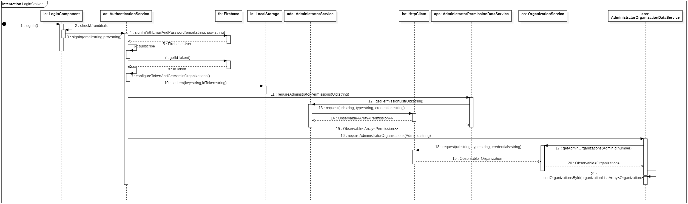
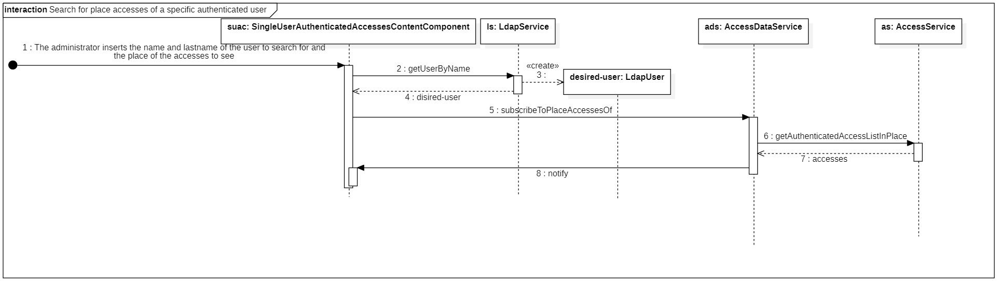
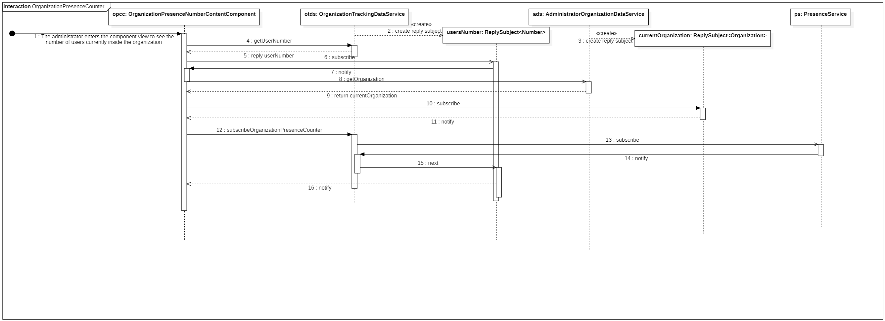
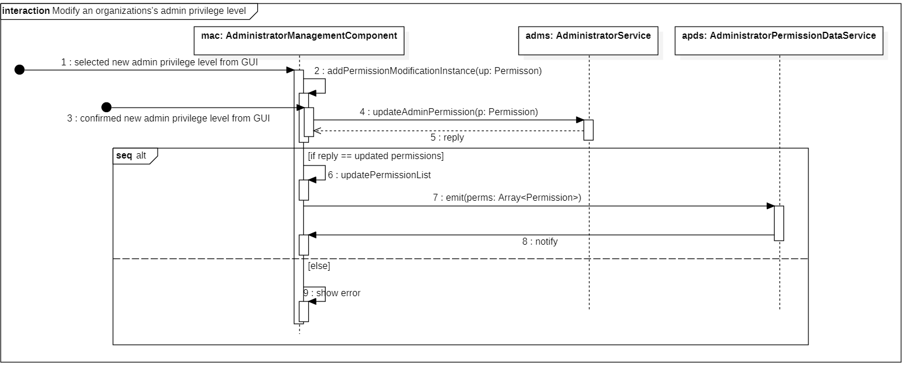

## Introduzione

Vengono qua presentati alcuni diagrammi di sequenza per fornire chiarezza sull'interazione tra gli oggetti per alcune funzionalità che richiedono l'interazione di più componenti.

Vengono di seguito rappresentati dei diagrammi di sequenza per:

-   il login dell'amministratore nella web-app;
-   visualizzazione degli accessi in un luogo di un utente autenticato;
-   la visualizzazione del contatore di presenze, in tempo reale, presso l'attuale organizzazione;
-   modifica dei privilegi di un admin.

## Diagramma del login dell'amministratore

<figcaption> <em> Diagramma di sequenza del login e del caricamento dei suoi permessi e delle organizzazioni </em> </figcaption>

Nel diagramma soprastante viene rappresentata la sequenza di interazione tra istanze di servizi e il `LoginComponent` per verificare il login dell'amministratore. Viene anche rappresentato come vengano caricate le organizzazioni e i relativi permessi a cui l'amministratore ha accesso.

## Diagramma degli accessi di un utente presso un luogo

<figcaption> <em> Diagramma di sequenza degli accessi di un utente autenticato presso uno specifico luogo </em> </figcaption>

Nel diagramma viene rappresentato come reperire gli accessi effettuati da un utente autenticato presso un luogo specifico dell'organizzazione.

## Diagramma del contatore presenze di un'organizzazione

<figcaption> <em> Diagramma di sequenza per la visualizzazione del contatore presenze in una data organizzazione </em> </figcaption>

Nel diagramma viene rappresentata la visualizzazione del contatore presenze in una data organizzazione.

## Diagramma della modifica dei privilegi di un amministratore

<figcaption> <em> Diagramma di sequenza per la modifica dei privilegi di un amministratore </em> </figcaption>

Nel diagramma viene rappresentato come avviene la modifica dei privilegi di un amministratore.
