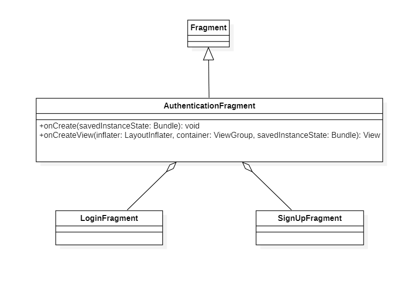
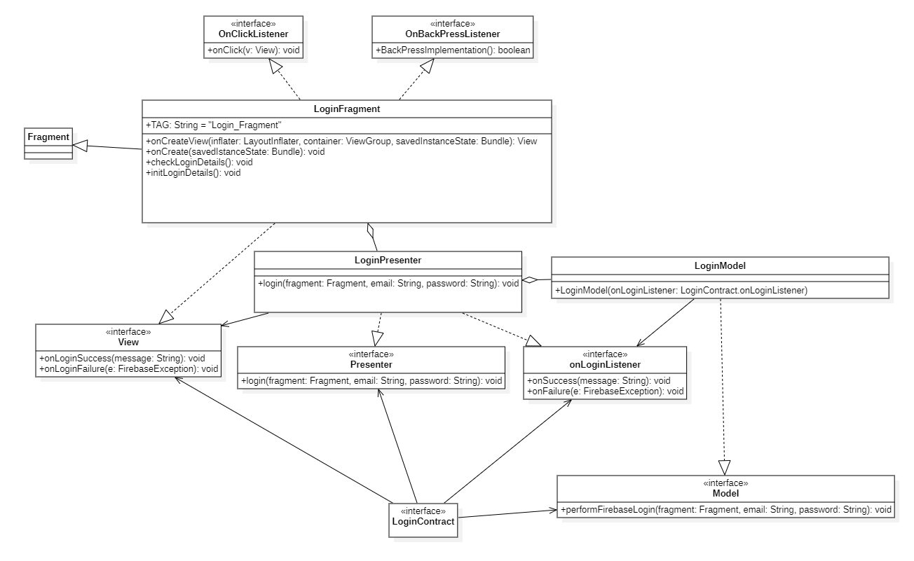
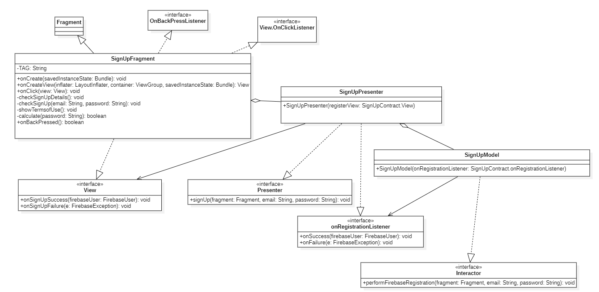
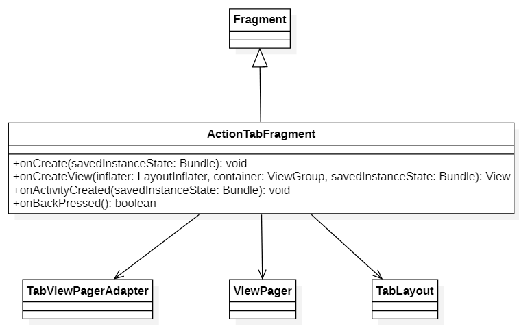
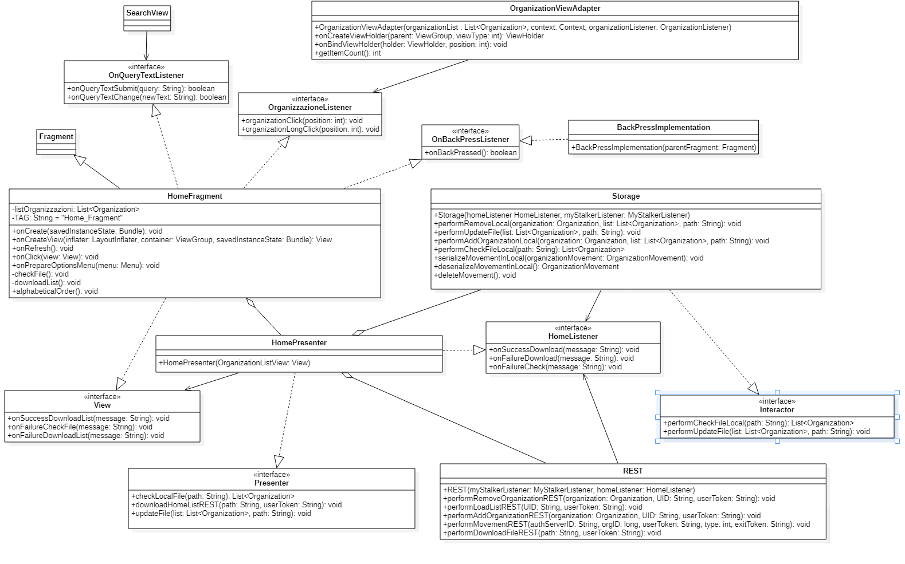
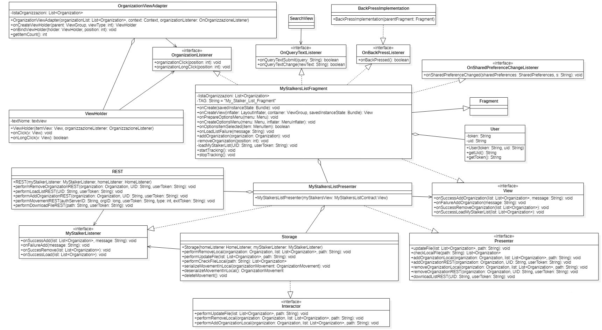
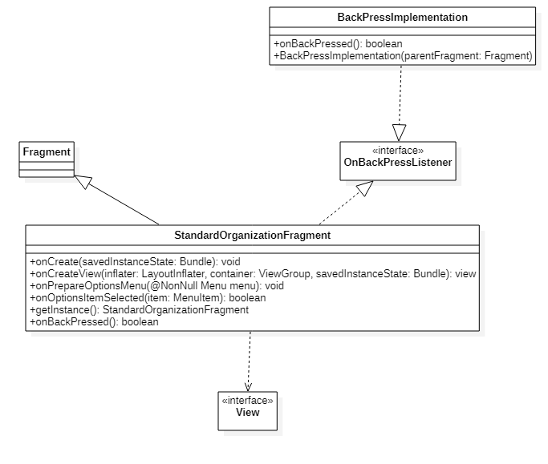
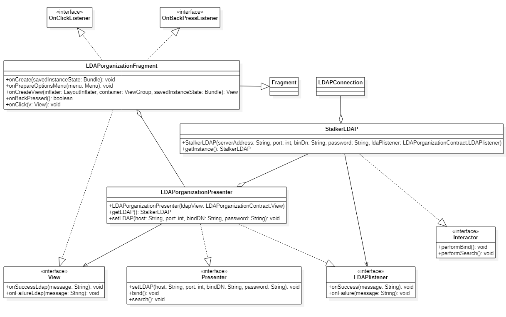

# Diagrammi delle classi
Vengono presentati qui di seguito i diagrammi UML delle classi relativi all'applicazione.  

## Authentication 

<figcaption align="center"> <em> Diagramma delle classi di Authentication </em> </figcaption>

La classe AuthenticationFragment fa parte della vista e mostra all'utente la pagina dove può scegliere se effettuare la registrazione oppure il login.

___
## Login

<figcaption align="center"> <em> Diagramma delle classi del Login </em> </figcaption>

La classe LoginFragment, così come LoginPresenter e LoginModel ad essa collegati, contengono tutti i metodi che permettono all'utente di autenticarsi.
L'utente per fare il Login deve inserire l'email e la password e successivamente cliccare sul pulsante "Login" per invocare i metodi di Firebase che verificano le credenziali e creano il collegamento.
In caso di successo l'utente sarà spostato nel HomePageActivity.class e visualizza un messaggio che indica il buon esito dell'autenticazione.
In caso di fallimento l'utente visualizza un messaggio di errore.

___
##  SignUp

<figcaption align="center"> <em> Diagramma delle classi del SignUp </em> </figcaption>

La classe SignUpFragment, così come SignUpPresenter e SignUpModel ad essa collegati, contengono tutti i metodi che permettono all'utente di registrarsi.
L'utente per registrarsi deve; inserire l'email, inserire la password, confermare la password, accettare le condizioni d'uso e infine cliccare il pulsante Registrati.
Una volta cliccato il pulsante vengono invocati i metodi della libreria Firebase che ti registrano nel sistema ed eseguono automaticamente il Login.

___
## Action Tab

<figcaption align="center"> <em> Diagramma delle classi del Action Tab </em> </figcaption>

La classe ActionTabFragment gestisce la view page principale dell'applicazione la quale contiene le due view pricipali ovvero: HomeFragment e MyStalkerFragment.
Si occupa inoltre di gestire il menu bar principale che permette all'utente di navigare tra le pagine dell'applicazione.

La classe Action Tab offre i seguenti metodi:

- 'onCreate(@Nullable Bundle savedInstanceState)':  si occupa della creazione del fragment in quanto componente.
- 'onCreateView(LayoutInflater inflater, ViewGroup container,Bundle savedInstanceState)': si occupa di creare il layout del fragment.
- 'public void onActivityCreated(Bundle savedInstanceState)': segnala che la creazione dell’Activity è stata completata.
- 'onBackPressed()': si occupa di recuperare il fragment appartenente all'Action Tab attualmete visibile per poi propagare la sua callBack agli altri fragment.

___
## Home 

<figcaption align="center"> <em> Diagramma delle classi di Home</em> </figcaption>

Se l'utente risulta già autenticato e avvia l'applicazione oppure ha appena effettuato l'autenticazione allora gli viene mostrato automaticamente la classe view del HomeFragment. In questa classe compariranno tutte le organizzazioni presenti nel server. L'utente ha la possibilità di aggiornare la lista oppure di scaricarla se dovessero incombere dei problemi.

La classe Home offre i seguenti metodi:

- 'onCreate(@Nullable Bundle savedInstanceState)':  si occupa della creazione del fragment in quanto componente.
- 'onCreateView(LayoutInflater inflater, ViewGroup container,Bundle savedInstanceState)': si occupa di creare il layout del fragment.
- 'checkFile()': si occupa di andare a caricare la lista delle organizzazioni andandole a caricare direttamente da FileSystem.
- 'onFailureCheckFile(String message)': si occupa di gestire un eventuale errore durante la lettura da FileSystem, fa visualizzare all'utente l'errore durante il caricamento.
- 'downloadList()': si occupa di scaricare la lista dal Server e in caso affermativo la salva su FileSystem.
- 'onSuccessDownloadList(String message)': si occupa di notificare all'utente il corretto scarimento della lista dal Server.
- 'onFailureDownloadList(String message)': si occupa di notificare all'utente il fallimento dello scaricamento della lista dal Server.
-'organizationClick(int position)': si occupa di inializzare e far visualizzare all'utente il fragment della organizzazione in seguito ad un rapido click.
- 'organizationLongClick(int position)':notifica all'utente un dialog contenente informazioni aggiuntive dell'organizzazione selezionata dall'utente in seguito ad un click prolungato.
- 'alphabeticalOrder()': si occupa di ordinare la lista presente nella view Home Fragment in ordine alfabetico.
- 'onPrepareOptionsMenu(@NonNull Menu menu)': si occupa di gestire la creazione del menu a tendina presente nella view HomeFragment.
- 'onQueryTextChange(String newText)': si occupa di visualizzare a schermo la lista delle organizzazioni in seguito agli input inseriti dall'utente nel menu di ricerca.
- 'onBackPressed()': si occupa di fa ritornare l'utente alla precendente Activity/Fragment.

___
## My Stalkers List 

<figcaption align="center"> <em> Diagramma delle classi di My Stalkers List </em> </figcaption>

In questa classe compariranno tutte le organizzazioni abilitate nel tracciamento dell'utente in precedenza aggiunte sia localmente che sul server. È possibile la rimozione dell'organizzazione dalla lista MyStalkers non consentendone più il tracciamento. Queste funzioni possono essere eseguite direttamente nell'applicazione. 

La classe My Stalker List offre i seguenti metodi:

- 'onServiceConnected(ComponentName name, IBinder service)': metodo della classe interna ServiceConnection che permette di stabile una connesione con il Bind Service.
- 'onServiceDisconnected(ComponentName name)': metodo della classe interna ServiceConnection che permette di disconnettere la connesione con il Bind Service.
- 'onCreate(@Nullable Bundle savedInstanceState)': si occupa della creazione del fragment in quanto componente.
- onCreateView(LayoutInflater inflater, @Nullable ViewGroup container, @Nullable Bundle savedInstanceState)': si occupa di creare il layout del fragment.
- 'organizationClick(int position)': si occupa di inializzare e far visualizzare all'utente il fragment della organizzazione in seguito ad un rapido click.
- 'organizationLongClick(int position)': notifica all'utente un dialog contenente la possibilità di eliminare l'organizzazione selezionata dall'utente in seguito ad un click prolungato.
- 'onPrepareOptionsMenu(@NonNull Menu menu)': si occupa di gestire la creazione del menu a tendina presente nella view HomeFragment.
- 'onQueryTextChange(String newText)': si occupa di visualizzare a schermo la lista delle organizzazioni in seguito agli input inseriti dall'utente nel menu di ricerca.
- 'addOrganization(Organization organization)': si occupa di aggiungere l'organizzazione ricevuta in input sia sul FileSystem sia sul Server
- 'onSuccessAddOrganization(ArrayList<Organization> list, String message)': notifica all'utente il successo dell'operazione di aggiunta dell'organizzazione.
- 'onFailureAddOrganization(String message)': notifica all'utente l'insuccesso dell'operazione di aggiunta dell'organizzazione.
- 'removeOrganization(int position)': si occupa di rimuovere un'organizzaione sia dal FileSystem sia dal Server.
- 'onSuccessRemoveOrganization(ArrayList<Organization> list)': notifica all'utente il successo dell'operazione di rimozione di una organizzazione.
- 'loadMyStalkerList(String UID, String userToken)': si occupa di scaricare dal Serve la lista delle organizzazioni aggiunte dall'utente in precedenza. 
- 'checkForUpdate()': si occupa di tenere traccia delle ventuali modifiche apportate dall'utente della sua lista delle organizzazioni presenti nella view MyStalkerListFragment.
- 'onSuccessLoadMyStalkerList(List<Organization> list)': notifica all'utente il successo dello scaricamneto della lua lista delle organizzazioni iserite in MyStalkerList e le mostra a schermo.
- 'onPause()': metodo che viene invocato quando l'Activity principale viene è in pausa e ci si aspetta un suo ritorno in breve tempo.
- 'onStop()': metodo che viene invocato quando l'Activity principale non è più visibile all'utente, ovvero quando quest'ultimo ha deciso di chiudere l'applicazione.
- 'onSharedPreferenceChanged(SharedPreferences sharedPreferences, String s)': metodo che viene chiamato quando una risorsa condivisa (tra due view) viene modificata, aggiunta o rimossa.
- 'startTracking()': metodo per gestire l'inizio del tracciamento facendo riferimento alle organizzazioni scelte ed inserite dall'utente nella view MyStalkerList.
- 'stopTracking() : metodo per gestire la terminazione del tracciamento facendo riferimento alle organizzazioni scelte ed inserite dall'utente nella view MyStalkerList. 
- 'onBackPressed()': si occupa di fa ritornare l'utente alla precendente Activity/Fragment.
___
## Standard Organization

<figcaption align="center"> <em> Diagramma delle classi dello Standard Organization</em> </figcaption>

La classe StandardOrganizationFragment rappresenta la pagina dedicata alle organizzazioni pubbliche, cioè quelle che non richiedono credenziali LDAP di autenticazione. La vista contiene le informazioni riferite all'organizzazione.
Qualora l'organizzazione dovesse essere aggiunta nella lista MyStalkers allora comparirà al suo interno una sezione che mostra se l'utente è dentro o fuori l'organizzazione.

___
## LDAP Organization

<figcaption align="center"> <em> Diagramma delle classi del LDAP Organization </em> </figcaption>

La classe LDAPorganizationFragment rappresenta la pagina dedicata alle organizzazioni che richiedono credenziali LDAP. La vista contiene le informazioni riferite all'organizzazione e un pulsante che fa aprire un pop-up dove è possibile inserire i dati di autenticazione.
Un utente, per poter essere tracciato dall'organizzazione privata, ha bisogno prima di autenticarsi ed in seguito a ciò se l'esito fosse positivo allora l'organizzazione viene automaticamente inserita nella lista delle organizzazioni MyStalker (lista preferite). In seguito apparirà uno switch dove è possibile cambiare la tipologia di tracciamento. 
Le credenziali che ha digitato l'utente vengono spedite al modello che interrogherà il server dedicato al LDAP dell'organizzazione. L'esito di questa procedura verrà rimandata
alla vista e apparirà una notifica visibile sulla schermata per avvisare l'utente.

