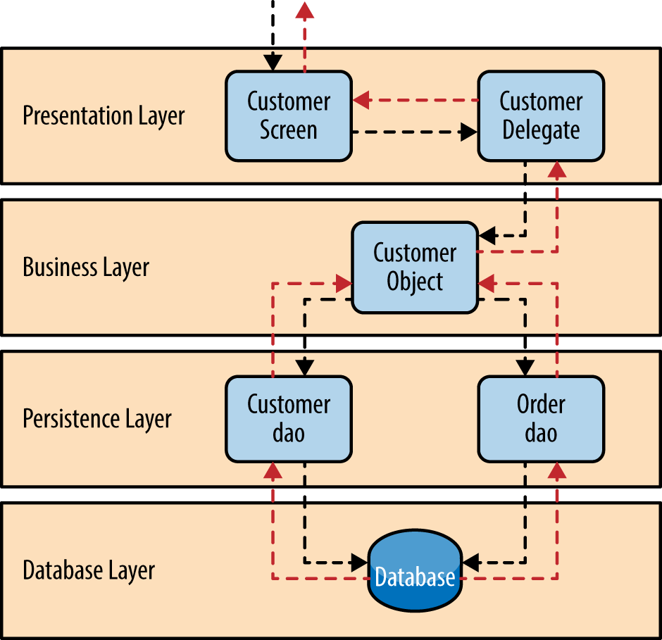

# 4.4 Architettura 
Per sviluppare il Backend abbiamo utilizzato la **layered architecture**, in cui le varie funzionalità del software sono logicamente separate, ovvero suddivise su più strati o livelli software differenti in comunicazione tra loro.  
Ogni strato è caratterizzato  dallo svolgimento di un singolo e specifico ruolo, separato dagli altri strati, ma che ha dipendenze solo verso gli strati più bassi e offre servizi solo agli strati superiori rispetto a lui.
   
Il presentation layer, nella nostra architettura, è composto dalle API che ricevono richieste dai clients e comunicano con il business layer.  
Questa architettura ci garantisce facilità di testing e mantenimento dato il disaccomppiamentro tra i diversi layer.  
Per gestire tutte le richieste provenienti dal presentation layer Spring utilizza il pattern Front Controller, che implementa una componente chiamata `DispatcherServlet`. Essa si occupa di gestire tutte le richieste provenienti dalla rete e inviate (*to dispatch*) alle classi Controller in grado di soddisfarle, ovvero quelle che sono mappate a un certo URI ricercato tramite un mapping effettuato da un’altra componente definita *Handler Mapping*.
Questo Handler sfrutta la annotation `@RequestMapping` per creare un’associazione tra URL e metodo Java da invocare che è stato scritto in una classe annotata `@Controller`.  
Non richiedendo particolari configurazioni, si è deciso di utilizzare il modulo Spring Boot, che evita allo sviluppatore di occuparsi di tutta la configurazione fin qui accennata. Di ciò che è stato trattato fino ad ora si trova progettato e implementato all’interno del backend solamente i controller ed il modello.  
   
Sono stati progettati e implementati anche un *service layer* che si occupa di eseguire la business logic sui dati che sono rappresentati dalle classi del modello, e un *persistence layer*, a cui il service layer fa riferimento per effettuare operazioni *CRUD* (Create Read Update Delete) sui dati.  
Le classi del service layer hanno una dipendenza con lo strato di persistenza, implementato con repository che si interfacciano con database SQL, classi che si interfacciano con database NoSQL (come Redis) e servizi esterni (come Firebase), mentre i controller hanno una dipendenza verso i service.  
La presenza del service layer permette di ridurre l’accoppiamento che ci sarebbe fra i Controller, che con l’architettura in essere si devono occupare solamente di rispondere alle richieste dei client e lo strato di persistenza, che potrebbe cambiare natura o implementazione, ma così facendo non intacca l’elaborazione delle richieste.
Questo permette, inoltre, di guadagnare in manutenibilità e testabilità.
