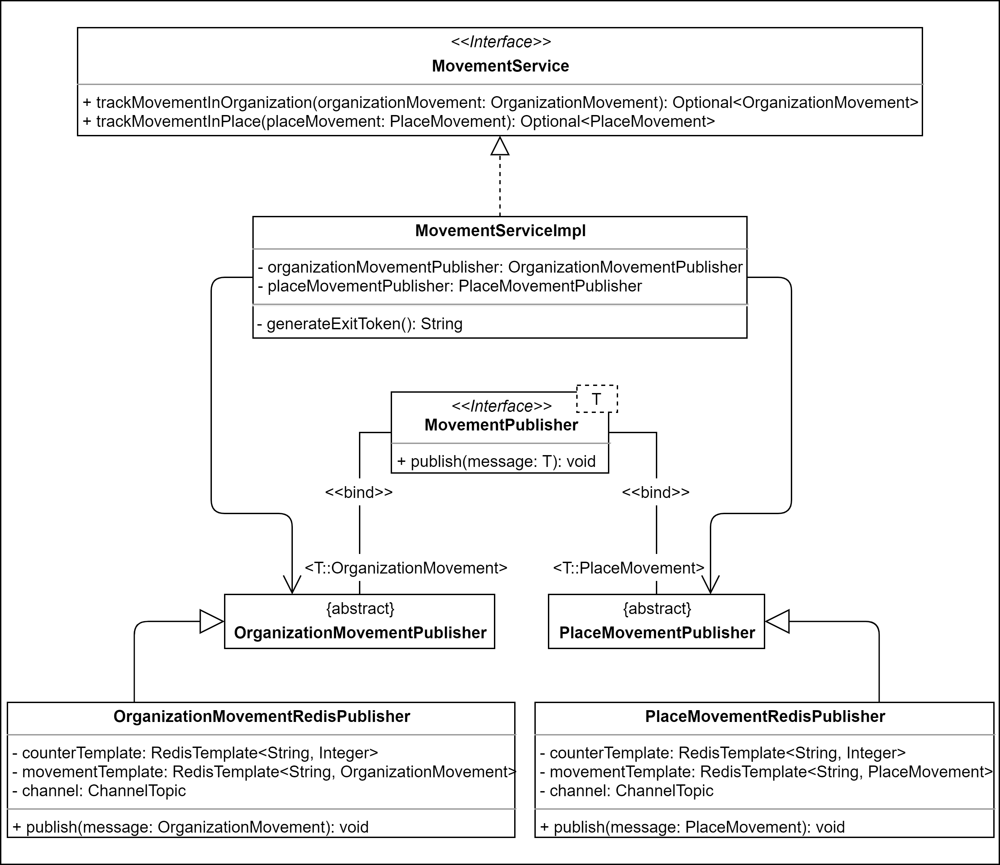
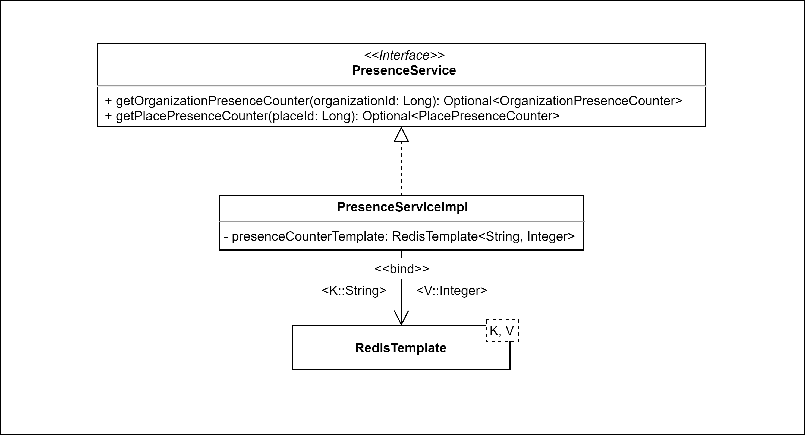
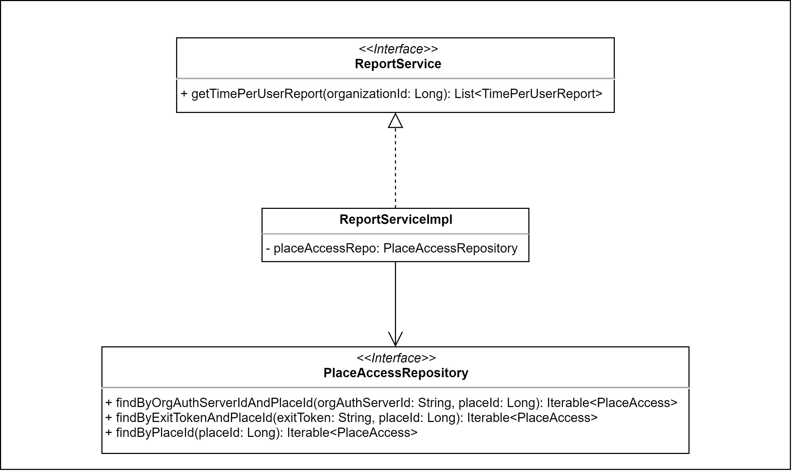
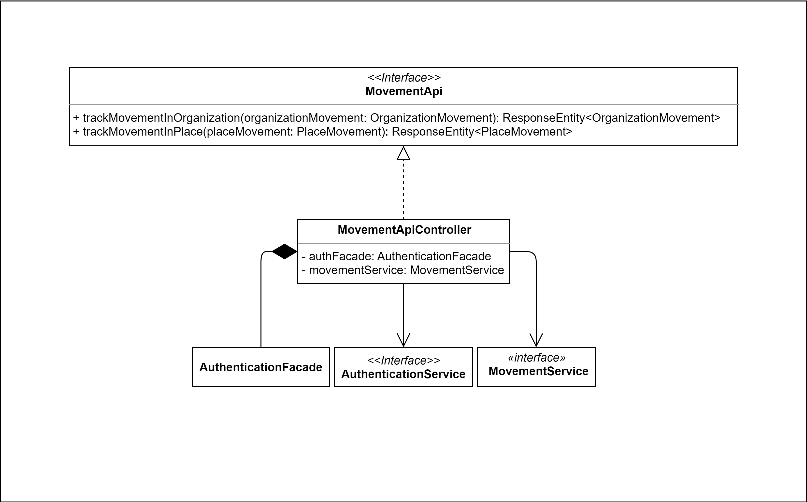

# 4.6 Diagrammi delle classi
Vengono presentati qui di seguito i diagrammi UML delle classi relativi al backend.  

!!! info
    Per rendere ogni componente riutilizzabile, mantenibile e facile da testare, si è cercato di progettare componenti che abbiano al loro interno poche responsabilità e che siano il più coese possibili, tenendo però sotto controllo il numero di dipendenze.

## 4.6.1 Diagrammi dei Service

### 4.6.1.1 AccessService

L'`AccessService` si occupa di soddisfare le richieste provenienti dai controller per ottenere informazioni sugli accessi di un utente presso un luogo o un'organizzazione.

Sono disponibili i seguenti metodi:

- `getAnonymousAccessListInOrganization`: ritorna una lista di **OrganizationAccess** che rappresenta tutti gli accessi di un utente anonimo (tracciati nel sistema tramite degli **exitToken** che permettono di reperire gli accessi a posteriori dall'utente che li ha effettuati) all'interno di una specifica organizzazione, identificata dal suo **organizationId**. Viene utilizzato il metodo `findByExitTokenAndOrganizationId` dell'interfaccia **OrganizationAccessRepository** che opera la query sul database per ottenere gli accessi dell'utente. Questa chiamata viene ripetuta per tutti gli *exitToken* passati al metodo e viene composta così la lista finale;
- `getAnonymousAccessListInPlace`: ritorna una lista di **PlaceAccess** che rappresenta tutti gli accessi di un utente anonimo (tracciati nel sistema tramite degli **exitToken** che permettono di reperire gli accessi a posteriori dall'utente che li ha effettuati) all'interno di uno specifico luogo di un'organizzazione, identificato dal suo **placeId**. Viene utilizzato il metodo `findByExitTokenAndPlaceId` dell'interfaccia **PlaceAccessRepository** che opera la query sul database per ottenere gli accessi dell'utente. Questa chiamata viene ripetuta per tutti gli *exitToken* passati al metodo e viene composta così la lista finale;
- `getAuthenticatedAccessListInOrganization`: ritorna una lista di *OrganizationAccess* che rappresenta tutti gli accessi di un insieme di utenti riconosciuti, tramite il loro codice identificativo nel server di autenticazione dell'organizzazione (**orgAuthServerId**), all'interno di un'organizzazione che permette il tracciamento autenticato, identificata dal suo **organizationId**. Viene utilizzato il metodo `findByOrgAuthServerIdAndOrganizationId` dell'interfaccia **OrganizationAccessRepository** per ottenere tutti gli accessi di un utente dato il suo identificativo e l'id dell'organizzazione. Viene chiamato per ogni *orgAuthServerId* passato ottenendo la lista completa di tutti gli accessi di tutti gli utenti richiesti;
- `getAuthenticatedAccessListInPlace`: ritorna una lista di *PlaceAccess* che rappresenta tutti gli accessi di un insieme di utenti riconosciuti, tramite il loro codice identificativo nel server di autenticazione dell'organizzazione (**orgAuthServerId**), all'interno di un luogo di un'organizzazione che permette il tracciamento autenticato, identificato dal suo **placeId**. Viene utilizzato il metodo `findByOrgAuthServerIdAndPlaceId` dell'interfaccia **OrganizationAccessRepository** per ottenere tutti gli accessi di un utente dato il suo identificativo e l'id del luogo. Viene chiamato per ogni *orgAuthServerId* passato ottenendo la lista completa di tutti gli accessi di tutti gli utenti richiesti.

### 4.6.1.2 AdministratorService

L'`AdministratorService` si occupa di soddisfare le richieste provenienti dai controller per ottenere informazioni sugli amministratori di un'organizzazione e per la gestione dei loro permessi.

Sono disponibili i seguenti metodi:

- `bindAdministratorToOrganization`: assegna un amministratore già esistente ad una organizzazione esistente. Il parametro di tipo **Permission** contiene tutte le informazioni necessarie al metodo; Viene utilizzato il metodo `save` dell'interfaccia **PermissionRepository** (che lo eredita da **CrudRepository** di **org.springframework.data.repository**) per salvare nel database l'oggetto di tipo **Permission** che rappresenta i privilegi di gestione (intesi in senso generico, quindi possono essere di visualizzazione - viewer -, gestione - manager -, possesso - owner -) concessi all'amministratore all'interno di una organizzazione;
- `createNewAdministratorInOrganization`: crea un nuovo account per un amministratore nel provider di autenticazione e ne assegna i permessi ad un'organizzazione tramite l'oggetto **Permission**. Viene utilizzato il metodo `save` dell'interfaccia **PermissionRepository** per salvare nel database il nuovo amministratore;  
- `getAdministratorListOfOrganization`: ritorna una lista di **Permission** che rappresenta l'insieme di amministratori che operano in una data organizzazione identificata dal suo **organizationId**. Viene utilizzato il metodo `findByOrganizationId` dell'interfaccia **PermissionRepository** per ottenere tutti gli amministratori in una organizzazione;
- `getPermissionList`: ritorna una lista di **Permission** che rappresenta tutte le organizzazioni in cui un dato amministratore (identificato tramite **administratorId**) ha permessi di gestione (intesi in senso generico). Viene utilizzato il metodo `findByAdministratorId` dell'interfaccia **PermissionRepository**; 
- `updateAdministratorPermission`: ritorna un oggetto di tipo **Permission** all'interno di un Optional (wrapper per oggetti introdotto in Java 8 e disponibile nel package **java.util**) che contiene le modifiche appena apportate ai permessi di uno specifico amministratore all'interno di un'organizzazione richieste passando a questo metodo un parametro di tipo **Permission**. Viene utilizzato il metodo `save` dell'interfaccia **PermissionRepository**;
- `unbindAdministratorFromOrganization`: cancella i permessi di un amministratore da un'organizzazione passando al metodo un oggetto di tipo **Permission**. Viene utilizzato il metodo `deleteById` dell'interfaccia **PermissionRepository** (che lo eredita).  

### 4.6.1.3 AuthenticationServerService

L'`AuthenticationServerService` si occupa di soddisfare le richieste provenienti dai controller per ottenere informazioni sulle utenze presenti nel server che autentica gli utenti dell'organizzazione. L'indirizzo del server a cui inoltrare le richieste è indicato nell'organizzazione, attraverso il campo **authenticationServerURL**.

- `getUserInfoFromAuthServer`: ritorna una lista di **OrganizationAuthenticationServerInformation** che rappresenta tutte le informazioni degli utenti richiesti, e di cui sono stati passati gli identificativi (**orgAuthServerId**) al metodo tramite l'oggetto **OrganizationAuthenticationServerRequest**, che nel campo orgAuthServerIds contiene una lista di stringhe con gli identificativi degli utenti per i quali ritornare le informazioni. Nell'implementazione per LDAP, in **LDAPServerConnectorAdapter**, orgAuthServerIds può contenere un singolo elemento ( **\***, un asterisco) e sta a significare che si intendono ottenere tutte le informazioni di tutti gli utenti dell'organizzazione. Condizione necessaria: l'organizzazione della quale si vogliono ricevere informazioni sugli utenti deve permettere il tracciamento autenticato.

### 4.6.1.4 AuthenticationService

L'`AuthenticationService` si occupa di soddisfare le richieste provenienti dai controller per ottenere informazioni sullo stato di autenticazione e i permessi (in questo caso intesi come "essere un utente dell'app" oppure "essere un amministratore della web-app") di un utente.    

Nella sua implementazione attraverso il provider di autenticazione [Firebase](requisiti.md#firebase-authentication), sono disponibili i seguenti metodi:

- `checkToken`: metodo privato che data una stringa utilizza il metodo `verifyIdToken` della classe **FirebaseAuth** per determinare se l'utente è autenticato tramite Firebase.  
- `isWebAppAdministrator`: data una stringa **accessToken** determina, utilizzando il metodo `getFirebaseUser` e `findByAdministratorId` di **PermissionRepository**, se l'utente identificato dall'**accessToken** sia un amministratore; in caso il token non sia valido lancia una **AuthenticationException**.  
- `isAppUser`: data una stringa **accessToken** determina, utilizzando il metodo `getFirebaseUser` e `findByAdministratorId`, se l'utente identificato dall'**accessToken** non sia un amministratore; in caso il token non sia valido lancia una **AuthenticationException**.   
- `createUser`: date tre stringhe (accessToken, email, password) utilizza il metodo `createUser` della classe **FirebaseAuth** per creare un utente su Firebase. Se l'operazione non ha successo ritorna **false**, mentre se avviene con successo ritorna **true**; in caso il token non sia valido lancia una **AuthenticationException**;  
- `getUserIdByEmail`: date due stringhe (accessToken, email) ritorna un **Optional&lt;String&gt;** che rappresenta l'identificativo dell'utente. Utilizza il metodo `getUserByEmail` della classe **FirebaseAuth**; in caso l'**accessToken** non fosse valido lancia una **AuthenticationException**, se invece non viene trovato l'identificativo dell'utente ritorna **Optional.empty()**;
- `getUserId`: ritorna l'identificativo dell'utente dato il suo **accessToken**, utilizzando il metodo `getFirebaseUser`; in caso il token non sia valido lancia una **AuthenticationException**;
- `getFirebaseUser`: ritorna un **Optional&lt;FirebaseToken&gt;** dato un **accessToken** utilizzando il metodo `verifyIdToken` della classe **FirebaseAuth**, se quest'ultimo metodo lancia una **FirebaseAuthException** `getFirebaseUser` ritorna **Optional.empty()**; 
- `getEmailByUserId`: ritorna **Optional&lt;String&gt;** contenente l'email dell'utente identificato da **userId**, utilizza il metodo `getUser` della classe **FirebaseAuth**, ritorna **Optional.empty()** nel caso in cui userId fornito sia vuoto o nullo, oppure se la chiamata di `getUser` lancia una **FirebaseAuthException** o **IllegalArgumentException**; nel caso l'**accessToken** passato non sia valido lancia **AuthenticationException**.  

### 4.6.1.5 FavoriteService

Il `FavoriteService` si occupa di soddisfare le richieste provenienti dai controller per ottenere informazioni sulle organizzazioni preferite di un utente dell'app e la gestione della loro lista dei preferiti.  

- `addFavoriteOrganization`: fornisce la possibilità per un utente di salvare un'organizzazione nei preferiti (nell'app utenti indicata come MyStalkersList) associando il suo identificativo all'identificativo dell'organizzazione nell'oggetto **Favorite** che riceve il metodo e quest'ultimo, utilizzando il metodo `save` della classe **FavoriteRepository** (che lo eredita come è stato detto fin qui per **PermissionRepository**), lo salva sul database e ritorna il risultato di tale operazione;
- `getFavoriteOrganizationList`: ritorna una lista di **Organization** che rappresenta tutte le organizzazioni inserite tra i preferiti da parte di uno specifico utente identificato dal suo **userId**. Viene utilizzato il metodo `findAllFavoriteOfOneUserId` della classe **FavoriteRepository** per ottenere tutti gli oggetti **Favorite** associati a un utente e in seguito utilizza il metodo `findAllById` della classe **OrganizationRepository** per ottenere tutte le organizzazioni contenute nella lista di **Favorite**;
- `removeFavoriteOrganization`: rimuove un oggetto **Favorite** dal database grazie al metodo `deleteById` della classe **FavoriteRepository** (che lo eredita, al solito);
- `getFavorite`: determina la presenza o meno di un record di tipo **Favorite** nel database grazie al metodo `existsById` della classe **FavoriteRepository** che accetta un parametro **FavoriteId** e ritorna **true** in caso sia già salvato, **false** in caso contrario.

### 4.6.1.6 MovementService

Il `MovementService` si occupa di soddisfare le richieste provenienti dai controller per tracciare i movimenti (ingressi o uscite) di un utente presso un luogo o un'organizzazione. In questo diagramma si può notare come `OrganizationMovementPublisher` e `PlaceMovementPublisher` implementino l'interfaccia `MovementPublisher`, a loro volta estese rispettivamente da `OrganizationMovementRedisPublisher` e `PlaceMovementRedisPublisher`. L'implementazione delle due tipologie di tracciamento è stata separata per permettere una maggiore flessibilità ed estendibilità delle loro implementazioni, oltre a poter cambiare del tutto lo strumento utilizzato per memorizzare i tracciamenti (Redis) e sostituirlo, senza richiedere che le classi che hanno dipendenze verso i due publisher debbano essere modificate.

Si dispone dei seguenti metodi:

- `trackMovementInOrganization`: si occupa di verificare l'integrità dell'oggetto **OrganizationMovement** e, nel caso il movimento sia d'entrata viene chiamato il metodo `setExitToken` della classe **OrganizationMovement** per salvare nell'oggetto **OrganizationMovement** un **exitToken** generato da `generateExitToken`; in seguito l'oggetto viene passato al metodo `publish` della classe **OrganizationMovementPublisher** per essere pubblicato su un canale Publisher/Subscriber di Redis;
- `trackMovementInPlace`: si occupa di verificare l'integrità dell'oggetto **PlaceMovement** e, nel caso il movimento sia d'entrata viene chiamato il metodo `setExitToken` della classe **PlaceMovement** per salvare nell'oggetto **PlaceMovement** un **exitToken** generato da `generateExitToken`; in seguito l'oggetto viene passato al metodo `publish` della classe **PlaceMovementPublisher** per essere pubblicato su un canale Publisher/Subscriber di Redis;
- `generateExitToken`: ritorna una stringa contenente caratteri alfanumerici randomizzati che rappresentano un **exitToken**.  

### 4.6.1.7 OrganizationService

L'`OrganizationService` si occupa di soddisfare le richieste provenienti dai controller per ottenere informazioni sulle organizzazioni e altre funzionalità disponibili agli amministratori, come ad esempio la richiesta di eliminazione dell'organizzazione amministrata.

### 4.6.1.8 PlaceService

Il `PlaceService` si occupa di soddisfare le richieste provenienti dai controller per ottenere informazioni sui luoghi di un'organizzazione e per gestirli.

### 4.6.1.9 PresenceService

Il `PresenceService` si occupa di soddisfare le richieste provenienti dai controller per ottenere informazioni sulle presenze correnti presso un luogo o un'organizzazione.

Sono implementati i seguenti metodi:

- `getOrganizationPresenceCounter`: si occupa di interrogare Redis per ottenere il numero di persone attualmente all'interno di una organizzazione specificata passando un **organizationId** al metodo. Il contatore viene ottenuto chiamando il metodo `opsForValue` della classe **RedisTemplate** che fornisce il metodo `get` di Redis, con parametro una stringa formata come segue: **"organization:" + organizationId**. La stringa corrisponde alla chiave per ricercare nella memoria delle coppie chiave-valore di Redis. Infine, viene ritornato **Optional** dell'oggetto, dopo aver verificato non sia nullo, e in caso sia nullo viene settato a zero.
- `getPlacePresenceCounter` si occupa di interrogare Redis per ottenere il numero di persone attualmente all'interno di un luogo di un'organizzazione specificata passando un **placeId** al metodo. Il contatore viene ottenuto chiamando il metodo `opsForValue` della classe **RedisTemplate** che fornisce il metodo `get` di Redis, con parametro una stringa formata come segue: **"place:" + placeId**. La stringa corrisponde alla chiave per ricercare nella memoria delle coppie chiave-valore di Redis. Infine, viene ritornato **Optional** dell'oggetto, dopo aver verificato non sia nullo, e in caso sia nullo viene settato a zero.

### 4.6.1.10 ReportService

Il `ReportService` si occupa di soddisfare le richieste provenienti dai controller per ottenere record di report tabellari sugli accessi passati presso i luoghi di un'organizzazione da parte di utenti autenticati.  

I metodi sono i seguenti:

- `getDuration`: dati due istanze di **OffsetDateTime**, il metodo calcola la differenza tra la seconda data e la prima trasformandole in secondi e dunque ritorna il numero di secondi trascorsi tra la prima data e la seconda;
- `getTimePerUserReport`: ritorna una lista di **TimePerUserReport** che rappresenta tutti gli accessi a uno specifico luogo degli utenti autenticati di un'organizzazione, il luogo viene indicato passando al metodo un **placeId**; utilizza il metodo `findByPlaceId` della classe **placeAccessRepo** per ottenere tutti gli accessi a un determinato luogo, questi accessi vengono controllati, raggruppati assieme per identificativo **orgAuthServerId** e viene calcolato il tempo trascorso tra l'entrata e l'uscita usando il metodo `getDuration`; infine da una lista di **PlaceAccess** si costruisce la lista di ritorno di **TimePerUserReport**.

## 4.6.2 Diagrammi dei Controller

### 4.6.2.1 AccessApiController

L'`AccessApiController` si occupa di soddisfare le richieste ricevute dai client per ottenere informazioni sugli accessi di un utente presso un luogo o un'organizzazione, servendosi dell'`AccessService`. 

I seguenti metodi permettono di rispondere agli end-point offerti dal backend:

- `getAnonymousAccessListInOrganization`: il metodo, in caso di successo (poiché in caso di insuccesso ritorna semplicemente un codice di stato), ritorna una istanza di **List&lt;OrganizationAccess&gt;**, ovvero tutti gli accessi ad un'organizzazione a tracciamento anonimo o autenticato fatti dallo stesso utente che effettua la richiesta. Deve essere passato al metodo uno o più **exitToken** che identificano uno o più accessi dell'utente e un **organizationId** che identifica l'organizzazione della quale ritornare gli accessi;
- `getAnonymousAccessListInPlace`: il metodo, in caso di successo (poiché in caso di insuccesso ritorna semplicemente un codice di stato), ritorna una istanza di **List&lt;PlaceAccess&gt;**, ovvero tutti gli accessi ad un luogo di un'organizzazione a tracciamento anonimo o autenticato fatti dallo stesso utente che effettua la richiesta. Deve essere passato al metodo uno o più **exitToken** che identificano uno o più accessi dell'utente e un **placeId** che identifica il luogo della ;quale ritornare gli accessi;
- `getAuthenticatedAccessListInOrganization`: il metodo, in caso di successo (poiché in caso di insuccesso ritorna semplicemente un codice di stato), ritorna una **List&lt;OrganizationAccess&gt;** che rappresenta tutti gli accessi di uno o più utenti autenticati ad una organizzazione a tracciamento autenticato. Il metodo richiede come parametri una lista di **orgAuthServerId** che, in caso la richiesta sia fatta da un'amministratore, contiene uno o più identificativi degli utenti, mentre se la richiesta viene fatta dal singolo utente sarà presente solo il proprio identificativo; il secondo parametro è invece l'identificativo dell'organizzazione;
- `getAuthenticatedAccessListInPlace`: il metodo, in caso di successo (poiché in caso di insuccesso ritorna semplicemente un codice di stato), ritorna una **List&lt;PlaceAccess&gt;** che rappresenta tutti gli accessi di uno o più utenti autenticati ad un luogo di un'organizzazione a tracciamento autenticato. Il metodo richiede come parametri una lista di **orgAuthServerId** che, in caso la richiesta sia fatta da un'amministratore, contiene uno o più identificativi degli utenti, mentre se la richiesta viene fatta dal singolo utente sarà presente solo il proprio identificativo; il secondo parametro è invece l'identificativo del luogo dell'organizzazione.

### 4.6.2.2 AdministratorApiController

L'`AdministratorApiController` si occupa di soddisfare le richieste ricevute dai client per ottenere informazioni sugli amministratori di un'organizzazione e per la gestione dei loro permessi, servendosi dell'`AdministratorService`. 

I seguenti metodi permettono di rispondere agli end-point offerti dal backend:

- `bindAdministratorToOrganization`: il metodo, in caso di successo (poiché in caso di insuccesso ritorna semplicemente un codice di stato), assegna ad una organizzazione un amministratore già registrato nel sistema. Questo metodo può essere utilizzato solamente da un amministratore almeno gestore che sia autenticato nel sistema. Come parametro richiede un'istanza di **AdministratorBindingRequest** che contiene tutte le informazioni necessarie. Il metodo controlla che sia l'organizzazione che l'amministratore esistano e dunque chiama il metodo `bindAdministratorToOrganization` della classe **AdministratorService**. In caso di successo nella creazione ritorna l'oggetto **Permission** che rappresenta i permessi dell'amministratore nell'organizzazione;
- `createNewAdministratorInOrganization`: il metodo, in caso di successo (poiché in caso di insuccesso ritorna semplicemente un codice di stato), crea un nuovo amministratore come account nel provider di autenticazione. Il metodo riceve come parametro un'istanza di **AdministratorBindingRequest** che contiene tutte le informazioni necessarie. Il metodo controlla che l'amministratore che effettua la richiesta sia autenticato nel sistema, altrimenti ritorna Unauthorized, e che sia owner dell'organizzazione nella quale vuole creare l'amministratore, altrimenti ritorna Forbidden. In seguito, chiama il metodo `createUserAccount` della classe **AuthenticationFacade** per creare un'utenza su Firebase e poi il metodo `createNewAdministratorInOrganization` della classe **AdministratorService** per creare l'amministratore nell'organizzazione;
- `getAdministratorListOfOrganization`: il metodo, in caso di successo (poiché in caso di insuccesso ritorna semplicemente un codice di stato), ritorna una **List&lt;Permission&gt;** che rappresenta tutti gli amministratori associati ad una determinata organizzazione identificata passando al metodo un **organizationId**. Il metodo controlla che la richiesta sia stata fatta da un amministratore autenticato nel sistema e che sia owner dell'organizzazione per la quale vuole sapere la lista degli amministratori. Per recuperare la lista chiama `getAdministratorListOfOrganization` della classe **AuthenticationFacade**;
- `getPermissionList`: il metodo, in caso di successo (poiché in caso di insuccesso ritorna semplicemente un codice di stato), ritorna una **List&lt;Permission&gt;** che rappresenta le organizzazioni in cui è stato nominato l'amministratore che ha invocato il metodo. Il metodo richiede un **administratorId**; l'amministratore che effettua la richiesta deve essere autenticato nel sistema e l'identificativo che viene inserito come parametro al metodo deve corrispondere all'identificativo dell'amministratore che effettua la richiesta, altrimenti viene ritornato Forbidden. Per ottenere la lista di permessi viene chiamato il metodo `getPermissionList` della classe **AdministratorService**;
- `unbindAdministratorFromOrganization`: il metodo, in caso di successo (poiché in caso di insuccesso ritorna semplicemente un codice di stato), toglie i permessi di un amministratore in una organizzazione. Richiede come parametro un oggetto di tipo **Permission** che contiene tutte le informazioni necessarie. L'amministratore che effettua la richiesta deve essere autenticato nel sistema e deve essere owner dell'organizzazione alla quale fa parte l'amministratore che deve essere rimosso. Per compiere l'operazione viene chiamato il metodo `unbindAdministratorFromOrganization` della classe **AdministratorService**;  
- `updateAdministratorPermission`: il metodo, in caso di successo (poiché in caso di insuccesso ritorna semplicemente un codice di stato), aggiorna il livello di permessi di un amministratore all'interno di una specifica organizzazione. Richiede un oggetto **Permission** come parametro, la richiesta deve essere effettuata da un'amministratore autenticato nel sistema e che sia owner dell'organizzazione nella quale cambiare i permessi dell'amministratore. Per effettuare tale operazione si serve del metodo `updateAdministratorPermission` della classe **AdministratorService**. 

### 4.6.2.3 AuthenticationServerController

L'`AuthenticationServerApiController` si occupa di soddisfare le richieste ricevute dai client per ottenere informazioni sulle utenze presenti nel server che autentica gli utenti dell'organizzazione, servendosi dell'`AuthenticationServerService`.

I seguenti metodi permettono di rispondere agli end-point offerti dal backend:

- `getUserInfoFromAuthServer`: il metodo, in caso di successo (poiché in caso di insuccesso ritorna semplicemente un codice di stato), ritorna un'istanza di **List&lt;OrganizationAuthenticationServerInformation&gt;** che rappresenta tutte le informazioni richieste da un'amministratore autenticato nel sistema tramite un oggetto **OrganizationAuthenticationServerRequest**. La lista di ritorno contiene tanti elementi quanti gli identificativi degli utenti inseriti nella lista interna all'oggetto passato come parametro al metodo.

### 4.6.2.4 FavoriteController

Il `FavoriteApiController` si occupa di soddisfare le richieste ricevute dai client per ottenere informazioni sulle organizzazioni preferite di un utente dell'applicazione e la gestione della loro lista dei preferiti, servendosi del `FavoriteService`.

I seguenti metodi permettono di rispondere agli end-point offerti dal backend:

- `addFavoriteOrganization`: il metodo, in caso di successo (poiché in caso di insuccesso ritorna semplicemente un codice di stato), riceve come parametro un oggetto **Favorite** e, utilizzando il metodo `addFavoriteOrganization` di **FavoriteService**, salva nel database l'oggetto;
- `getFavoriteOrganizationList`: il metodo, in caso di successo (poiché in caso di insuccesso ritorna semplicemente un codice di stato), ritorna un'istanza di una lista di **Organization** che rappresenta tutte le organizzazioni presenti nella lista dei favoriti di un utente identificato tramite il codice **userId** fornito come parametro al metodo. Per ottenere la lista utilizza il metodo `getFavoriteOrganizationList` della classe **FavoriteService**; 
- `removeFavoriteOrganization`: il metodo, in caso di successo, rimuove un oggetto **Favorite** passato come parametro dalla lista dei preferiti dell'utente che effettua la richiesta, che deve essere necessariamente un utente dell'applicazione in possesso dell'organizzazione nella propria lista di preferiti, altrimenti viene restituito un codice di errore.  

### 4.6.2.5 MovementController

Il `MovementApiController` si occupa di soddisfare le richieste ricevute dai client per tracciare i movimenti (ingressi o uscite) di un utente presso un luogo o un'organizzazione, servendosi del `MovementService`.
- `trackMovementInOrganization`: il metodo riceve come parametro un oggetto  **OrganizationMovement** da parte di un utente dell'applicazione e utilizzando il metodo `trackMovementInOrganization` pubblica il movimento su Redis, per poter effettuare questa operazione il metodo controlla che l'utente sia autenticato tramite Firebase;  
- `trackMovementInPlace`: il metodo riceve come parametro un oggetto **PlaceMovement**  da parte di un utente dell'applicazione e utilizzando il metodo `trackMovementInPlace` pubblica il movimento su Redis, per poter effettuare questa operazione il metodo controlla che l'utente sia autenticato tramite Firebase;  

### 4.6.2.6 OrganizationController

L'`OrganizationApiController` si occupa di soddisfare le richieste ricevute dai client per ottenere informazioni sulle organizzazioni e altre funzionalità disponibili agli amministratori, come ad esempio la richiesta di eliminazione dell'organizzazione amministrata, servendosi dell'`OrganizationService`.  
- `getOrganization`:  il metodo ricevendo come parametro un identificativo **organizationId** di un'organizzazione ritorna un'istanza di un oggetto **Organization** che contiene tutte le informazioni sull'organizzazione; per effettuare questa operazione sia l'utente che amministratore devono essere autenticati tramite Firebase;  
- `getOrganizationList`: il metodo ritorna un'istanza della lista di tutte le organizzazioni presenti nel sistema, solo gli utenti dell'applicazione possono inviare questa richiesta, inoltre devono anche essere autenticati presso Firebase; il metodo utilizza `getOrganizationList` della classe **OrganizationService** per leggere dal DB;  
- `requestDeletionOfOrganization`: il metodo richiede come parametro un oggetto **OrganizationDeletionRequest** che permette solo ad un amministratore owner di eliminare l'organizzazione nella quale possiede questi permessi; l'amministratore deve essere autenticato tramite Firebase; viene utilizzato il metodo `requestDeletionOfOrganization` della classe **OrganizationService**;  
- `updateOrganization`: il metodo richiede come parametro un oggetto **Organization** che contiene le modifiche fatte ad un'organizzazione da parte di un amministratore owner della stessa, queste modifiche si devono riflettere su una organizzazione esistente altrimenti vengono scartate; l'amministratore deve essere autenticato tramite Firebase; viene utilizzato il metodo `updateOrganization` della class **OrganizationService**;  
- `updateOrganizationTrackingArea`: il metodo richiede come parametri un identificativo dell'organizzazione e una stringa che rappresenta l'area di tracciamento in formato JSON, il compito del metodo è aggiornare l'area di tracciamento della specificata organizzazione con la nuova area di tracciamento passatagli; questa modifica può essere effettuata solo da un'amministratore autenticato tramite Firebase e almeno manager della stessa organizzazione; nel caso in cui l'organizzazione non esista o l'area di tracciamento ecceda il limite stabilito o non sia valida la modifica viene scartata.  

### 4.6.2.7 PlaceController

Il `PlaceController` si occupa di soddisfare le richieste ricevute dai client per ottenere informazioni sui luoghi di un'organizzazione e per gestirli, servendosi del `PlaceService`.

### 4.6.2.8 PresenceController

Il `PresenceController` si occupa di soddisfare le richieste ricevute dai client per ottenere informazioni sulle presenze correnti presso un luogo o un'organizzazione, servendosi del `PresenceService`.

### 4.6.2.9 ReportController

Il `ReportController` si occupa di soddisfare le richieste ricevute dai client per ottenere report tabellari sugli accessi passati presso i luoghi di un'organizzazione da parte di utenti autenticati, servendosi del `ReportService`.

## 4.6.3 Diagrammi di altre classi

### 4.6.3.1 AuthenticationFacade

L'`Authentication Facade` è una classe che implementa il design pattern Facade. Si occupa di raggruppare tutte le funzionalità comuni ai vari controller fornendole da un unico punto di accesso. Queste funzionalità sono quelle offerte dall'`AuthenticationService`, per verificare lo stato di autenticazione di un utente o amministratore, e quelle del PermissionService, per verificare se un utente è amministratore o meno e se ha i permessi presso una determinata organizzazione.

### 4.6.3.2 GpsAreaFacade

Le funzionalità che controllano la dimensione di un'area geografica espressa dall'area di tracciamento (trackingArea) di un'organizzazione o di un luogo vengono realizzate dalle classi che permettono a `GpsArea Facade` di funzionare. Nuovamente, come dice il nome, viene utilizzato il design pattern Facade per avere un unico punto di accesso alle tre funzionalità di calcolo dell'area data una lista di coordinate geografiche, verifica di appartenenza di un punto all'interno di un certo perimetro e costruzione di oggetti di tipo `Coordinate`, che corrisponde all'interfaccia che permette di elaborare i dati ricevuti dalle trackingArea. Inoltre, le tre interfacce `AreaCalculator`, `CoordinateFactory` e `PointInsidePolygon` sono implementate attualmente in un modo abbastanza semplice, ma potrebbero essere aggiornate o sostituite da altre implementazioni più precise, indicandone l'uso nella configurazione del software.

### 4.6.3.3 MovementSubscriber

Avendo deciso di implementare il pattern Publisher-Subscriber, se il MovementService dispone del publisher, deve esserci anche un subscriber. In questo caso, il subscriber si occupa di ottenere i messaggi dal Message Broker, di analizzarli per convertirli da semplici movimenti (di ingresso o di uscita) in istanze (parziali) di accessi che vengono memorizzate tramite i supporti di persistenza per poterli ottenere successivamente tramite le API fornite per gli Access.