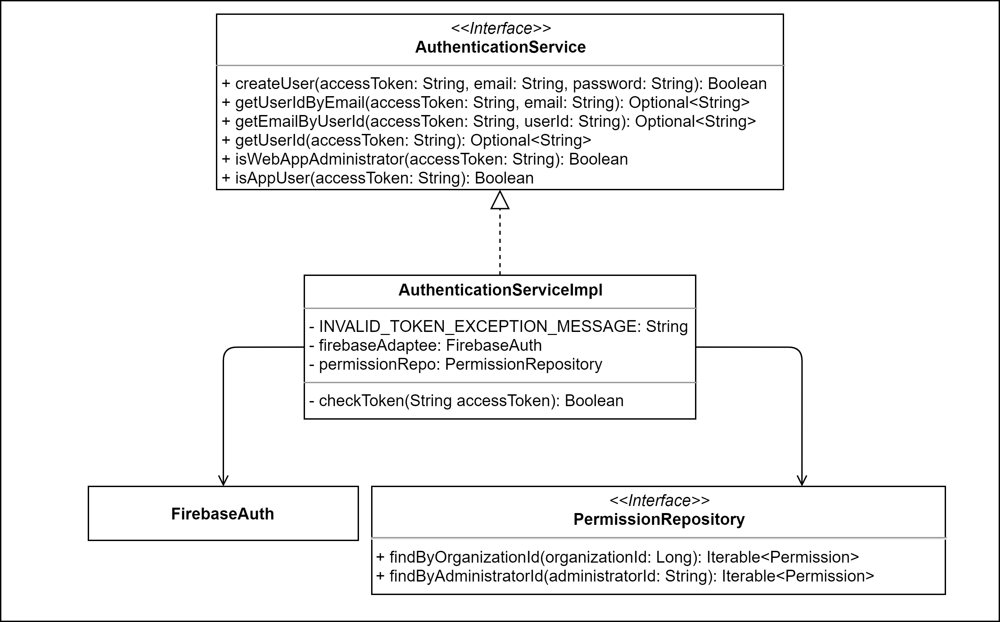
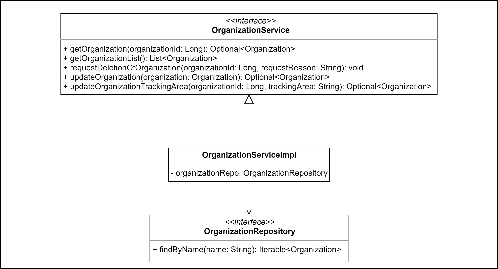

# 4.6 Diagrammi delle classi
Vengono presentati qui di seguito i diagrammi UML delle classi relativi al backend.  

!!! info
    Per rendere ogni componente riutilizzabile, mantenibile e facile da testare, si è cercato di progettare componenti che abbiano al loro interno poche responsabilità e che siano il più coese possibili, tenendo però sotto controllo il numero di dipendenze.

## Diagrammi dei Service

### Access Service

L'Access Service si occupa di soddisfare le richieste provenienti dai controller per ottenere informazioni sugli accessi di un utente presso un luogo o un'organizzazione.
___

### Administrator Service

L'Administrator Service si occupa di soddisfare le richieste provenienti dai controller per ottenere informazioni sugli amministratori di un'organizzazione e per la gestione dei loro permessi.
___

### Authentication Service

L'Authentication Service si occupa di soddisfare le richieste provenienti dai controller per ottenere informazioni sullo stato di autenticazione e i permessi (in questo caso intesi come "essere un utente dell'app" oppure "essere un amministratore della web-app") di un utente.
___

### Favorite Service

Il Favorite Service si occupa di soddisfare le richieste provenienti dai controller per ottenere informazioni sulle organizzazioni preferite di un utente dell'app e la gestione della loro lista dei preferiti.
___

### Movement Service

Il Movement Service si occupa di soddisfare le richieste provenienti dai controller per tracciare i movimenti (ingressi o uscite) di un utente presso un luogo o un'organizzazione. In questo diagramma si può notare come OrganizationMovementPublisher e PlaceMovementPublisher implementino l'interfaccia MovementPublisher, a loro volta estese rispettivamente da OrganizationMovementRedisPublisher e PlaceMovementRedisPublisher. Questa gerarchia di tipi è un'implementazione del design pattern Strategy: l'implementazione delle due tipologie di tracciamento è stata separata per permettere una maggiore flessibilità ed estendibilità delle loro implementazioni, oltre a poter cambiare del tutto lo strumento utilizzato per memorizzare i tracciamenti (Redis) e sostituirlo, senza richiedere che le classi che hanno dipendenze verso i due publisher debbano essere modificate.
___

### Organization Service

L'Organization Service si occupa di soddisfare le richieste provenienti dai controller per ottenere informazioni sulle organizzazioni e altre funzionalità disponibili agli amministratori, come ad esempio la richiesta di eliminazione dell'organizzazione amministrata.
___

### Place Service

Il Place Service si occupa di soddisfare le richieste provenienti dai controller per ottenere informazioni sui luoghi di un'organizzazione e per gestirli.
___

### Presence Service

Il Presence Service si occupa di soddisfare le richieste provenienti dai controller per ottenere informazioni sulle presenze correnti presso un luogo o un'organizzazione.
___

### Report Service

Il Report Service si occupa di soddisfare le richieste provenienti dai controller per ottenere report tabellari sugli accessi passati presso i luoghi di un'organizzazione da parte di utenti autenticati.
___

## Diagrammi dei Controller

### Access Controller

L'Access Controller si occupa di soddisfare le richieste ricevute dai client per ottenere informazioni sugli accessi di un utente presso un luogo o un'organizzazione, servendosi dell'Access Service.
___

### Administrator Controller

L'Administrator Controller si occupa di soddisfare le richieste ricevute dai client per ottenere informazioni sugli amministratori di un'organizzazione e per la gestione dei loro permessi, servendosi dell'Administrator Service.
___

### Favorite Controller

Il Favorite Controller si occupa di soddisfare le richieste ricevute dai client per ottenere informazioni sulle organizzazioni preferite di un utente dell'app e la gestione della loro lista dei preferiti, servendosi del Favorite Service.
___

### Movement Controller

Il Movement Controller si occupa di soddisfare le richieste ricevute dai client per tracciare i movimenti (ingressi o uscite) di un utente presso un luogo o un'organizzazione, servendosi del Movement Service.
___

### Organization Controller

L'Organization Controller si occupa di soddisfare le richieste ricevute dai client per ottenere informazioni sulle organizzazioni e altre funzionalità disponibili agli amministratori, come ad esempio la richiesta di eliminazione dell'organizzazione amministrata, servendosi dell'Organization Service.
___

### Place Controller

Il Place Controller si occupa di soddisfare le richieste ricevute dai client per ottenere informazioni sui luoghi di un'organizzazione e per gestirli, servendosi del Place Service.
___

### Presence Controller

Il Presence Controller si occupa di soddisfare le richieste ricevute dai client per ottenere informazioni sulle presenze correnti presso un luogo o un'organizzazione, servendosi del Presence Service.
___

### Report Controller

Il Report Controller si occupa di soddisfare le richieste ricevute dai client per ottenere report tabellari sugli accessi passati presso i luoghi di un'organizzazione da parte di utenti autenticati, servendosi del Report Service.
___

## Diagrammi di altre classi

### Authentication Facade

L'Authentication Facade è una classe che implementa il design pattern Facade. Si occupa di raggruppare tutte le funzionalità comuni ai vari controller fornendole da un unico punto di accesso. Queste funzionalità sono quelle offerte dall'Authentication Service, per verificare lo stato di autenticazione di un utente o amministratore, e quelle del Permission Service, per verificare se un utente è amministratore o meno e se ha i permessi presso una determinata organizzazione.

### Movement Subscriber

Avendo deciso di implementare il pattern Publisher-Subscriber, se il Movement Service dispone del publisher, deve esserci anche un subscriber. Il Movement Subscriber è, come il publisher, implementato con il design pattern Strategy, per le stesse ragioni che ne hanno giustificato l'utilizzo nel precedente. In questo caso, il subscriber si occupa di ottenere i messaggi dal Message Broker, di analizzarli per convertirli da semplici movimenti (di ingresso o di uscita) in istanze (parziali) di accessi che vengono memorizzate tramite i supporti di persistenza per poterli ottenere successivamente tramite le API fornite per gli Access.