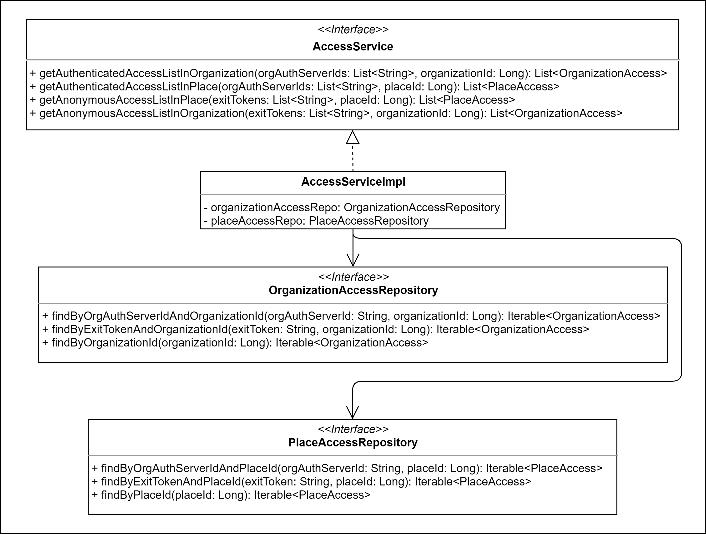
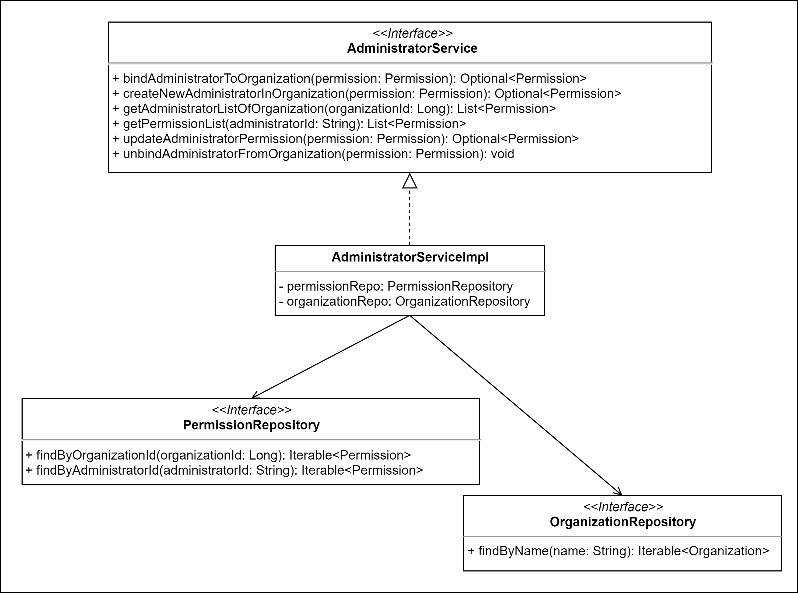
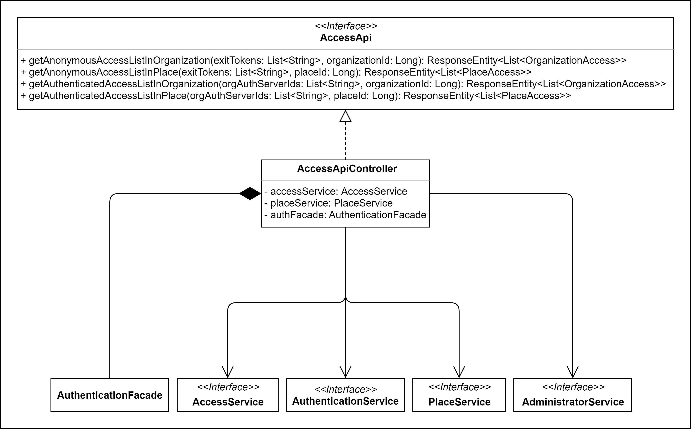
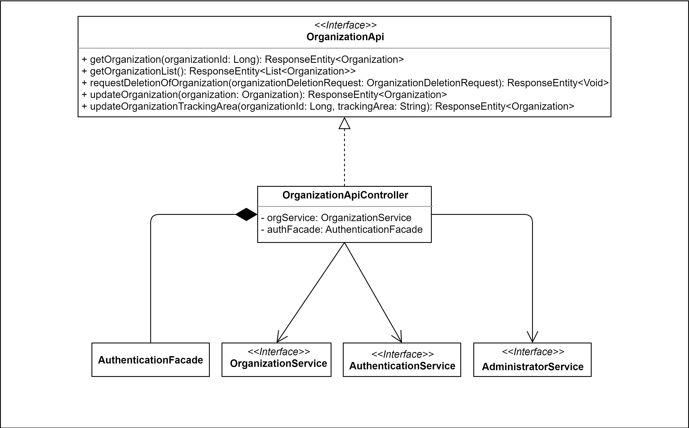
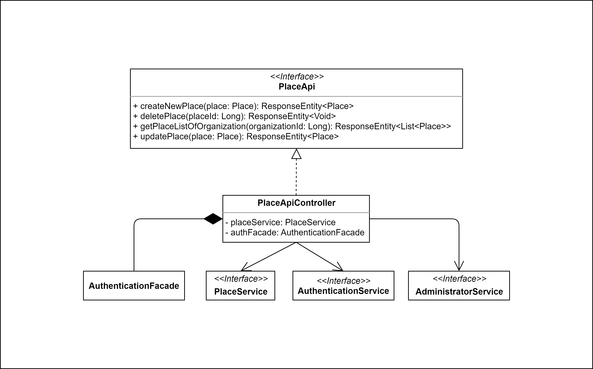
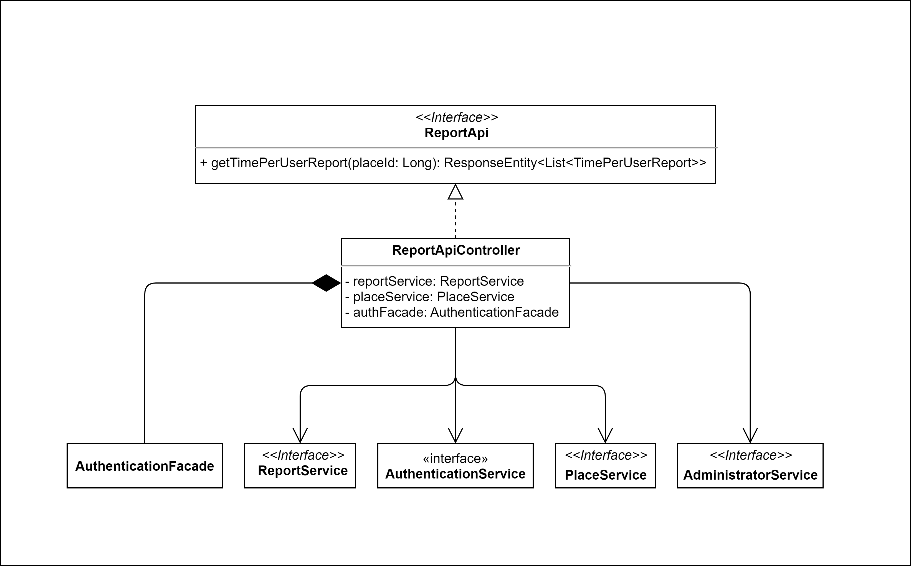

# 4.6 Diagrammi delle classi
Vengono presentati qui di seguito i diagrammi UML delle classi relativi al backend.  

!!! info
    Per rendere ogni componente riutilizzabile, mantenibile e facile da testare, si è cercato di progettare componenti che abbiano al loro interno poche responsabilità e che siano il più coese possibili, tenendo però sotto controllo il numero di dipendenze.

## 4.6.1 Diagrammi dei Service

### 4.6.1.1 AccessService

L'`AccessService` si occupa di soddisfare le richieste provenienti dai controller per ottenere informazioni sugli accessi di un utente presso un luogo o un'organizzazione.
- `getAnonymousAccessListInOrganization`: ritorna una lista di **OrganizationAccess** che rappresenta tutti gli accessi di un insieme di utenti anonimi (tracciati nel sistema tramite un **exitToken** per ognuno che non fornisce informazioni sulla sua identità) all'interno di una specifica organizzazione identificata dal suo **organizationId**; utilizza il metodo `findByExitTokenAndOrganizationId` della classe **OrganizationAccessRepository** che opera la query su DB per ottenre gli acessi di un singolo utente, quindi questa chiamata viene ripetuta per tutti gli *exitToken* passati al metodo e si compone così la lista finale.  
- `getAnonymousAccessListInPlace`: ritorna una lista di **PlaceAccess** che rappresenta tutti gli accessi effettuati da un insieme di utenti anonimi identificati ognuno da un **exitToken** all'interno di un luogo identificato tramite il suo  **placeId**; utilizza il metodo `findByExitTokenAndPlaceId` della classe **PlaceAccessRepository** per ottenre dal DB la lista di tutti gli accessi, per ogni **exitToken** fornito, nel luogo specificato, dall'insieme di quest'ultimi si forma la lista di tutti gli accessi al luogo.
- `getAuthenticatedAccessListInOrganization`: ritorna una lista di *OrganizationAccess* che rappresenta tutti gli accessi di un insieme di utenti identificati tramite LDAP all'interno di un'organizzazione che permette il tracciamento autentiicato, identificata dal suo **organizationId**; utilizza il metodo `findByOrgAuthServerIdAndOrganizationId` della classe **OrganizationAccessRepository** per ottenre tutti gli accessi di un utente dato il suo identificativo e l'id dell'organizzazione, viene chiamato per ogni *orgAuthServerId* passato ottenendo la lista completa di tutti gli accessi di tutti gli utenti richiesti.
- `getAuthenticatedAccessListInPlace`: ritorna una lista di **PlaceAccess** che rappresenta tutti gli accessi di un insieme di utenti identificati tramite credenziali LDAP all'interno di un luogo identificato dal suo **placeId**; utilizza il metodo `findByOrgAuthServerIdAndPlaceId` della classe **PlaceAccessRepository** per ottenere tutti gli accessi di un singolo utente autenticato, chiamato per ogni utente desiderato compone la lista di tutti gli accessi a luogo.
___

### 4.6.1.2 AdministratorService

L'`AdministratorService` si occupa di soddisfare le richieste provenienti dai controller per ottenere informazioni sugli amministratori di un'organizzazione e per la gestione dei loro permessi.
- `bindAdministratorToOrganization`: assegna un amministratore già esistente ad una organizzazione esistente, il parametro **Permission** contiene tutte le informazioni necessarie al metodo; `bindAdministratorToOrganization` utilizza il metodo `save` della classe **PermissionRepository** per salvare nel DB l'oggetto **Permission** che rappresenta il potere dell'amministratore all'interno di una organizzazione.  
- `createNewAdministratorInOrganization`: crea un nuovo amministratore all'interno di una specifica organizzazione e ne assegna i permessi tramite l'oggetto **Permission**; utilizza il metodo `save` della classe **PermissionRepository** per salvare nel DB il nuovo amministratore.  
- `getAdministratorListOfOrganization`: ritorna una lista di **Permission** che rappresenta l'insieme di amministratori che operano in una data organizzazione identificata dal suo **organizationId**, utilizza il metodo `findByOrganizationId` della classe **PermissionRepository** per ottenere tutti gli amministratori in una organizzazione.  
- `getPermissionList`: ritorna una lista di **Permission** che rappresenta tutte le organizzazioni in cui un dato amministratore ( identificato tramite **administratorId** ) opera; utilizza il metodo `findByAdministratorId` della classe **PermissionRepository**.  
- `updateAdministratorPermission`: ritorna un Optional di **Permission** che contiene le modifiche appena apportate ai permessi di uno specifico amministratore all'interno di un'organizzazione passando a questo metodo il parametro **Permission**; utilizza il metodo `save` della classe **PermissionRepository**.  
- `unbindAdministratorFromOrganization`: cancella i permessi di un amministratore da un'organzizazione passando al metodo un oggetto **Permission**; utilizza il metodo `deleteById` della classe **PermissionRepository**.  
___

### 4.6.1.3 AuthenticationServerService

L'`AuthenticationServerService` si occupa di soddisfare le richieste provenienti dai controller per ottenere informazioni sulle utenze presenti nel server che autentica gli utenti dell'organizzazione. Il server a cui inoltrare le richieste è indicato nell'organizzazione.

- `getUserInfoFromAuthServer`: ritorna una lista di **OrganizationAuthenticationServerInformation** che rappresenta tutte le informazioni degli utenti passati al metodo tramite l'oggetto **OrganizationAuthenticationServerRequest** che nel campo OrgAuthServerIds contiene una lista di stringhe contenenti gli identificativi degli utenti per i quali ritornare le informazioni oppure può contenre un singolo elemento ( ***** ) per significare che si vogliono le informazioni di tutti gli utenti dell'organizzazione, l'organizzazione della quale si vogliono ricevere informazioni sugli utenti deve essere a tracciamento autenticato. 

___

### 4.6.1.4 AuthenticationService

L'`AuthenticationService` si occupa di soddisfare le richieste provenienti dai controller per ottenere informazioni sullo stato di autenticazione e i permessi (in questo caso intesi come "essere un utente dell'app" oppure "essere un amministratore della web-app") di un utente.    
-`checkToken`: metodo privato che data una stringa utilizza il metodo `verifyIdToken` della classe **FirebaseAuth** per determinare se l'utente è autenticato tramite Firebase.  
-`isWebAppAdministrator`: data una stringa **accessToken** determina utilizzando i metodi `getFirebaseUser` e `findByAdministratorId` se l'utente identificato dall'**accessToken** sia un amministratore; in caso il token non sia valido lancia una **AuthenticationException**.  
-`isAppUser`: data una stringa **accessToken** determina utilizzando i metodi `getFirebaseUser` e `findByAdministratorId` se l'utente identificato dall'**accessToken** non sia un amministratore; in caso il token non sia valido lancia una **AuthenticationException**.   
-`createUser`: date 3 stringhe (accessToken, email, password) utilizza il metodo `createUser` della classe **FirebaseAuth** per creare un utente su Firebase, se l'operazione non ha successo ritorna **false** mentre se avviene con successo ritorna **true**; in caso il token non sia valido lancia una **AuthenticationException**.  
-`getUserIdByEmail`: date 2 stringhe (accessToken, email) ritorna un **Optional<String>** che rappresenta l'identificativo dell'utente, utilizza il metodo `getUserByEmail` della classe **FirebaseAuth**, in caso l'**accessToken** non fosse valido lancia una **AuthenticationException** e se invece non viene trovato l'identificativo dell'utente ritorna **Optional.empty()**.
-`getUserId`: ritorna l'identificativo dell'utente dato il suo **accessToken**, utilizza il metodo `getFirebaseUser`; in caso il token non sia valido lancia una **AuthenticationException**.  
-`getFirebaseUser`: ritorna un **Optional<FirebaseToken>** dato un **accessToken** utilizzando il metodo `verifyIdToken` della classe **FirebaseAuth**, se quest'ultimo metodo lancia una **FirebaseAuthException** `getFirebaseUser` ritorna **Optional.empty()**.  
-`getEmailByUserId`: ritorna **Optional<String>** contenente l'email dellìutente identificato da **userId**, utilizza il metodo `getUser` della classe **FirebaseAuth**, ritorna **Optional.empty()** nel caso in cui userId fornito sia vuoto o nullo, oppure se la chiamata di `getUser` lanci FirebaseAuthException o IllegalArgumentException; invece `getEmailByUserId` nel caso l'**accessToken** passato non sia valido lancia **AuthenticationException**.  

___

### 4.6.1.5 FavoriteService

Il `FavoriteService` si occupa di soddisfare le richieste provenienti dai controller per ottenere informazioni sulle organizzazioni preferite di un utente dell'app e la gestione della loro lista dei preferiti.  
-`addFavoriteOrganization`: fornisce la possibilità per un utente di salvare un'organizzazione nei preferiti associando il suo identificativo all'identificativo dell'organizzazione nell'oggetto **Favorite** che riceve il metodo e, quest'ultimo, utilizzando il metodo `save` della classe **FavoriteRepository** lo salva sul DB e ritorna il risultato di tale operazione.  
-`getFavoriteOrganizationList`: ritorna una lista di **Organization** che rappresenta tutte le organizzazioni inserite tra i preferiti da parte di uno specifico utente identificato dal suo **userId**; utilizza il metodo `findAllFavoriteOfOneUserId` della classe **FavoriteRepository** per ottenre tutti gli oggetti **Favorite** associati a un utente e in seguito utilizza il metodo `findAllById` della classe **OrganizationRepository** per ottenere tutte le organizzazioni contenute nella lista di **Favorite**.  
-`removeFavoriteOrganization`: rimuove un oggetto **Favorite** dal DB grazie al metodo `deleteById` della classe **FavoriteRepository**.  
-`getFavorite`: determina la presenza o meno di un oggetto **Favorite** nel DB grazie al metodo `existsById` della classe **FavoriteRepository** che accetta un parametro **FavoriteId** e ritorna true in caso sia già salvato e false in caso contrario.  
___

### 4.6.1.6 MovementService

Il `MovementService` si occupa di soddisfare le richieste provenienti dai controller per tracciare i movimenti (ingressi o uscite) di un utente presso un luogo o un'organizzazione. In questo diagramma si può notare come `OrganizationMovementPublisher` e `PlaceMovementPublisher` implementino l'interfaccia `MovementPublisher`, a loro volta estese rispettivamente da `OrganizationMovementRedisPublisher` e `PlaceMovementRedisPublisher`. L'implementazione delle due tipologie di tracciamento è stata separata per permettere una maggiore flessibilità ed estendibilità delle loro implementazioni, oltre a poter cambiare del tutto lo strumento utilizzato per memorizzare i tracciamenti (Redis) e sostituirlo, senza richiedere che le classi che hanno dipendenze verso i due publisher debbano essere modificate.  
-`trackMovementInOrganization`: si occupa di verificare l'integrità dell'oggetto **OrganizationMovement**, inoltre in caso il movimento sia d'entrata viene chiamato il metodo `setExitToken` della classe **OrganizationMovement** per salvare nell'oggetto **OrganizationMovement** un exitToken; in seguito l'oggetto viene passato al metodo `publish` della classe **OrganizationMovementPublisher** per essere pubblicato su Redis.  
-`trackMovementInPlace`: si occupa di verificare l'integrità dell'oggetto **PlaceMovement**, inoltre in caso il movimento sia d'entrata viene chiamato il metodo `setExitToken` della classe **PlaceMovement** per salvare nell'oggetto **PlaceMovement** un exitToken; in seguito l'oggetto viene passato al metodo `publish` della classe **PlaceMovementPublisher** per essere pubblicato su Redis.  
-`generateExitToken`: ritorna una stringa contenente caratteri da 0-9a-z randomizzati che rappresentano un **exitToken**.  
___

### 4.6.1.7 OrganizationService

L'`OrganizationService` si occupa di soddisfare le richieste provenienti dai controller per ottenere informazioni sulle organizzazioni e altre funzionalità disponibili agli amministratori, come ad esempio la richiesta di eliminazione dell'organizzazione amministrata.
___

### 4.6.1.8 PlaceService

Il `PlaceService` si occupa di soddisfare le richieste provenienti dai controller per ottenere informazioni sui luoghi di un'organizzazione e per gestirli.
___

### 4.6.1.9 PresenceService

Il `PresenceService` si occupa di soddisfare le richieste provenienti dai controller per ottenere informazioni sulle presenze correnti presso un luogo o un'organizzazione.  
-`getOrganizationPresenceCounter`: si occupa di interrogare Redis per ottenre in numero di presenze all'interno di una organizzazione specificata passando un **organizationId** al metodo; il contatore viene ottenuto chiamando il metodo `opsForValue` della classe **RedisTemplate<String, Integer>** e sul risultato chiamare  `get` con parametro la stringa contente **"organization:"+organizationId**; infine viene ritornato Optional dell'oggetto dopo aver verificato non sia nullo, e in caso sia nullo viene settato a zero.
-`getPlacePresenceCounter`:si occupa di interrogare Redis per ottenre in numero di presenze all'interno di un luogo specificato passando un **placeId** al metodo; il contatore viene ottenuto chiamando il metodo `opsForValue` della classe **RedisTemplate<String, Integer>** e sul risultato chiamare  `get` con parametro la stringa contente **"place:"+placeId**; infine viene ritornato Optional dell'oggetto dopo aver verificato non sia nullo, e in caso sia nullo viene settato a zero.
___

### 4.6.1.10 ReportService

Il `ReportService` si occupa di soddisfare le richieste provenienti dai controller per ottenere report tabellari sugli accessi passati presso i luoghi di un'organizzazione da parte di utenti autenticati.
___

## 4.6.2 Diagrammi dei Controller

### 4.6.2.1 AccessController

L'`AccessController` si occupa di soddisfare le richieste ricevute dai client per ottenere informazioni sugli accessi di un utente presso un luogo o un'organizzazione, servendosi dell'`AccessService`.
___

### 4.6.2.2 AdministratorController

L'`AdministratorController` si occupa di soddisfare le richieste ricevute dai client per ottenere informazioni sugli amministratori di un'organizzazione e per la gestione dei loro permessi, servendosi dell'`AdministratorService`.
___

### 4.6.2.3 AuthenticationServerController

L'`AuthenticationServerController` si occupa di soddisfare le richieste ricevute dai client per ottenere informazioni sulle utenze presenti nel server che autentica gli utenti dell'organizzazione, servendosi dell'`AuthenticationServerService`.
___

### 4.6.2.4 FavoriteController

Il `FavoriteController` si occupa di soddisfare le richieste ricevute dai client per ottenere informazioni sulle organizzazioni preferite di un utente dell'app e la gestione della loro lista dei preferiti, servendosi del `FavoriteService`.
___

### 4.6.2.5 MovementController

Il `MovementController` si occupa di soddisfare le richieste ricevute dai client per tracciare i movimenti (ingressi o uscite) di un utente presso un luogo o un'organizzazione, servendosi del `MovementService`.
___

### 4.6.2.6 OrganizationController

L'`OrganizationController` si occupa di soddisfare le richieste ricevute dai client per ottenere informazioni sulle organizzazioni e altre funzionalità disponibili agli amministratori, come ad esempio la richiesta di eliminazione dell'organizzazione amministrata, servendosi dell'`OrganizationService`.
___

### 4.6.2.7 PlaceController

Il `PlaceController` si occupa di soddisfare le richieste ricevute dai client per ottenere informazioni sui luoghi di un'organizzazione e per gestirli, servendosi del `PlaceService`.
___

### 4.6.2.8 PresenceController

Il `PresenceController` si occupa di soddisfare le richieste ricevute dai client per ottenere informazioni sulle presenze correnti presso un luogo o un'organizzazione, servendosi del `PresenceService`.
___

### 4.6.2.9 ReportController

Il `ReportController` si occupa di soddisfare le richieste ricevute dai client per ottenere report tabellari sugli accessi passati presso i luoghi di un'organizzazione da parte di utenti autenticati, servendosi del `ReportService`.
___

## 4.6.3 Diagrammi di altre classi

### 4.6.3.1 AuthenticationFacade

L'`Authentication Facade` è una classe che implementa il design pattern Facade. Si occupa di raggruppare tutte le funzionalità comuni ai vari controller fornendole da un unico punto di accesso. Queste funzionalità sono quelle offerte dall'`AuthenticationService`, per verificare lo stato di autenticazione di un utente o amministratore, e quelle del PermissionService, per verificare se un utente è amministratore o meno e se ha i permessi presso una determinata organizzazione.
___

### 4.6.3.2 GpsAreaFacade

Le funzionalità che controllano la dimensione di un'area geografica espressa dall'area di tracciamento (trackingArea) di un'organizzazione o di un luogo vengono realizzate dalle classi che permettono a `GpsArea Facade` di funzionare. Nuovamente, come dice il nome, viene utilizzato il design pattern Facade per avere un unico punto di accesso alle tre funzionalità di calcolo dell'area data una lista di coordinate geografiche, verifica di appartenenza di un punto all'interno di un certo perimetro e costruzione di oggetti di tipo `Coordinate`, che corrisponde all'interfaccia che permette di elaborare i dati ricevuti dalle trackingArea. Inoltre, le tre interfacce `AreaCalculator`, `CoordinateFactory` e `PointInsidePolygon` sono implementate attualmente in un modo abbastanza semplice, ma potrebbero essere aggiornate o sostituite da altre implementazioni più precise, indicandone l'uso nella configurazione del software.
___

### 4.6.3.3 MovementSubscriber

Avendo deciso di implementare il pattern Publisher-Subscriber, se il MovementService dispone del publisher, deve esserci anche un subscriber. In questo caso, il subscriber si occupa di ottenere i messaggi dal Message Broker, di analizzarli per convertirli da semplici movimenti (di ingresso o di uscita) in istanze (parziali) di accessi che vengono memorizzate tramite i supporti di persistenza per poterli ottenere successivamente tramite le API fornite per gli Access.
___