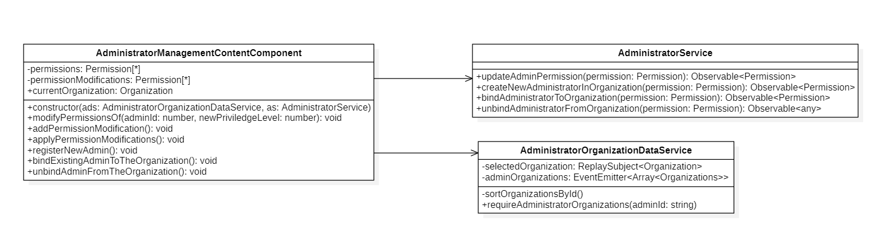
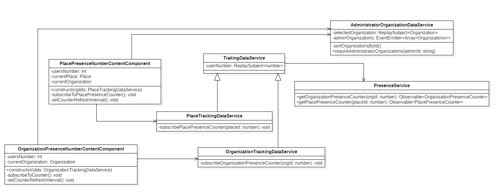
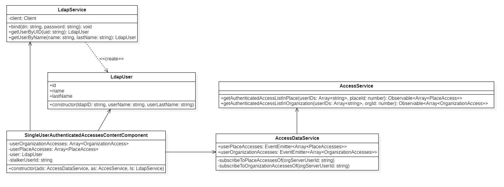
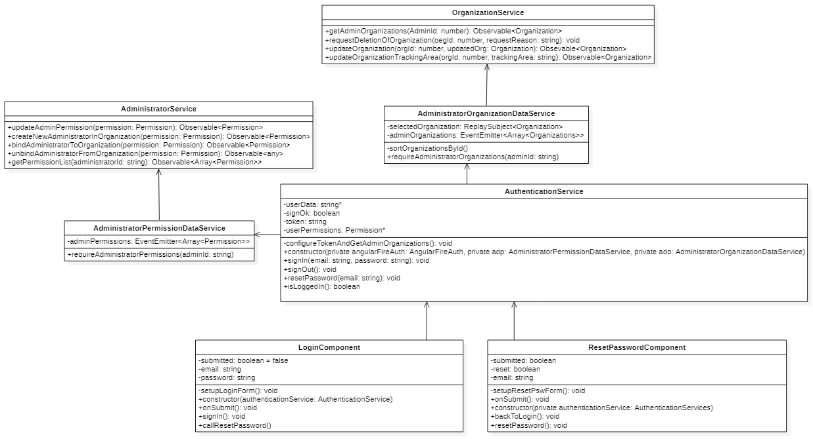
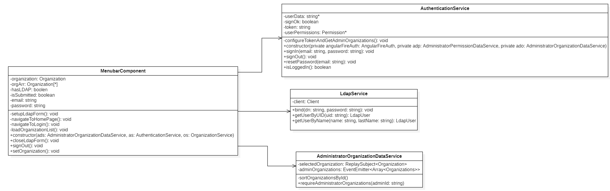
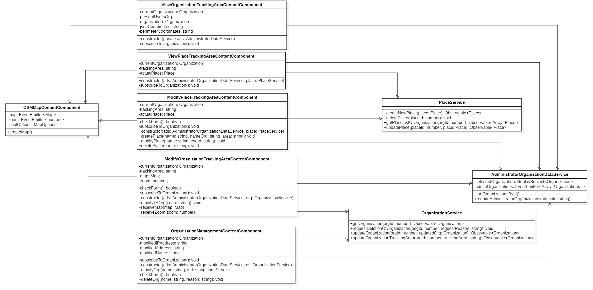

Vengono presentati qui di seguito i diagrammi UML delle classi relativi alla applicazione webG.
Per redente ogni componente riutilizzabile, mantenibile e facile da testare, si è cercato di progettare componenti che abbiano al loro interno poche responsabilità e che siano il più coese possibili, tenendo pero sotto controllo il numero di dipendenze.

## Administrator management

<figcaption align=center> <em> Diagramma delle classi - Administrator </em> </figcaption>

Nel precedente diagramma viene illustrato come sono state progettate le funzionalità per la gestione degli amministratori. 
Il component **AdministratorManagementContentComponent**  contiene come attributi **permissionModifications** che contiene le modifiche ai permessi da applicare, **permission** invece contiene i permessi attuali dei amministratori nella organizzazione selezionata contenuta nel attributo **currentOrganization**. 
Offre i seguenti metodi:

-   **modifyPermissionsOf(adminId:number, newPriviledgeLevel:number)**: modifica dei permessi di uno specifico amministratore inserendo come parametri l'id e la modifica del privilegio;

-   **addPermissionModification()**:aggiunge a **permissionModifications** i permessi da modificare, questo metodo viene richiamato dal metodo precedentemente descritto nel caso in cui si vuole modificare contemporaneamente i permessi di più amministratori;

-   **applyPermissionModifications()**: permette l'applicazione delle modifiche;

-   **registerNewAdmin()**:registra un nuovo amministratore nell'organizzazione nel caso in cui non sia presente nel sistema Stalker;

-   **bindExistingAdminToTheOrganization()**:registra un nuovo amministratore nell'organizzazione nel caso in cui sia presente nel sistema Stalker;

-   **unbindAdminFromTheOrganization()**: eliminazione di un amministratore dall'organizzazione, viene letto dalla *view* l'amministratore selezionato e successivamente eliminato.

Viene inoltre offerta anche la funzionalità di annullamento delle modifiche, infatti le modifiche fatte vengo salvate temporaneamente e solo dopo l'avvenuta conferma da parte dell'amministratore, si procede all'applicazione delle modifiche. 

**AdministratorManagementContentComponent** ha due dipendenze di tipo **associazione** verso **AdministratorService** e **AdministratorOrganizationDataService**. 

**AdministratorOrganizationDataService** fornisce l'elenco delle organizzazioni in cui l'amministratore è registrato attraverso l'attributo **adminOrganizations** e l'organizzazione su cui si sta lavorando attraverso **selectedOrganization**. 

**AdministratorService** fornisce metodi per la comunicazione con il backendG:

-   **updateAdminPermission(permission:Permission)**: permette la modifica dei permessi a un amministratore;

-   **createNewAdministratorInOrganization(permission:Permission)**: registra un nuovo amministratore nell'organizzazione nel caso in cui non sia presente nel sistema Stalker;

-   **bindAdministratorToOrganization(permission:Permission)**: registra un nuovo amministratore nell'organizzazione nel caso in cui sia presente nel sistema Stalker;

-   **unbindAdministratorFromOrganization(permission:Permission)**: eliminazione di un amministratore dall'organizzazione:

Si ricorda inoltre che per usufruire di questa funzionalità occorre essere un amministratore di tipo **owner**.

## Anonymous tracking

<figcaption align=center> <em> Diagramma delle classi - Anonymous tracking </em> </figcaption>

Nel precedente diagramma viene illustrato come sono state progettate le funzionalità per il monitoraggio dei utenti anonimi sia nelle organizzazioni sia nei luoghiG dell'organizzazione.
Il component **OrganizationPresenceNumberContentComponent** permette di mostrare il numero di utenti anonimi presenti nell'organizzazione attraverso l'attributo **usersNumber**. 
Esistono i seguenti metodi:

 -  **setCounterRefreshInterval(ms:number)**:imposta l'intervallo di tempo per aggiornare automaticamente il contatore asseconda del parametro in input;

 -  **subscribeToCounter()**: permette di mantenere aggiornato il contatore delle presenze.

Analogamente **PlacePresenceNumberContentComponent** offre le stesse funzionalità ma per i luoghiG dell'organizzazione.

Essi hanno una dipendenza di tipo **associazione** verso **AdministratorOrganizationDataService** che fornisce l'organizzazione su cui si vuole fare monitoraggio. 

**OrganizationPresenceNumberContentComponent** ha una associazione con **OrganizationTrackingDataService** la quale permette di ottenere il numero degli utenti anonimi presenti nell'organizzazione attraverso il metodo **subscribeOrganizationPresenceCounter( orgId:number)**, per far ciò ha bisogno di utilizzare i metodi offerti da **PresenceService** i quali permettono di comunicare con il backendG.

**PresenceService** offre i seguenti metodi:

-   **getOrganizationPresenceCounter(orgId:number)**: ritorna il numero di utenti anonimi presenti all'interno dell'organizzazione;

-   **getPlacePresenceCounter(placeId:number)**: ritorna il numero di utenti anonimi presenti all'interno di un luogo dell'organizzazione;

Analogamente per **PlacePresenceNumberContentComponent** ha una associazione con **PlaceTrackingDataService**il quale offre il numero di utenti anonimi presenti all'interno di un luogo di un'organizzazioneG.

**OrganizationTrackingDataService** e **PlaceTrackingDataService** sono delle specializzazioni della  classe astratta **TrakingDataService**.

## Recognized tracking 

<figcaption align=center> <em> Diagramma delle classi - Recognized tracking </em> </figcaption>

## Authentication

<figcaption align=center> <em> Diagramma delle classi - Authentication </em> </figcaption>

Nel precedente diagramma viene illustrato come è stata progettata la funzionalità di autenticazione nella applicazione webG. 

**LoginComponent** contiene gli attributi, **submitted** per indicare se è stato cliccato il bottone *invio*, email contiene l'email inserita, password contiene la password inserita,ha i seguenti metodi:

-   **setupLoginForm()**: offre la possibilità di inserire email e password per l'autenticazione e di controllare se sono in una forma valida. 
-   **onSubmit()**: modificare submitted col valore *true*;
-   **sign()**: richiamare i metodi per il login;
-   **callResetPassword()**: metodo che viene chiamato quando l'utente clicca sul pulsante *password dimenticata* per chiamare il controllor **ResetPasswordComponent**.

**ResetPasswordComponent** ha gli stessi attributi del controllor precedentemente descritto e più o meno gli stessi metodi, si segnala il metodo **resetPassword()** per richiamare i metodi per il reset della password.

**LoginComponent** e **ResetPasswordComponent** ha una associazione con **AuthenticationService** dove si segnalano gli attributi **userData** entità dell'utente autenticato. Dispone i seguenti metodi:
 
-   **signIn(in email:string, in password:string)**: permette l'autenticazione attraverso i servizi di FireBase;

-   **signOut()**: permette il logoutG; 

-   **resetPassword(in email:string)**: permette il reset della password e per ottenere i permessi e le organizzazioni posseduti da un amministratore durante il processo di autenticazione. Ha perciò due associazioni, una con **AdministratorPermissionDataService** che permette di ottenere i permessi di un amministratore e successivamente se li memorizza, offrendoli a chi ne fa richiesta. A sua volta ha una associazione con **AdministratorService**, il quale permette la comunicazione con il backendG, permettendo di ottenere i permessi di un amministratore. L'altra associazione che ha **AuthenticationService** è **AdministratorOrganizationDataService** che permette di ottenere la lista delle organizzazioni a cui l'amministratore è registrato e successivamente se la memorizza, offrendola a chi ne fa richiesta. A sua volta ha una associazione con **OrganizationService**, il quale permette la comunicazione con il backendG, permettendo di ottenere la lista delle organizzazioni di un amministratore.  **ResetPasswordComponent** offre la possibilità di recuperare la password e di controllare se l'email per il recupero della password è nella forma valida.

## Menubar

<figcaption align=center> <em> Diagramma delle classi - Menubar </em> </figcaption>

Nel precedente diagramma viene mostrato come è stato progettato il component **Manubar**. **Menubar** è un component che permette di gestire gli eventi generati della componente grafica omonima *menubar*. Questi eventi possono richiedere azioni di logoutG perciò esiste una associazione con **AuthenticationService**, azioni di selezione di una organizzazioni tra quelle disponibili e quindi si ha una associazione con **AdministratorOrganizationDataService** che offre la lista delle organizzazione da cui selezionare l'organizzazione che sarà memorizzata in **AdministratorOrganizationDataService** è ritornarla a chi lo richiede, e infine l'azione di autenticazione LDAPG nel caso in cui l'amministratore selezione una organizzazione che richiede tale tipo di autenticazione. Quindi esiste una associazione con **LDAPService** che offre l'autenticazione LDAPG.

## Organization management

<figcaption align=center> <em> Diagramma delle classi - Organization management </em> </figcaption>