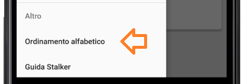

# 2.1 Funzionalità dell'applicazione per utenti

L'applicazione Android viene utilizzata dagli utenti che devono, o vogliono, fare in modo che i loro movimenti di ingresso e uscita dalle organizzazioni e dai loro luoghi vengano tracciati. Il movimento viene tracciato quando l'utente entra nell'organizzazione dalla quale ha scelto di essere tracciato avendola inserita nella lista MyStalker. Questo significa che gli amministratori possono monitore l'orario di accesso/uscita di ogni spostamento all'interno della loro azienda effettuato da ogni dipendente che usa l'applicazione. Vengono tracciati gli ingressi e le uscite dai luoghi presenti nell'organizzazione qualora siano presenti. Inoltre l'utente può controllare in tempo reale l'organizzazione e il luogo in cui si trova e il tempo di permanenza attuale.

All'utente dell'applicazione vengono offerte tutte le funzionalità indicate in questa pagina.

## 2.1.1 Login

<iframe width="720" src="https://www.youtube.com/embed/NkVPdpIPZNs" frameborder="0" style="height: 540px" allow="accelerometer; autoplay; encrypted-media; gyroscope; picture-in-picture" allowfullscreen></iframe>

L'utente può autenticarsi inserendo il proprio indirizzo e-mail e la propria password.
Qualora l'utente si fosse dimenticato la password è possibile eseguire il reset cliccando sul testo: **"Password dimenticata?"** e apparirà un pop-up dove l'utente dovrà inserire l'email ricevendo così un link per cambiare la password.

<figcaption align="center"> <em> Pop-up reset password </em> </figcaption>

## 2.1.2 Registrazione

<iframe width="720" src="https://www.youtube.com/embed/5hrvVSfxrr8" frameborder="0" style="height: 540px" allow="accelerometer; autoplay; encrypted-media; gyroscope; picture-in-picture" allowfullscreen></iframe>

L'utente ha la possibilità di registrarsi inserendo la propria e-mail personale, la password (con la necessità di confermarla per sicurezza) e accettando le condizioni d'uso di Stalker. 

Per poter accedere nella pagina dedicata alla registrazione basta cliccare la scritta **"Clicca qui"** nella schermata di login.

<figcaption align="center"> <em> Pulsante per la registrazione </em> </figcaption>

## 2.1.3 Scaricamento della lista delle organizzazioni

Al primo accesso alla applicazione da parte dell'utente, verrà mostrato un pop-up per offrire la possibilità di scaricare la lista delle organizzazioni dal server di Stalker. Gli utenti avranno la possibilità di accettare o rifiutare la proposta; nel caso in cui l'utente accettasse, verrebbero visualizzate tutte le organizzazioni disponibili, come mostrato nel paragrafo '2.1.6'.

<figcaption align="center"> <em> Scarica lista delle organizzazioni </em> </figcaption>

In seguito c'è anche la possibilità di scaricare la lista effettuando uno *Swipe down* nella Home page.

## 2.1.4 Menù drawer

L'utente può accedere ad una serie di funzionalità utilizzando l'*Hamburger button* riportato in alto a sinistra della schermata dell'applicazione.

<figcaption align="center"> <em> Hamburger button </em> </figcaption>

Una volta cliccato su questo bottone apparirà il menù drawer, da cui è possibile accedere alle seguenti funzionalità:

- Eseguire il logout;
- Attivare o disattivare il tracciamento tramite uno pulsante switch;
- Scegliere se essere tracciati in modalità anonima (impostata come default) o in modalità autenticata tramite uno pulsante switch;
- Ordinare alfabeticamente la lista delle organizzazioni;
- Guida Stalker, cioè un link che indirizza l'utente nella pagina web dedicata alla guida dell'applicazione.

Inoltre è presente una sezione denominata "info tracciamento" per visualizzare le seguenti informazioni:

- Un messaggio che indica all'utente se si trova fuori o all'interno di un'organizzazione. In quest'ultimo caso verrà indicato il nome dell'organizzazione in cui si è presenti;
- Un messaggio che indica all'utente se si trova fuori o all'interno di un luogo. In quest'ultimo caso verrà indicato il nome del luogo in cui si è presenti;
- Il tempo di permanenza dell'utente all'interno di un'organizzazione. Se l'utente si trova al di fuori di un'organizzazione, il tempo sarà indicato con "00:00:00";
- Il tempo di permanenza dell'utente all'interno di un luogo. Se l'utente si trova al di fuori di un luogo, il tempo sarà indicato con "00:00:00".

<figcaption align="center"> <em> Menù drawer </em> </figcaption>

## 2.1.5 Logout

<iframe width="720" src="https://www.youtube.com/embed/sD7La3a569s" frameborder="0" style="height: 540px" allow="accelerometer; autoplay; encrypted-media; gyroscope; picture-in-picture" allowfullscreen></iframe>

L'utente può eseguire il logout aprendo il menù drawer e poi cliccando su **Logout**.

## 2.1.6 Lista delle organizzazioni

<figcaption align="center"> <em> Lista organizzazioni </em> </figcaption>

In questa sezione vi sono tutte le organizzazioni scaricate dal server. 

## 2.1.7 MyStalkerList(organizzazioni preferite)

<figcaption align="center"> <em> MyStalkerList </em> </figcaption>

In questa sezione vi sono tutte le organizzazioni da cui l'utente ha scelto di essere tracciato.

<figcaption align="center"> <em> Organizzazione con autenticazione LDAP </em> </figcaption>

Se un'organizzazione richiede l'autenticazione tramite LDAP per poter tracciare l'utente, vicino al nome sarà presente un simbolo di un lucchetto per indicare tale necessità.

## 2.1.8 Ordinamento alfabetico della lista delle organizzazioni

<iframe width="720" src="https://www.youtube.com/embed/aZ3fPGN_Oj8" frameborder="0" style="height: 540px" allow="accelerometer; autoplay; encrypted-media; gyroscope; picture-in-picture" allowfullscreen></iframe>

L'utente può eseguire l'ordinamento alfabetico della lista delle organizzazioni aprendo il menù drawer e cliccando successivamente su **Ordinamento Alfabetico**.

<figcaption align="center"> <em> Ordinamento alfabetico </em> </figcaption>

## 2.1.9 Ricerca

<iframe width="720" src="https://www.youtube.com/embed/bB4VtZd_pLY" frameborder="0" style="height: 540px" allow="accelerometer; autoplay; encrypted-media; gyroscope; picture-in-picture" allowfullscreen></iframe>

Nella lista delle organizzazioni e nella lista MyStalker, in alto a destra vi è situata una sezione per la funzionalità di ricerca. Con essa è possibile eseguire ricerche testuali per filtrare e visualizzare una lista personalizzata delle organizzazioni. Ci sono diverse modalità:

- Ricerca per nome (impostata come default);
- Ricerca per città;
- Ricerca per nazione;
- Ricerca per organizzazioni anonime o autenticate.

<figcaption align="center"> <em> Ricerca </em> </figcaption>

Anche nella sezione dedicata allo storico accessi vi è situato un comando che permetterà di accedere ad una distinta funzionalità di ricerca. Essa consentirà di:

- ottenere la lista degli accessi riordinata per data in ordine crescente;
- ottenere la lista degli accessi riordinata per data in ordine decrescente;
- ottenere gli accessi presso un'organizzazione in un giorno specifico.

<figcaption align="center"> <em> Ricerca storico accessi</em> </figcaption>

## 2.1.10 Visualizzazione pagina organizzazione

<figcaption align="center"> <em> Pagina dedicata all'organizzazione </em> </figcaption>

L'utente può entrare nella pagina dedicata di un'organizzazione cliccando l'elemento della lista con il nome di quella organizzazione. Al suo interno è possibile visualizzare il nome dell'organizzazione, l'immagine di anteprima, una descrizione e un pulsante `Autenticazione` qualora l'organizzazione richiedesse un'autenticazione tramite LDAP.

## 2.1.11 Aggiunta organizzazione in MyStalkerList

<iframe width="720" src="https://www.youtube.com/embed/o8ma7mRCMG4" frameborder="0" style="height: 540px" allow="accelerometer; autoplay; encrypted-media; gyroscope; picture-in-picture" allowfullscreen></iframe>

Tramite un click prolungato sull'elemento della lista delle organizzazione, apparirà un pop-up che darà la possibilità all'utente di premere su uno dei due pulsanti:

- Il primo, chiamato `Maggiori informazioni`, farà accedere alla pagina di visualizzazione dell'organizzazione selezionata;
- Il secondo, chiamato `Aggiungi a MyStalker`, permetterà di aggiungere l'organizzazione selezionata alla lista dei preferiti MyStalkerList. Qualora l'organizzazione richiedesse un'autenticazione  tramite LDAP allora con il pop-up sarà possibile visualizzare solamente il pulsante`Maggiori informazioni`.

<figcaption align="center"> <em> Aggiunta di un'organizzazione in MyStalkerList </em> </figcaption>

## 2.1.12 Autenticazione e aggiunta di un'organizzazione che richiede tracciamento autenticato in MyStalkerList

<iframe width="720" src="https://www.youtube.com/embed/8592HpcfZx0" frameborder="0" style="height: 540px" allow="accelerometer; autoplay; encrypted-media; gyroscope; picture-in-picture" allowfullscreen></iframe>

L'utente, per poter aggiungere a MyStalkerList un'organizzazione che richiede tracciamento autenticato, dovrà accedere alla pagina con le informazioni dell'organizzazione nella quale sarà presente un pulsante `Autenticazione`, premuto il pulsante basterà inserire le proprie credenziali LDAP. Qualora l'autenticazione avvenisse con successo, l'organizzazione verrà aggiunta a MyStalkerList.

<figcaption align="center"> <em> Autenticazione di un'organizzazione aziendale </em> </figcaption>

## 2.1.13 Eliminazione organizzazione da MyStalkerList

<iframe width="720" src="https://www.youtube.com/embed/CP2-rYQa3-M" frameborder="0" style="height: 540px" allow="accelerometer; autoplay; encrypted-media; gyroscope; picture-in-picture" allowfullscreen></iframe>

Tramite un click prolungato sull'elemento di MyStalkerList, apparirà un pop-up che permetterà rimuovere l'organizzazione dalla lista.

<figcaption align="center"> <em> Eliminazione di un'organizzazione da MyStalker</em> </figcaption>

## 2.1.14 Attivazione tracciamento e cambio modalità tracciamento

<iframe width="720" src="https://www.youtube.com/embed/aXBl3tfzzhE" frameborder="0" style="height: 540px" allow="accelerometer; autoplay; encrypted-media; gyroscope; picture-in-picture" allowfullscreen></iframe>

La funzionalità del tracciamento sarà possibile attivarla attraverso lo switch collocato nel menù del drawer. Di default è settata con modalità anonima, però, tramite uno switch del pulsante, l'utente può passare in modalità di tracciamento autenticata. In questo modo gli amministratori di MyStalker hanno la possibilità di sapere l'identità (tramite le credenziali LDAP) dell'utente che effettua i movimenti all'interno della loro organizzazione.

<figcaption align="center"> <em> Modalità di tracciamento anonima o autenticata </em> </figcaption>

La prima volta che si utilizza questa funzionalità sul dispositivo viene visualizzato un pop-up in cui l'utente dovrà accettare la richiesta del sistema per poter accedere alle funzionalità di geolocalizzazione.

<figcaption align="center"> <em> Pop-up di accettazione permessi per il tracciamento </em> </figcaption>

## 2.1.15 Tracciamento

<iframe width="720" src="https://www.youtube.com/embed/eORyA8tPDWE" frameborder="0" style="height: 540px" allow="accelerometer; autoplay; encrypted-media; gyroscope; picture-in-picture" allowfullscreen></iframe>

La funzionalità di tracciamento consente all'utente di registrare gli ingressi e le uscite presso le organizzazioni e presso i loro luoghi. Il tracciamento, come già detto, avviene solamente per le organizzazioni presenti in MyStalkerList. Qualora l'organizzazione richiedesse l'autenticazione con credenziali LDAP allora è possibile cambiare, tramite uno switch presente nel menù del drawer, la tipologia di tracciamento da anonimo (default) ad autenticato (e viceversa). La modalità di tracciamento autenticato permette alle organizzazioni di visualizzare a posteriori gli accessi (insieme di un ingresso e un'uscita da un'organizzazione o luogo) dei loro dipendenti, identificati grazie alle credenziali LDAP.

## 2.1.16 Tracciamento luogo dell'organizzazione

<iframe width="720" src="https://www.youtube.com/embed/5BCB0wv_woo" frameborder="0" style="height: 540px" allow="accelerometer; autoplay; encrypted-media; gyroscope; picture-in-picture" allowfullscreen></iframe>

Verrà mostrato un esempio della funzionalità di tracciamento che traccia l'ingresso e l'uscita di un'organizzazione e di un suo luogo.

<figcaption align="center"> <em> Tracciamento in un'organizzazione </em> </figcaption>

## 2.1.17 Tracciamento in background

<iframe width="720" src="https://www.youtube.com/embed/VvPiyFBfOm8" frameborder="0" style="height: 540px" allow="accelerometer; autoplay; encrypted-media; gyroscope; picture-in-picture" allowfullscreen></iframe>

Se il tracciamento è attivo e si esce dall'applicazione, quest'ultima continuerà a funzionare passando alla modalità di tracciamento in background. È possibile notare sulla barra delle notifiche di Android un'area dedicata all'applicazione Stalker tramite la quale sarà possibile riaprire l'applicazione.
Scegliendo di interrompere il tracciamento l'applicazione verrà chiusa definitivamente.

<figcaption align="center"> <em> Tracciamento in background </em> </figcaption>

## 2.1.18 Storico accessi 

<iframe width="720" src="https://www.youtube.com/embed/JdZw94_z4Q8" frameborder="0" style="height: 540px" allow="accelerometer; autoplay; encrypted-media; gyroscope; picture-in-picture" allowfullscreen></iframe>

In questa sezione vi sono tutti gli accessi effettuati dall'utente nelle organizzazioni. Ogni volta che l'utente farà un accesso e un'uscita da un'organizzazione, verrà aggiunta una riga contenente le seguenti informazioni:

- Nome dell'organizzazione;
- Data in cui si è effettuato l'accesso;
- Orario in cui si è effettuata l'entrata nell'organizzazione;
- Orario in cui si è effettuata l'uscita nell'organizzazione.

<figcaption align="center"> <em> Storico accessi di un'organizzazione </em> </figcaption>

Tramite un click prolungato su un'elemento della lista, apparirà un pop-up che permetterà di ottenere ulteriori informazioni sull'accesso dell'utente: si potrà sapere il suo tempo di permanenza all'interno dell'organizzazione selezionata e il tipo di accesso (anonimo o autenticato).

<figcaption align="center"> <em> Maggiori informazioni degli storico accessi di un'organizzazione </em> </figcaption>

## 2.1.19 Storico accessi ai luoghi

<iframe width="720" src="https://www.youtube.com/embed/JdZw94_z4Q8" frameborder="0" style="height: 540px" allow="accelerometer; autoplay; encrypted-media; gyroscope; picture-in-picture" allowfullscreen></iframe>

Cliccando su un elemento nella lista dello storico degli accessi, verranno visualizzati gli accessi effettuati dall'utente in tutti i luoghi presenti nell'organizzazione selezionata, con le stesse informazioni elencate nello storico accessi delle organizzazioni.

<figcaption align="center"> <em> Storico accessi di un luogo </em> </figcaption>

