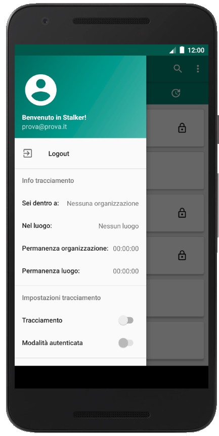

# 2.1 Funzionalità dell'applicazione per utenti

L'applicazione Android viene utilizzata dagli utenti che devono o vogliono fare in modo che i loro movimenti di ingresso e uscita dalle organizzazioni e dai loro luoghi vengano tracciati. Il movimento viene tracciato solo dal punto di vista dell'orario e dell'utenza presso l'organizzazione.

All'utente dell'applicazione vengono offerte le funzionalità indicate in questa pagina.

## 2.1.1 Registrazione

<iframe width="720" src="https://www.youtube.com/embed/t_jtcHEzhFw" frameborder="0" style="height: 540px" allow="accelerometer; autoplay; encrypted-media; gyroscope; picture-in-picture" allowfullscreen></iframe>

L'utente ha la possibilità di registrarsi inserendo la propria e-mail personale, password e accettando le condizioni d'uso di Stalker.

## 2.1.2 Login e scaricamento della lista delle organizzazioni

<iframe width="720" src="https://www.youtube.com/embed/YPHun6qWReo" frameborder="0" style="height: 540px" allow="accelerometer; autoplay; encrypted-media; gyroscope; picture-in-picture" allowfullscreen></iframe>

L'utente può autenticarsi inserendo il proprio indirizzo e-mail e la propria password.
Al primo accesso alla applicazione da parte dell'utente, verrà mostrato un pop-up per richiedere la possibilità di scaricare la lista delle organizzazioni dal server di Stalker. Gli utenti avranno la possibilità di accettare o rifiutare la proposta.

## 2.1.3 Menù drawer

L'utente può accedere ad una serie di funzionalità utilizzando l'*Hamburger button* riportato in alto a sinistra della schermata dell'applicazione.

<figcaption align="center"> <em> Hamburger button </em> </figcaption>

Una volta cliccato su questo bottone apparirà il menù drawer, da cui è possibile accedere alle seguenti funzionalità:

- Attivare o disattivare il tracciamento tramite uno pulsante switch;
- Eseguire il logout;
- Ordinare alfabeticamente la lista delle organizzazioni.

<figcaption align="center"> <em> Menù drawer </em> </figcaption>

## 2.1.4 Logout

<iframe width="720" src="https://www.youtube.com/embed/Rw4QFxDUisU" frameborder="0" style="height: 540px" allow="accelerometer; autoplay; encrypted-media; gyroscope; picture-in-picture" allowfullscreen></iframe>

L'utente può eseguire il logout aprendo il menù drawer e poi cliccando su "Logout".

## 2.1.5 Scaricamento della lista delle organizzazioni

<figcaption align="center"> <em> Pop-up scaricamento lista organizzazione </em> </figcaption>

L'utente per poter visualizzare la lista di tutte le organizzazioni disponibili in Stalker dovrà prima scaricarla. Una volta richiesto lo scaricamento, se dovesse decidere di annullarlo o se venisse a mancare la connessione ad Internet, apparirà nella schermata principale un tasto per ritentare l'operazione.

## 2.1.6 Lista delle organizzazioni

<figcaption align="center"> <em> Lista organizzazioni </em> </figcaption>

In questa sezione vi sono tutte le organizzazioni scaricate dal server.

## 2.1.7 Aggiornamento lista delle organizzazioni 

<iframe width="720" src="https://www.youtube.com/embed/cPhIBJBg2pY" frameborder="0" style="height: 540px" allow="accelerometer; autoplay; encrypted-media; gyroscope; picture-in-picture" allowfullscreen></iframe>

L'utente può aggiornare la lista delle organizzazioni eseguendo uno *swipe down* nella schermata principale.

## 2.1.8 MyStalkersList(organizzazioni preferite)

<figcaption align="center"> <em> MyStalkersList </em> </figcaption>

In questa sezione vi sono tutte le organizzazioni da cui l'utente ha scelto di essere tracciato.

## 2.1.9 Ordinamento alfabetico della lista delle organizzazioni

<iframe width="720" src="https://www.youtube.com/embed/4z8e3ciX33g" frameborder="0" style="height: 540px" allow="accelerometer; autoplay; encrypted-media; gyroscope; picture-in-picture" allowfullscreen></iframe>

L'utente può eseguire l'ordinamento alfabetico della lista delle organizzazioni aprendo il menù drawer e poi cliccando su "Ordinamento Alfabetico".

## 2.1.10 Ricerca

<iframe width="720" src="" frameborder="0" style="height: 540px" allow="accelerometer; autoplay; encrypted-media; gyroscope; picture-in-picture" allowfullscreen></iframe>

In alto è situata la barra principale dell'applicazione e vi è una sezione di ricerca. Con essa è possibile eseguire  ricerche testuali per filtrare e visualizzare la lista delle organizzazioni.

## 2.1.11 Visualizzazione pagina organizzazione

<figcaption align="center"> <em> Pagina dedicata all'organizzazione </em> </figcaption>

L'utente può entrare nella pagina dedicata di un'organizzazione cliccando l'elemento della lista ad essa appartenente. Al suo interno è possibile visualizzare il nome dell'organizzazione, l'immagine di anteprima, una descrizione e un pulsante `Autenticati` qualora l'organizzazione richiesse un'autenticazione aziendale tramite LDAP.

## 2.1.12 Aggiunta organizzazione in MyStalkersList

<iframe width="720" src="https://www.youtube.com/embed/D4_vzmNqs-4" frameborder="0" style="height: 540px" allow="accelerometer; autoplay; encrypted-media; gyroscope; picture-in-picture" allowfullscreen></iframe>

Tramite un tap prolungato sull'elemento della lista delle organizzazione, apparirà un pop-up che permetterà di aggiungere l'organizzazione selezionata a MyStalkersList. Qualora l'organizzazione richiesse un'autenticazione presso l'organizzazione (tramite LDAP) allora con il pop-up sarà possibile visualizzarne solamente il contenuto.

## 2.1.13 Autenticazione presso l'organizzazione LDAP e aggiunta di un'organizzazione che richiede tracciamento autenticato in MyStalkersList

<iframe width="720" src="https://www.youtube.com/embed/Qo5BAUyBx0g" frameborder="0" style="height: 540px" allow="accelerometer; autoplay; encrypted-media; gyroscope; picture-in-picture" allowfullscreen></iframe>

L'utente per poter aggiungere a MyStalkerList un'organizzazione che richiede tracciamento autenticato, dovrà prima accedere alla rispettiva pagina dedicata autenticandosi tramite le proprie credenziali LDAP. Qualora l'autenticazione avvenisse con successo, l'organizzazione verrà aggiunta a MyStalkersList.

## 2.1.14 Eliminazione organizzazione da MyStalkersList

<iframe width="720" src="https://www.youtube.com/embed/Uz0xGepIdYs" frameborder="0" style="height: 540px" allow="accelerometer; autoplay; encrypted-media; gyroscope; picture-in-picture" allowfullscreen></iframe>

Tramite un tap prolungato sull'elemento di MyStalkersList, apparirà un pop-up che permetterà rimuovere l'organizzazione dalla lista.

## 2.1.15 Attivazione tracciamento

<iframe width="720" src="https://www.youtube.com/embed/Lvfcnkc-trg" frameborder="0" style="height: 540px" allow="accelerometer; autoplay; encrypted-media; gyroscope; picture-in-picture" allowfullscreen></iframe>

La funzionalità del tracciamento sarà possibile attivarla attraverso lo switch collocato nel menù del drawer . Una volta attavita tale funzionalità, l'utente passa in modalità di tracciamento anonimo (per cui il tracciamento presso le organizzazioni di MyStalkersList è solo di tipo anonimo per entrambi i tipi delle organizzazioni).

La prima volta che si utilizza questa funzionalità sul dispositivo viene visualizzato un pop-up in cui l'utente dovrà accettare la richiesta del sistema per poter accedere alle funzionalità di geolocalizzazione del dispositivo.

<figcaption align="center"> <em> Pop-up di accettazione permessi per il tracciamento </em> </figcaption>

## 2.1.16 Tracciamento

<iframe width="720" src="https://www.youtube.com/embed/YAfcW1RyUL8" frameborder="0" style="height: 540px" allow="accelerometer; autoplay; encrypted-media; gyroscope; picture-in-picture" allowfullscreen></iframe>

La funzionalità di tracciamento consente all'utente di tracciare gli ingressi e le uscite presso le organizzazioni e presso i loro luoghi. Il tracciamento, come già detto, avviene solamente per le organizzazioni presenti in MyStalkersList. Qualora l'organizzazione richiedesse l'autenticazione con credenziali dell'organizzazione (LDAP) allora è possibile cambiare, tramite uno switch presente nella pagina dell'organizzazione, la tipologia di tracciamento da anonimo (default) ad autenticato (e viceversa). La modalità di tracciamento autenticato permette alle organizzazioni di visualizzare a posteriori gli accessi (insieme di un ingresso e un'uscita da un'organizzazione o luogo) degli utenti che le hanno aggiunte a MyStalkersList.

## 2.1.17 Tracciamento in background

<iframe width="720" src="https://www.youtube.com/embed/c_spUnOrv9s" frameborder="0" style="height: 540px" allow="accelerometer; autoplay; encrypted-media; gyroscope; picture-in-picture" allowfullscreen></iframe>

Se il tracciamento è attivo e si esce dall'applicazione, queat'ultima continuerà a funzionare passando alla modalità di tracciamento in background. È possibile notare sulla barra delle notifiche di Android un'area dedicata all'applicazione Stalker tramite la quale sarà posssibile riaprire l'applicazione.
Scegliendo di interrompere il tracciamento l'applicazione verrà chiusa definitivamente.
