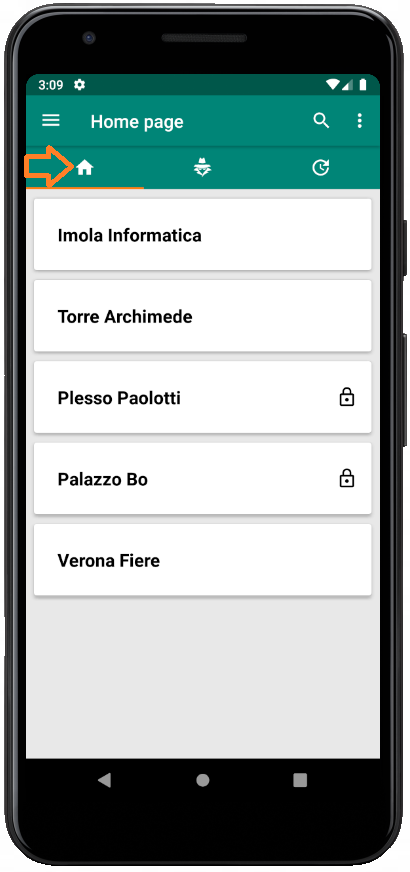
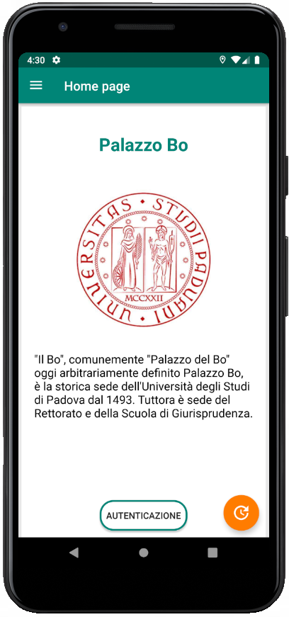

# Funzionalità dell'applicazione per utenti

L'applicazione Android viene utilizzata dagli utenti che devono o vogliono fare in modo che i loro movimenti di ingresso e uscita dalle organizzazioni e dai loro luoghi vengano tracciati. Il movimento viene tracciato solo dal punto di vista dell'orario e dell'utenza presso l'organizzazione, qualora presente e attiva.

All'utente dell'applicazione vengono offerte le funzionalità indicate in questa pagina.

## Registrazione

<iframe width="720" src="https://www.youtube.com/embed/t_jtcHEzhFw" frameborder="0" style="height: 540px" allow="accelerometer; autoplay; encrypted-media; gyroscope; picture-in-picture" allowfullscreen></iframe>

L'utente ha la possibilità di registrarsi inserendo la propria e-mail personale, password e accettando le condizioni d'uso di Stalker.

## Login e scaricamento della lista delle organizzazioni

<iframe width="720" src="https://www.youtube.com/embed/YPHun6qWReo" frameborder="0" style="height: 540px" allow="accelerometer; autoplay; encrypted-media; gyroscope; picture-in-picture" allowfullscreen></iframe>

L'utente può autenticarsi inserendo il proprio indirizzo e-mail e la propria password.
Se è il suo primo accesso all'applicazione Stalker dopo la registrazione, un pop-up appare per richiedere all'utente la possibilità di scaricare la lista delle organizzazioni dal server di Stalker. Gli utenti hanno la possibilità di accettare o rifiutare la proposta.

## Menu drawer

L'utente può accedere ad una serie di funzionalità utilizzando l'*Hamburger button* riportato in alto a sinistra della schermata dell'applicazione.

<figcaption align="center"> <em> Hamburger button </em> </figcaption>

Una volta cliccato su questo bottone apparirà il menu drawer, da cui è possibile accedere alle seguenti funzionalità:

- Attivare o disattivare il tracciamento tramite uno pulsante switch;
- Eseguire il logout;
- Ordinare alfabeticamente la lista delle organizzazioni.

<figcaption align="center"> <em> Menu drawer </em> </figcaption>

## Logout

<iframe width="720" src="https://www.youtube.com/embed/Rw4QFxDUisU" frameborder="0" style="height: 540px" allow="accelerometer; autoplay; encrypted-media; gyroscope; picture-in-picture" allowfullscreen></iframe>

L'utente può eseguire il logout aprendo il menu drawer e poi cliccando su "Logout".

## Scaricamento della lista delle organizzazioni

<figcaption align="center"> <em> Pop-up scaricamento lista organizzazione </em> </figcaption>

L'utente, per poter visualizzare la lista di tutte le organizzazioni disponibili in Stalker, deve prima scaricarla. Una volta richiesto lo scaricamento, se dovesse decidere di annullarlo o se venisse a mancare la connessione ad Internet, apparirebbe nella schermata principale un tasto per ritentare l'operazione.

## Lista delle organizzazioni

<figcaption align="center"> <em> Lista organizzazioni </em> </figcaption>

In questa sezione vi sono tutte le organizzazioni scaricate dal server.

## Aggiornamento lista delle organizzazioni 

<iframe width="720" src="https://www.youtube.com/embed/cPhIBJBg2pY" frameborder="0" style="height: 540px" allow="accelerometer; autoplay; encrypted-media; gyroscope; picture-in-picture" allowfullscreen></iframe>

L'utente può aggiornare la lista delle organizzazioni eseguendo uno *swipe down* nella schermata principale.

## MyStalkersList

<figcaption align="center"> <em> MyStalkersList </em> </figcaption>

In questa sezione vi sono tutte le organizzazioni da cui l'utente ha scelto di essere tracciato.

## Ordinamento alfabetico della lista delle organizzazioni

<iframe width="720" src="https://www.youtube.com/embed/4z8e3ciX33g" frameborder="0" style="height: 540px" allow="accelerometer; autoplay; encrypted-media; gyroscope; picture-in-picture" allowfullscreen></iframe>

L'utente può eseguire l'ordinamento alfabetico della lista delle organizzazioni aprendo il menu drawer e poi cliccando su "Ordinamento Alfabetico".

## Ricerca

<figcaption align="center"> <em> Ricerca organizzazione </em> </figcaption>

In alto c'è la barra principale dell'applicazione e vi è una sezione di ricerca. Con essa è possibile eseguire delle ricerche testuali per filtrare e visualizzare la lista delle organizzazioni.

## Visualizzazione pagina organizzazione

<figcaption align="center"> <em> Pagina dedicata all'organizzazione </em> </figcaption>

L'utente può entrare nella pagina dedicata di un'organizzazione cliccando l'elemento della lista ad essa appartenente. Al suo interno è possibile visualizzare il nome dell'organizzazione, l'immagine di anteprima, una descrizione, ed un pulsante `Autenticati` se l'organizzazione richiede un'autenticazione aziendale tramite LDAP.

## Aggiunta organizzazione in MyStalkersList

<iframe width="720" src="https://www.youtube.com/embed/D4_vzmNqs-4" frameborder="0" style="height: 540px" allow="accelerometer; autoplay; encrypted-media; gyroscope; picture-in-picture" allowfullscreen></iframe>

L'utente, tenendo premuto su un elemento della lista delle organizzazione, fa apparire un pop-up che permette di aggiungere l'organizzazione selezionata in MyStalkersList, o più semplicemente visualizzarne il contenuto. Se l'organizzazione richiede un'autenticazione presso l'organizzazione (tramite LDAP) allora con il pop-up è possibile solamente visualizzarne il contenuto.

## Autenticazione presso l'organizzazione LDAP e aggiunta di un'organizzazione che richiede tracciamento autenticato in MyStalkersList

<iframe width="720" src="https://www.youtube.com/embed/Qo5BAUyBx0g" frameborder="0" style="height: 540px" allow="accelerometer; autoplay; encrypted-media; gyroscope; picture-in-picture" allowfullscreen></iframe>

L'utente deve accedere alla pagina dedicata dell'organizzazione che richiede tracciamento autenticato per poterla aggiungere a MyStalkersList. Deve inizialmente autenticarsi tramite le proprie credenziali LDAP (presso l'organizzazione). Se l'autenticazione avviene con successo, tale organizzazione compare in MyStalkersList.

## Eliminazione organizzazione da MyStalkersList

<iframe width="720" src="https://www.youtube.com/embed/Uz0xGepIdYs" frameborder="0" style="height: 540px" allow="accelerometer; autoplay; encrypted-media; gyroscope; picture-in-picture" allowfullscreen></iframe>

L'utente, tenendo premuto sull'elemento di MyStalkersList, fa comparire un pop-up che richiede se si intende rimuovere l'organizzazione dalla lista.

## Attivazione tracciamento

<iframe width="720" src="https://www.youtube.com/embed/Lvfcnkc-trg" frameborder="0" style="height: 540px" allow="accelerometer; autoplay; encrypted-media; gyroscope; picture-in-picture" allowfullscreen></iframe>

Il tracciamento è possibile attivarlo attraverso lo switch collocato nel menu drawer apribile con la pressione dell'*Hamburger button*. Di default è disattivato e, una volta attivato, l'utente passa in modalità di tracciamento anonimo (per cui il tracciamento presso le organizzazioni in MyStalkersList viene fatto solo anonimo anche se possono richiedere tracciamento autenticato).

La prima volta che si utilizza questa funzionalità sul dispositivo viene visualizzato un pop-up in cui l'utente dovrà accettare la richiesta del sistema per poter accedere alle funzionalità di geolocalizzazione del dispositivo.

<figcaption align="center"> <em> Pop-up di accettazione permessi per il tracciamento </em> </figcaption>

## Tracciamento

<iframe width="720" src="https://www.youtube.com/embed/YAfcW1RyUL8" frameborder="0" style="height: 540px" allow="accelerometer; autoplay; encrypted-media; gyroscope; picture-in-picture" allowfullscreen></iframe>

La funzionalità di tracciamento consente all'utente di tracciare gli ingressi e le uscite presso le organizzazioni e presso i loro luoghi. Il tracciamento, come già detto, avviene solamente per le organizzazioni presenti in MyStalkersList. Se l'organizzazione richiede l'autenticazione con credenziali dell'organizzazione (LDAP) allora è possibile cambiare, tramite uno switch presente nella pagina dell'organizzazione, la tipologia di tracciamento da anonimo (default) ad autenticato (e viceversa). La modalità di tracciamento autenticato permette alle organizzazioni di visualizzare a posteriori gli accessi (insieme di un ingresso e un'uscita da un'organizzazione o luogo) di coloro che le hanno aggiunte a MyStalkersList.

## Tracciamento in background

<iframe width="720" src="https://www.youtube.com/embed/c_spUnOrv9s" frameborder="0" style="height: 540px" allow="accelerometer; autoplay; encrypted-media; gyroscope; picture-in-picture" allowfullscreen></iframe>

Se il tracciamento è attivo e si esce dall'applicazione, l'applicazione continua a funzionare passando alla modalità di tracciamento in background. È possibile notare sulla barra delle notifiche di Android un'area dedicata all'applicazione Stalker dove si può riaprirla oppure bloccare il tracciamento e conseguentemente uscire definitivamente dall'applicazione.