# 3.1 Funzionalità dell'applicazione web per amministratori

L'applicazione web viene utilizzata dagli amministratori che hanno la necessità di tracciare i movimenti di ingresso e uscita dalle organizzazioni e dai luoghi in esse.

All'amministratore, attraverso l'applicazione web, vengono offerte le funzionalità indicate in questa pagina.

## 3.1.1 Login

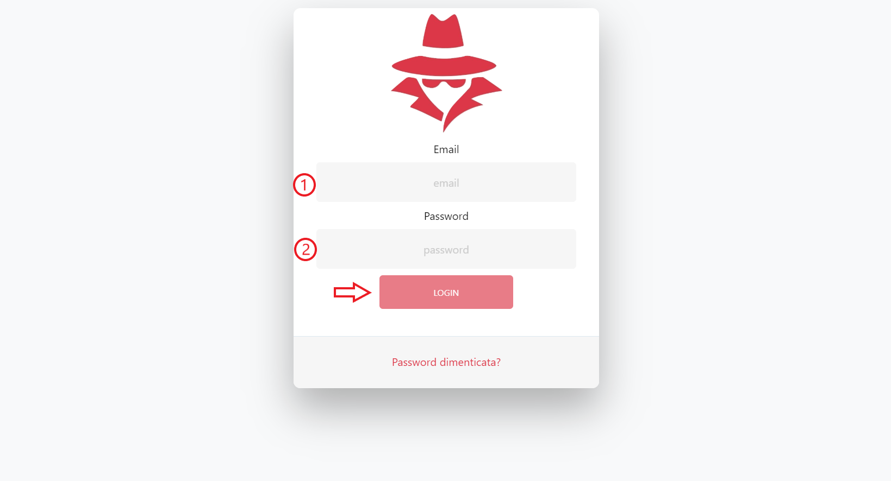
<figcaption align="center"> <em> Schermata di login </em> </figcaption>

L'amministratore può autenticarsi inserendo la propria e-mail e password. Per farlo deve inserire, nel primo campo di testo, la propria email e nel secondo campo di testo la corrispettiva password. Dopo di che, cliccare sul bottone **Login** per effettuare l'autenticazione. La procedura viene illustrata nel seguente video:

<iframe width="720" height="540" src="https://www.youtube.com/embed/-IPXDqfyKcQ" frameborder="0" allow="accelerometer; autoplay; encrypted-media; gyroscope; picture-in-picture" allowfullscreen></iframe>
## 3.1.2 Logout

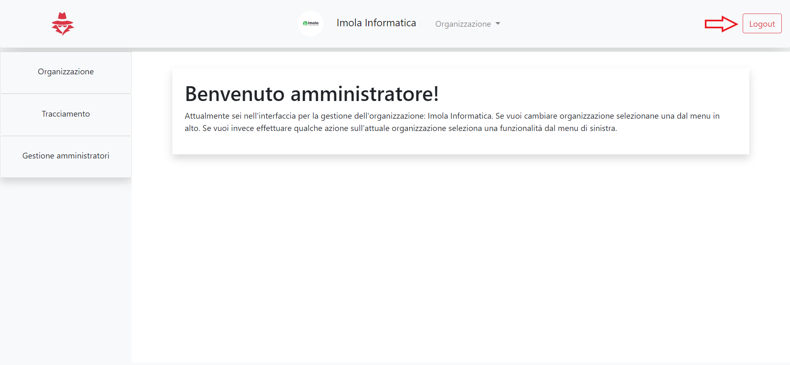
<figcaption align="center"> <em> Schermata di logout </em> </figcaption>

L'amministratore, una volta effettuata l'autenticazione, può eseguire il logout da qualsiasi pagina della web-app. Sarà sufficiente cliccare sul pulsante in alto a destra denominato **Logout**. I passaggi vengono mostrati nel seguente video:

<iframe width="720" src="https://www.youtube.com/embed/ccjX0b9QQ0I" frameborder="0" style="height: 540px" allow="accelerometer; autoplay; encrypted-media; gyroscope; picture-in-picture" allowfullscreen></iframe>

## 3.1.3 Reset password

<figcaption align="center"> <em> Schermata di reset password </em> </figcaption>

L'amministratore può effettuare il reset della password qualora non se la ricordasse. Per eseguire tale operazione deve cliccare su **Password dimenticata** presente nella pagina di login, come viene indicato nell'immagine.

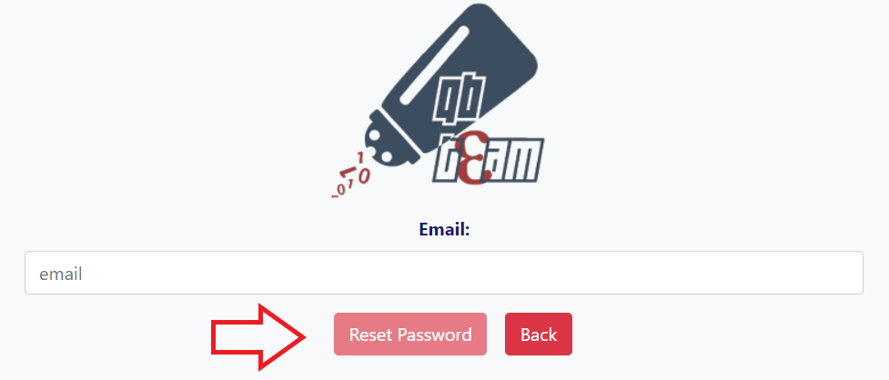
<figcaption align="center"> <em> Schermata di reset password </em> </figcaption>

 Successivamente deve inserire l'email dell'account di cui vuole effettuare il reset della password. Gli verrà dunque inviata una e-mail con un link che porterà a una pagina dove sarà possibile inserire la nuova password, di almeno 8 caratteri. Per annullare la procedura basta cliccare sul pulsante **Torna indietro**. I passaggi appena descritti sono mostrati nel seguente video:

<iframe width="720" height="540" src="https://www.youtube.com/embed/z9YFaJqePDs" frameborder="0" allow="accelerometer; autoplay; encrypted-media; gyroscope; picture-in-picture" allowfullscreen></iframe>

## 3.1.4 Selezione dell'organizzazione

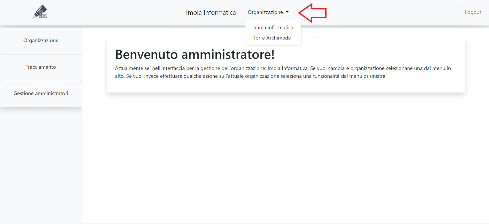
<figcaption align="center"> <em> Schermata di selezione </em> </figcaption>

L'amministratore, nell'home page, può selezionare l'organizzazione che desidera dal menù in alto a sinistra, accedendo alle svariate funzionalità che la web-app offre.

!!!info
    L'amministratore visualizzerà solo le organizzazioni a cui ha accesso.

<iframe width="720" height="540" src="https://www.youtube.com/embed/uW7x0qzZMeI" frameborder="0" allow="accelerometer; autoplay; encrypted-media; gyroscope; picture-in-picture" allowfullscreen></iframe>

## 3.1.5 Informazioni sull'organizzazione

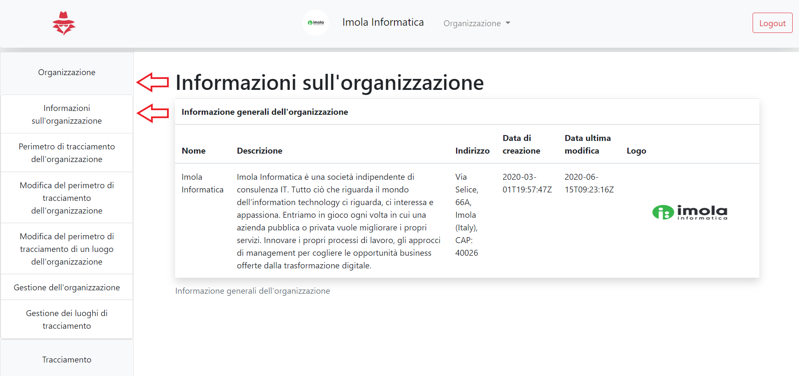
<figcaption align="center"> <em> Schermata delle informazioni sull'organizzazione </em> </figcaption>

L'amministratore ha la possibilità di visionare le seguenti informazioni di una specifica organizzazione:

- Nome;
- Descrizione;
- Via;
- Numero civico;
- Codice postale;
- Città;
- Stato;
- Data di inserimento dell'organizzazione in Stalker;
- Data dell'ultima modifica;
- Logo dell'organizzazione.

Per poterlo fare, si deve cliccare nel menù laterale a sinistra la voce **Organizzazione** e poi sulla voce **Informazioni sull'organizzazione**. Verrà quindi aperta una finestra con una tabella avente le informazioni descritte in precedenza. Procedura illustrata nel seguente video:

<iframe width="720" height="540" src="https://www.youtube.com/embed/KzR_oE_x_uY" frameborder="0" allow="accelerometer; autoplay; encrypted-media; gyroscope; picture-in-picture" allowfullscreen></iframe>

## 3.1.6 Ritorno alla home page

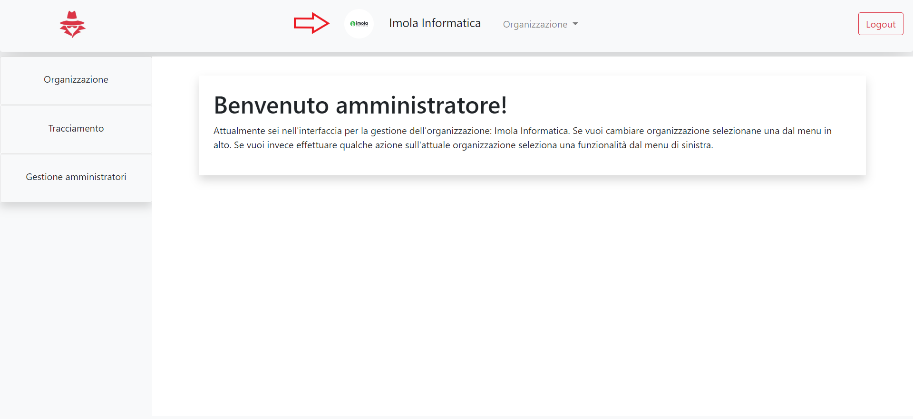
<figcaption align="center"> <em> Schermata della homepage </em> </figcaption>

Se l'amministratore si dovesse trovare nella pagina di un'organizzazione e volesse ritornare all'home page deve cliccare sul nome dell'organizzazione nella barra principale in alto nella schermata. Il seguente video ne illustra la procedura:

<iframe width="720" src="https://www.youtube.com/embed/H730w4P49oQ" frameborder="0" style="height: 540px" allow="accelerometer; autoplay; encrypted-media; gyroscope; picture-in-picture" allowfullscreen></iframe>

## 3.1.7 Visualizzazione del perimetro di tracciamento dell'organizzazione

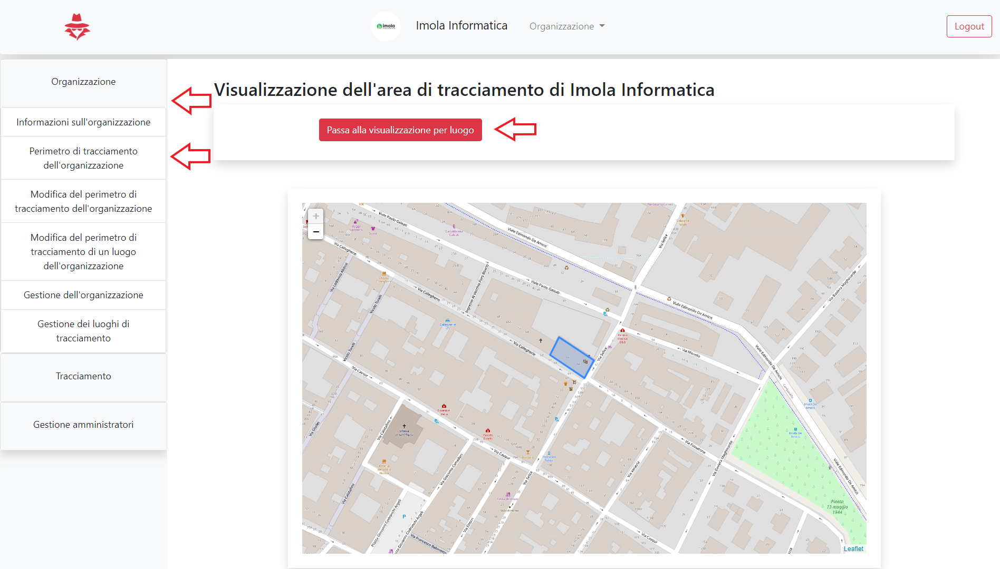
<figcaption align="center"> <em> Schermata del perimetro di tracciamento </em> </figcaption>

L'amministratore ha la possibilità di visionare il perimetro dell'organizzazione tramite una mappa.

Per farlo si dovrà cliccare nel menù laterale a sinistra sulla voce **Organizzazione** e dopo di che cliccare sulla voce **Perimetro di tracciamento dell'organizzazione**. Verrà perciò aperta una finestra con una mappa geografica dove verrà mostrata la posizione dell'organizzazione e il suo perimetro di tracciamento. Il seguente video ne mostra la procedure:

<iframe width="720" height="540" src="https://www.youtube.com/embed/srl-6YW8rzQ" frameborder="0" allow="accelerometer; autoplay; encrypted-media; gyroscope; picture-in-picture" allowfullscreen></iframe>

## 3.1.8 Visualizzazione del perimetro di tracciamento del luogo di un'organizzazione

<figcaption align="center"> <em> Schermata del perimetro di tracciamento </em> </figcaption>

L'amministratore ha la possibilità di visionare il perimetro del luogo di un'organizzazione tramite una mappa.

Perciò si dovrà cliccare nel menù laterale a sinistra sulla voce **Organizzazione** e dopo di che cliccare sulla voce **Perimetro di tracciamento dell'organizzazione**. Cliccare poi sul bottone **Passa alla visualizzazione per luogo** come indicato nell'immagine qui sopra. Verrà perciò aperta una finestra con una mappa geografica, dove verrà mostrata la posizione del primo luogo  dell'organizzazione e il suo perimetro di tracciamento.

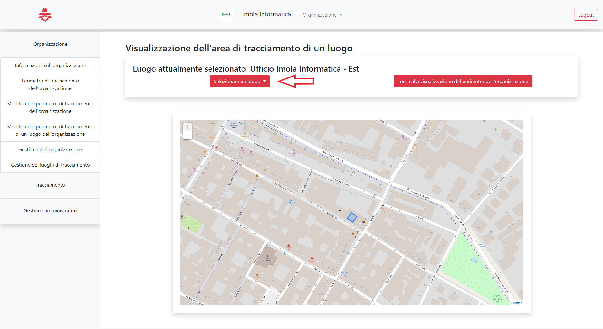
<figcaption align="center"> <em> Schermata del perimetro di tracciamento </em> </figcaption>

E' possibile, come mostrato nell'immagine qui sopra selezionare un qualsiasi luogo dell'organizzazione selezionando il suo nome nel menù a tendina, cosi che si possa visualizzare il perimetro di ogni luogo presente nell'organizzazione. Inoltre è possibile ritornare alla visualizzazione del perimetro di tracciamento dell'organizzazione cliccando sul bottone **Torna alla visualizzazione del perimetro dell'organizzazione** . Il seguente video mostra quanto spiegato precedentemente:

<iframe width="720" height="540" src="https://www.youtube.com/embed/srl-6YW8rzQ" frameborder="0" allow="accelerometer; autoplay; encrypted-media; gyroscope; picture-in-picture" allowfullscreen></iframe>

## 3.1.9 Modifica del perimetro di tracciamento dell'organizzazione
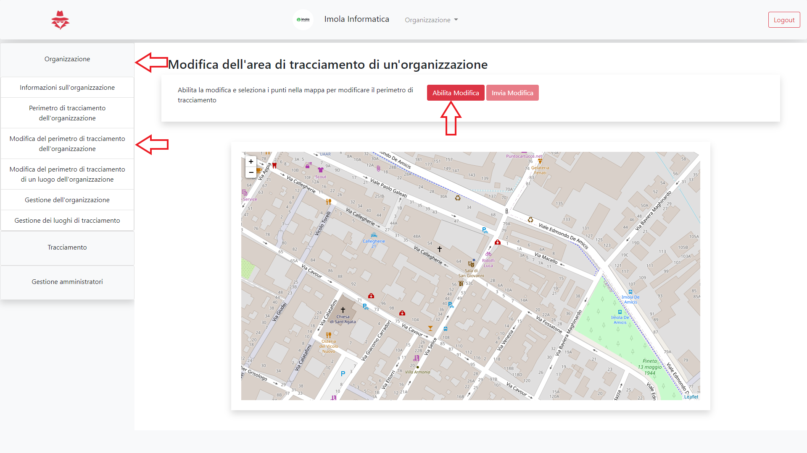
<figcaption align="center"> <em> Schermata della modifica del perimetro di tracciamento </em> </figcaption>

L'amministratore gestore ha la possibilità di modificare il perimetro dell'organizzazione tramite una mappa.

Per farlo dovrà cliccare nel menù laterale a sinistra sulla voce **Organizzazione** e dopo di che cliccare sulla voce **Modifica del perimetro di tracciamento dell'organizzazione**.  Prima però, di poter effettuare le modifiche del perimetro, si dovrà cliccare sul bottone **Abilita modifica** come indicato nell'immagine qui sopra.
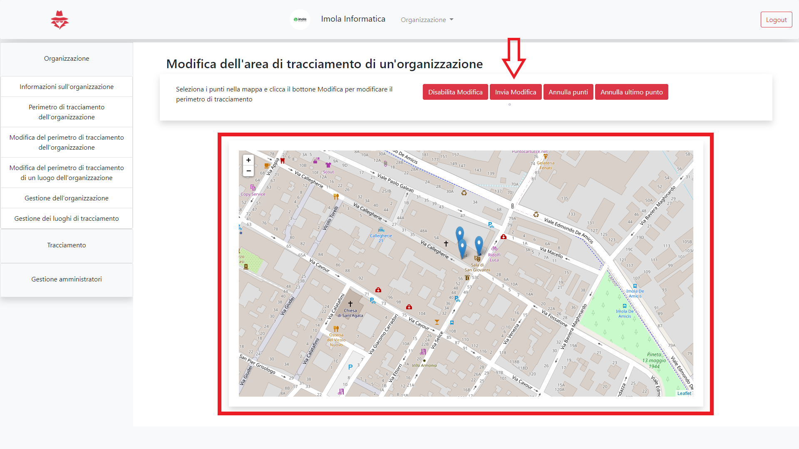
<figcaption align="center"> <em> Schermata della modifica del perimetro di tracciamento </em> </figcaption>

Una volta abilitata la modifica sarà possibile selezionare le coordinate del perimetro di tracciamento, cliccando semplicemente nella mappa che viene mostrata nell'immagine qui sopra, nel caso si sbagli a cliccare è possibile rimuovere l'ultimo punto inserito o eventualmente, è possibile eliminare tutti i punti selezionati. Una volta finito, per inviare le modifiche, si clicca il bottone **Modifica**.

!!!info
    Per poter inviare la modifica pero sarà necessario selezionare almeno tre punti e l'area di tracciamento non deve essere più grande di una certa soglia prestabilita.

Il seguente video mostra quanto spiegato precedentemente:

<iframe width="720" height="540" src="https://www.youtube.com/embed/lkrz28XE8Sw" frameborder="0" allow="accelerometer; autoplay; encrypted-media; gyroscope; picture-in-picture" allowfullscreen></iframe>

## 3.1.10 Modifica del perimetro di tracciamento del luogo di un'organizzazione

<figcaption align="center"> <em> Schermata della modifica del perimetro di tracciamento </em> </figcaption>

L'amministratore gestore ha la possibilità di modificare il perimetro del luogo dell'organizzazione tramite una mappa.

Per farlo dovrà cliccare nel menù laterale a sinistra sulla voce **Organizzazione** e dopo di che cliccare sulla voce **Modifica del perimetro di tracciamento di un luogo dell'organizzazione**. Successivamente, si seleziona nel menu a tendina indicato nell'immagine, il luogo a cui si vuole apportare la modifica al perimetro di tracciamento. Prima però, di poter effettuare le modifiche del perimetro, si dovrà cliccare sul bottone **Abilita modifica** come indicato nell'immagine qui sopra.
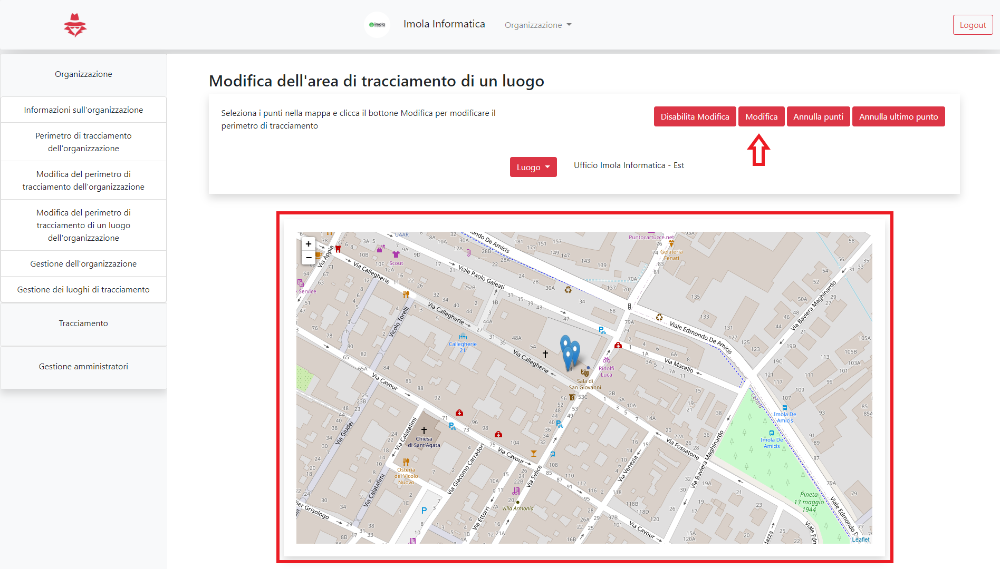
<figcaption align="center"> <em> Schermata della modifica del perimetro di tracciamento </em> </figcaption>

Una volta abilitata la modifica sarà possibile selezionare le coordinate del perimetro di tracciamento, cliccando semplicemente nella mappa che viene mostrata nell'immagine qui sopra, nel caso si sbagli a cliccare è possibile rimuovere l'ultimo punto inserito o eventualmente, è possibile eliminare tutti i punti selezionati. Una volta finito, per inviare le modifiche, si clicca il bottone **Modifica**.

!!!info
    Per poter inviare la modifica pero, sarà necessario selezionare almeno tre punti e l'area di tracciamento non deve essere ne più grande e ne fuoriuscire dal perimetro di tracciamento dell'organizzazione, inoltre non deve sovrapporsi ad altre area di tracciamento di altri luoghi.

Il seguente video mostra quanto spiegato precedentemente:

<iframe width="720" height="540" src="https://www.youtube.com/embed/pwuUwYMAG_4" frameborder="0" allow="accelerometer; autoplay; encrypted-media; gyroscope; picture-in-picture" allowfullscreen></iframe>

## 3.1.11 Modifica dei dati di un'organizzazione

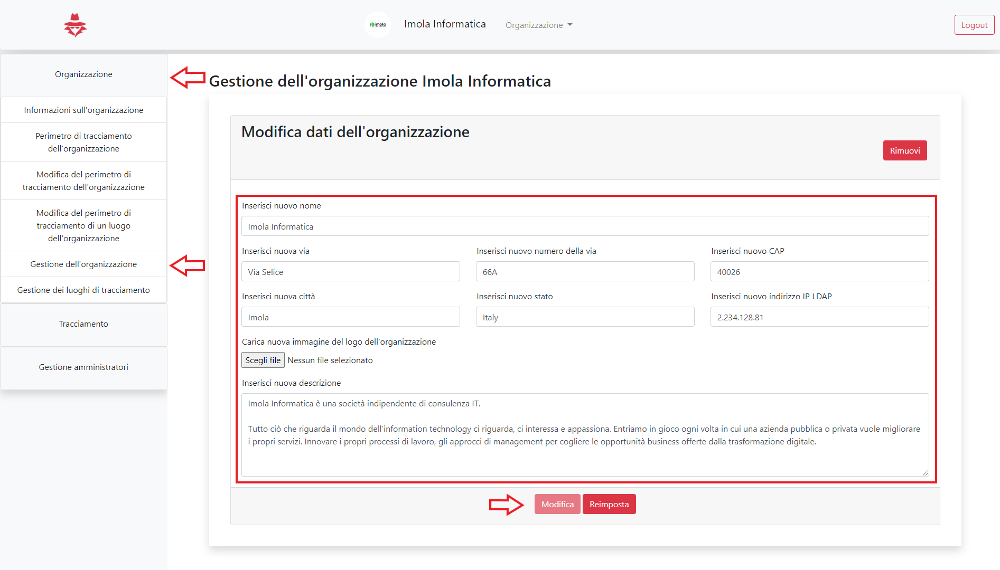
<figcaption align="center"> <em> Schermata della modifica dei dati </em> </figcaption>

L'amministratore gestore ha la possibilità di modificare i dati dell'organizzazione.

Per effettuare la modifica dei dati di un organizzazione occorre cliccare nel menù laterale a sinistra sulla voce **Organizzazione** e dopo di che cliccare sulla voce **Gestione dell'organizzazione**. Una volta fatto ciò si aprirà una schermata con una form avente nei vari campi, i valori attuali dell'organizzazione. Per modificarli basterà inserire nei campi della form dei nuovi valori validi e successivamente cliccare sul bottone **Modifica** per inviare le modiche fatte. Nel caso in cui si sbagli è possibile annullare la modifica cliccando sul bottone a lato.

I campi che possono essere modificati sono:

- Nome;
- Descrizione;
- Via;
- Numero civico;
- Codice postale;
- Città;
- Stato;
- URL del server LDAP se l'organizzazione richiede autenticazione tramite LDAP;
- Logo dell'organizzazione.

Il seguente video mostra quanto spiegato precedentemente:

<iframe width="7420" height="540" src="https://www.youtube.com/embed/lamSL-IgUpk" frameborder="0" allow="accelerometer; autoplay; encrypted-media; gyroscope; picture-in-picture" allowfullscreen></iframe>

## 3.1.12 Invio della richiesta di rimozione di un'organizzazione

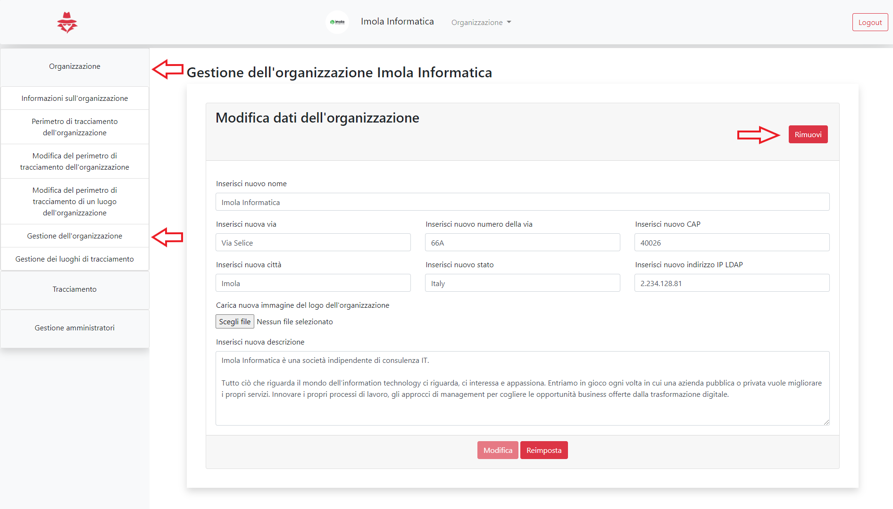
<figcaption align="center"> <em> Schermata della modifica dei dati </em> </figcaption>

L'amministratore proprietario ha la possibilità inviare la richiesta di eliminazione dell'organizzazione.

Per farlo occorre cliccare nel menù laterale a sinistra sulla voce **Organizzazione** e dopo di che cliccare sulla voce **Gestione dell'organizzazione**. Una volta fatto ciò bisogna cliccare sul bottone **Rimuovi**, che si trova nell'intestazione della form come indicato nell'immagine.

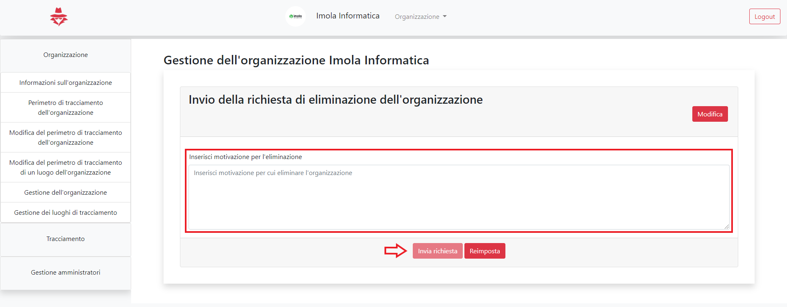
<figcaption align="center"> <em> Schermata della rimozione </em> </figcaption>

Successivamente si aprirà la schermata che viene mostrata nell'immagine qui sopra, dove si dovrà inserire nella form la motivazione per cui si vuole eliminare l'organizzazione. Per inviare la richiesta si dovrà cliccare sul bottone **Invia richiesta**. Nel caso in cui si sbagli è possibile annullare la rimozione cliccando sul bottone a lato.

!!!info
    La descrizione della richiesta deve essere lunga almeno 100 caratteri e non più 512 caratteri.

Il seguente video mostra quanto spiegato precedentemente:

prossimamente.....

## 3.1.13 Creazione di un nuovo luogo di un'organizzazione

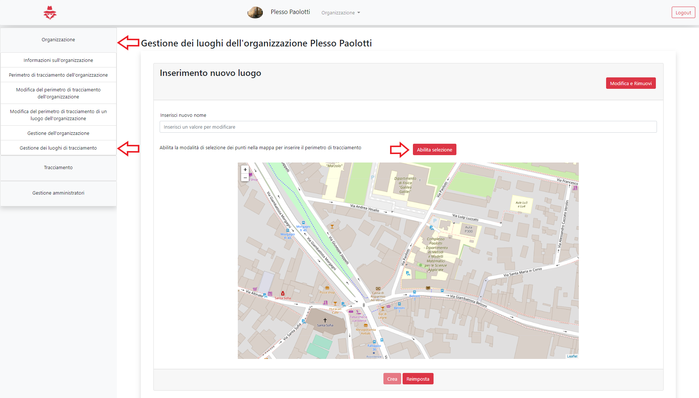
<figcaption align="center"> <em> Schermata della creazione </em> </figcaption>

L'amministratore gestore ha la possibilità inviare la richiesta di creazione di un nuovo luogo dell'organizzazione.

Per farlo occorre cliccare nel menù laterale a sinistra sulla voce **Organizzazione** e dopo di che cliccare sulla voce **Gestione dei luoghi di tracciamento**. Successivamente apparirà una form con una mappa dove inserire le coordinate del nuovo luogo, come mostrato dalle immagini. Per poter inserire le coordinate del nuovo luogo, occorre abilitare l'inserimento delle coordinate cliccando il bottone **Abilita selezione** come indicato dell'immagine qui sopra, dopo di che si potrà interagire con la mappa per l'inserimento delle coordinate.

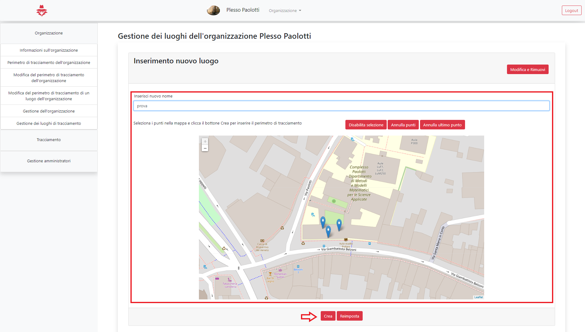
<figcaption align="center"> <em> Schermata della creazione </em> </figcaption>

Nel caso si sbagli a cliccare durante l'inserimento delle coordinate, è possibile rimuovere l'ultimo punto inserito o eventualmente, è possibile eliminare tutti i punti selezionati. Infine dopo aver inserito il nome e le coordinate del nuovo luogo, cliccando sul bottone **Crea**, come indicato nella immagine qui sopra, si invierà la richiesta di creazione di un nuovo luogo nell'organizzazione.

!!!info
    Per poter inviare la creazione pero, sarà necessario selezionare almeno tre punti e l'area di tracciamento non deve essere ne più grande e ne fuoriuscire dal perimetro di tracciamento dell'organizzazione, inoltre non deve sovrapporsi ad altre area di tracciamento di altri luoghi.

Il seguente video mostra quanto spiegato precedentemente:

<iframe width="720" height="540" src="https://www.youtube.com/embed/LI4g8p20BN0" frameborder="0" allow="accelerometer; autoplay; encrypted-media; gyroscope; picture-in-picture" allowfullscreen></iframe>

## 3.1.14 Modifica di un luogo dell'organizzazione

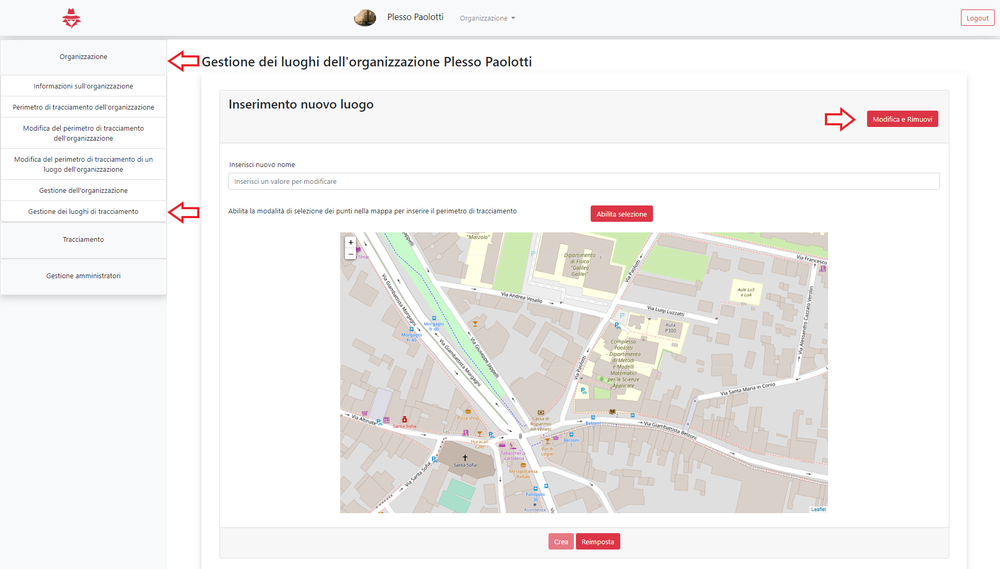
<figcaption align="center"> <em> Schermata della creazione </em> </figcaption>

L'amministratore gestore ha la possibilità di modificare un luogo dell'organizzazione.

Per farlo occorre cliccare nel menù laterale a sinistra sulla voce **Organizzazione** e dopo di che cliccare sulla voce **Gestione dei luoghi di tracciamento**. Successivamente bisogna cliccare sul bottone **Modifica e rimuovi** come indicato nell'immagine qui sopra, e si aprirà una form dove inserire il nuovo nome del luogo dell'organizzazione, come si può vedere nell'immagine qui sotto.

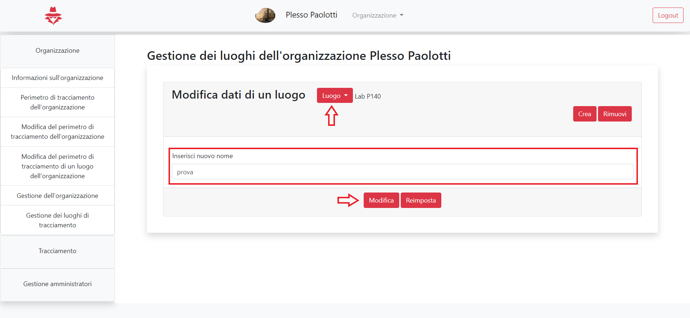
<figcaption align="center"> <em> Schermata della modifica </em> </figcaption>

Per scegliere quale luogo modificare basta scegliere uno tra quelli disponibili nel menu a tendina indicato nell'immagine qui sopra. Per inviare la modifica infine, basta cliccare sul bottone **Modifica** indicato in foto.

Il seguente video mostra quanto spiegato precedentemente:

<iframe width="720" height="540" src="https://www.youtube.com/embed/LI4g8p20BN0?start=22" frameborder="0" allow="accelerometer; autoplay; encrypted-media; gyroscope; picture-in-picture" allowfullscreen></iframe>

## 3.1.15 Eliminazione di un luogo dell'organizzazione

<figcaption align="center"> <em> Schermata della creazione </em> </figcaption>

L'amministratore gestore ha la possibilità di eliminare un luogo dell'organizzazione.

Per farlo occorre cliccare nel menù laterale a sinistra sulla voce **Organizzazione** e dopo di che cliccare sulla voce **Gestione dei luoghi di tracciamento**. Successivamente bisogna cliccare sul bottone **Modifica e rimuovi** come indicato nell'immagine qui sopra.

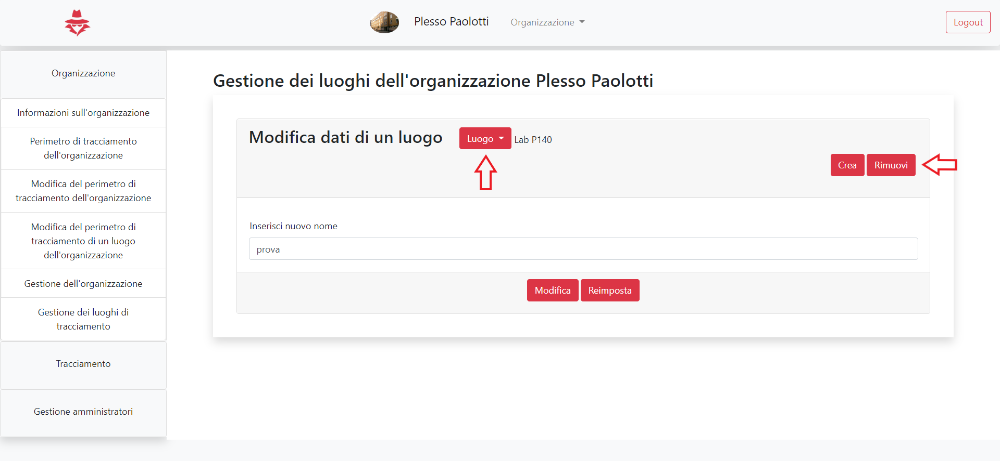
<figcaption align="center"> <em> Schermata della rimozione </em> </figcaption>

Come si può vedere dall'immagine qui sopra si aprirà una schermata dove è possibile selezionare quale luogo eliminare da un menù a tendina, una volta scelto il luogo da eliminare, si deve cliccare sul pulsante **Rimuovi** indicato nell'immagine qui sopra per rimuovere il luogo.

Il seguente video mostra quanto spiegato precedentemente:

<iframe width="720" height="540" src="https://www.youtube.com/embed/LI4g8p20BN0?start=37" frameborder="0" allow="accelerometer; autoplay; encrypted-media; gyroscope; picture-in-picture" allowfullscreen></iframe>

## 3.1.16 Presenze utenti nell'organizzazione

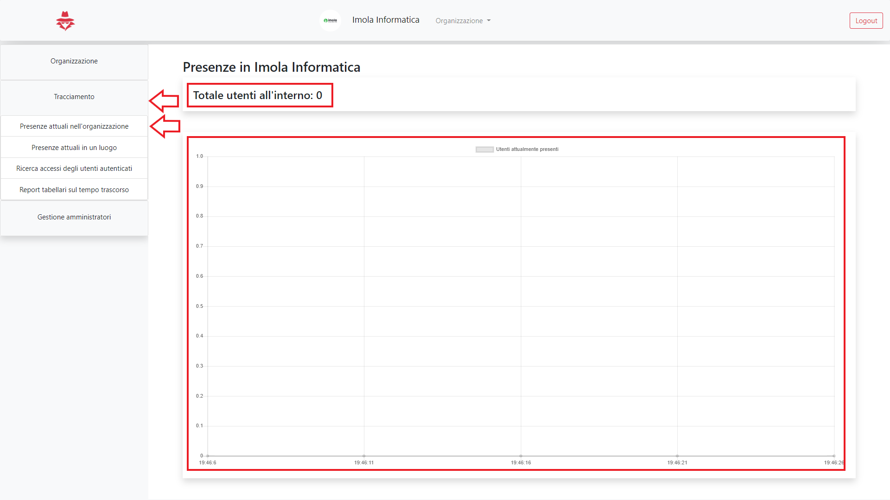
<figcaption align="center"> <em> Schermata del tracciamento</em> </figcaption>

L'amministratore ha la possibilità di monitorare le presenze degli utenti, in tempo reale, all'interno dell'organizzazione. Per farlo si dovrà cliccare nel menù laterale a sinistra sulla voce **Tracciamento** e dopo di che cliccare sulla voce **presenze attuali nell'organizzazione**. Verrà perciò aperta una finestra con un contatore di presenze e un grafico che mostra uno storico degli accessi a partire da quando si è aperta la pagina, come mostrato nell'immagine qui sopra.

 I passi descritti precedentemente sono mostrati nel seguente video:

<iframe width="720" height="540" src="https://www.youtube.com/embed/WwD2JblYdk4" frameborder="0" allow="accelerometer; autoplay; encrypted-media; gyroscope; picture-in-picture" allowfullscreen></iframe>

## 3.1.17 Presenze utenti in un luogo dell'organizzazione

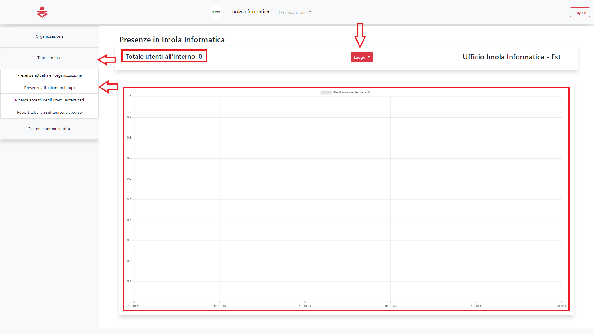
<figcaption align="center"> <em> Schermata del tracciamento</em> </figcaption>

L'amministratore ha la possibilità di monitorare le presenze degli utenti, in tempo reale, all'interno di un luogo dell'organizzazione. Per farlo si dovrà cliccare nel menù laterale a sinistra sulla voce **Tracciamento** e dopo di che cliccare sulla voce **presenze attuali in un luogo**. Verrà perciò aperta una finestra con un contatore di presenze e un grafico che mostra uno storico degli accessi a partire da quando si è aperta la pagina. Per iniziare il monitoraggio pero, è necessario scegliere quale luogo dell'organizzazione si vuole monitorare, selezionando dal menu a tendina come indicato nell'immagine qui sopra.

 I passi descritti precedentemente sono mostrati nel seguente video:

<iframe width="720" height="540" src="https://www.youtube.com/embed/094m8TnzZFE" frameborder="0" allow="accelerometer; autoplay; encrypted-media; gyroscope; picture-in-picture" allowfullscreen></iframe>
## 3.16. Ricerca accessi degli utenti autenticati

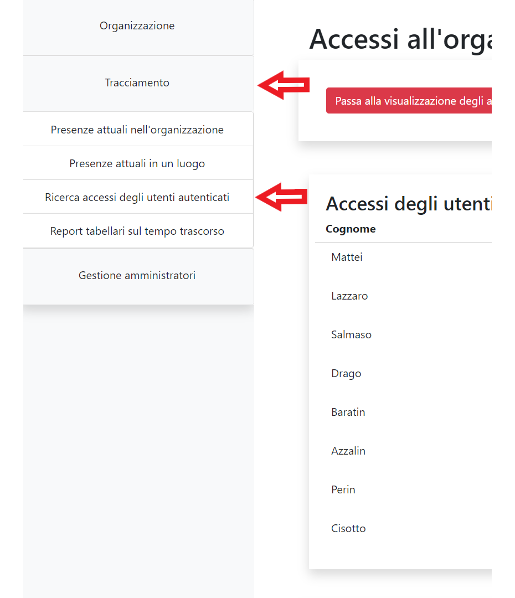
<figcaption align="center"> <em> Accedere agli accessi autenticati</em> </figcaption>

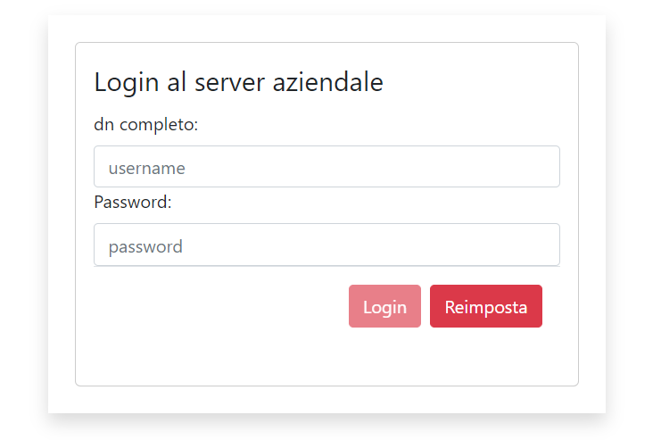
<figcaption align="center"> <em> Login al server aziendale</em> </figcaption>

L'amministratore, qualora non lo avesse già fatto, dovrà autenticarsi al server aziendale per accedere alla visualizzazione degli accessi da parte degli utenti autenticati. Sarà sufficiente inserire le credenziali nel form visualizzato e quindi cliccare sul pulsante **Login**.

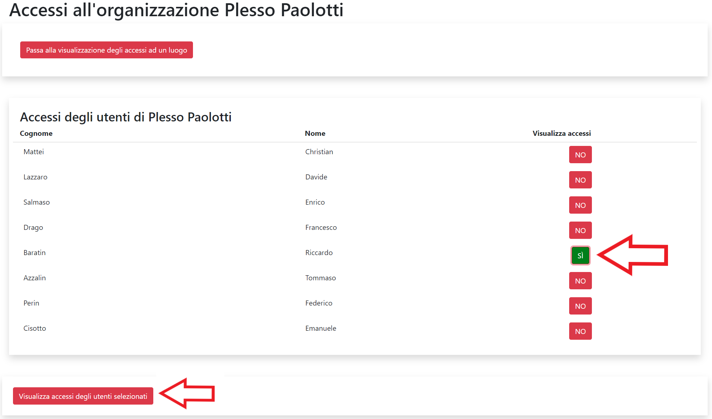
<figcaption align="center"> <em> Selezione degli utenti da visualizzare</em> </figcaption>

L'amministratore potrà ora selezionare gli utenti da visualizzare cliccando sui rispettivi pulsanti **Visualizza accessi**. Una volta selezionati gli utenti desiderati potrà cliccare sul pulsante **Visualizza accessi degli utenti selezionati** per visualizzarne i rispettivi accessi.

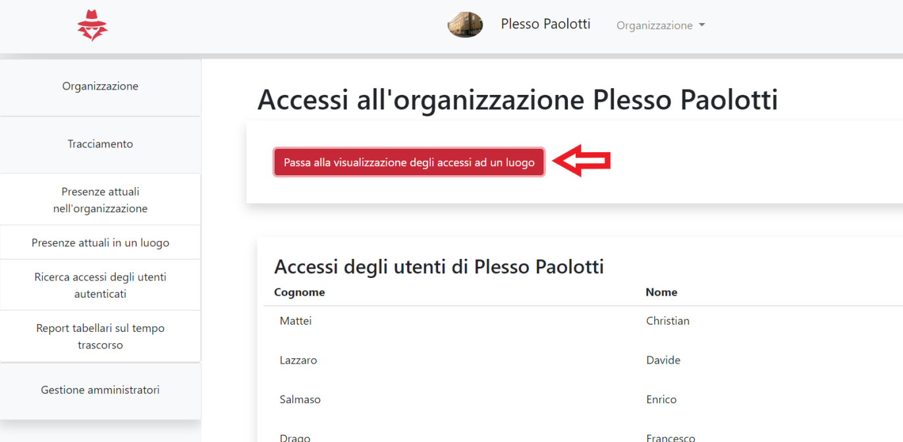
<figcaption align="center"> <em> Passaggio alla visualizzazione degli accessi nei luoghi</em> </figcaption>

Per passare alla visualizzazione degli accessi presso i luoghi sarà necessario premere il pulsante **Passa alla visualizzazione degli accessi ad un luogo** e poi selezionare il luogo desiderato dal menù a tendina a destra.

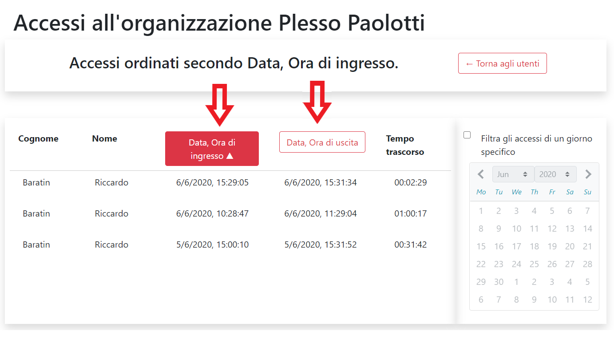
<figcaption align="center"> <em> Ordinamento per data degli accessi visualizzati</em> </figcaption>

L'amministratore ha la possibilità di ordinare gli accessi visualizzati o per data di ingresso o per data di uscita, sia in ordine decrescente che decrescente, semplicemente cliccando sui pulsanti posi nella tabella degli accessi. Il pulsante rosso indicherà l'ordinamento attualmente attivo.

<figcaption align="center"> <em> Visualizzazione degli accessi effettuati in uno specifico giorno</em> </figcaption>

L'amministratore ha inoltre la possibilità di filtrare gli accessi visualizzati secondo un giorno preciso attraverso il calendario posto a destra della tabella. Per filtrare gli accessi sarà sufficiente spuntare la casella affianco alla scritta *Filtra gli accessi di un giorno specifico* e selezionare quindi il giorno desiderato.

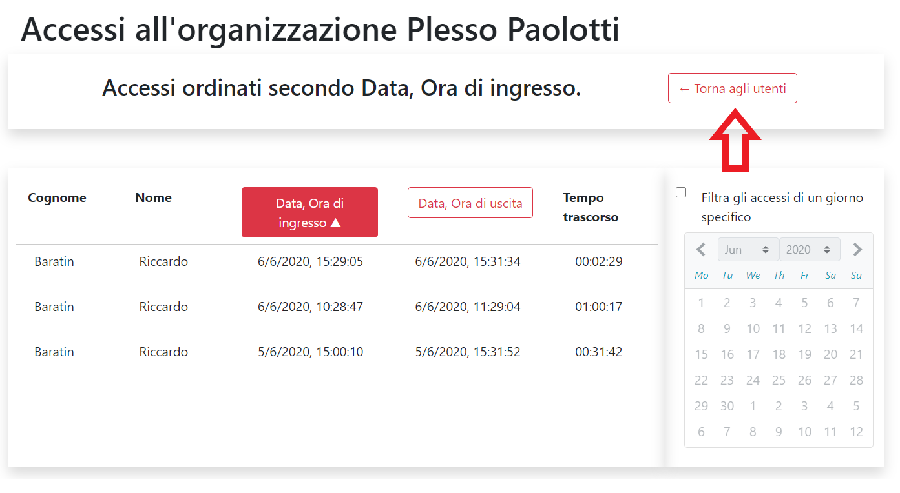
<figcaption align="center"> <em> Ritorno agli utenti</em> </figcaption>

Per tornare alla selezione degli utenti di cui visualizzare gli accessi sarà sufficiente cliccare il pulsante **Torna agli utenti** situato in alto sopra il calendario.

## 3.17. Visualizzazione dei report tabellari

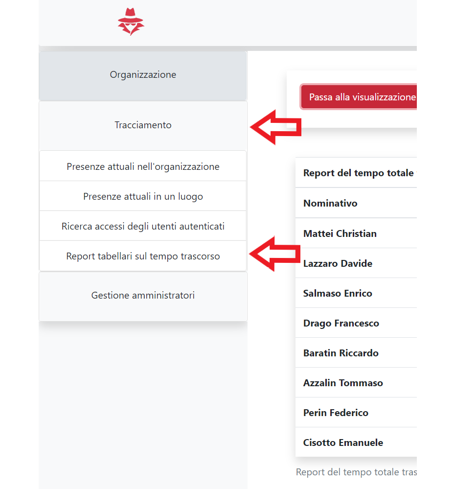
<figcaption align="center"> <em> Accedere agli accessi autenticati</em> </figcaption>

<figcaption align="center"> <em> Login al server aziendale</em> </figcaption>

L'amministratore, qualora non lo avesse già fatto, dovrà autenticarsi al server aziendale per accedere alla visualizzazione dei report tabellari. Sarà sufficiente inserire le credenziali nel form visualizzato e quindi cliccare sul pulsante **Login**.

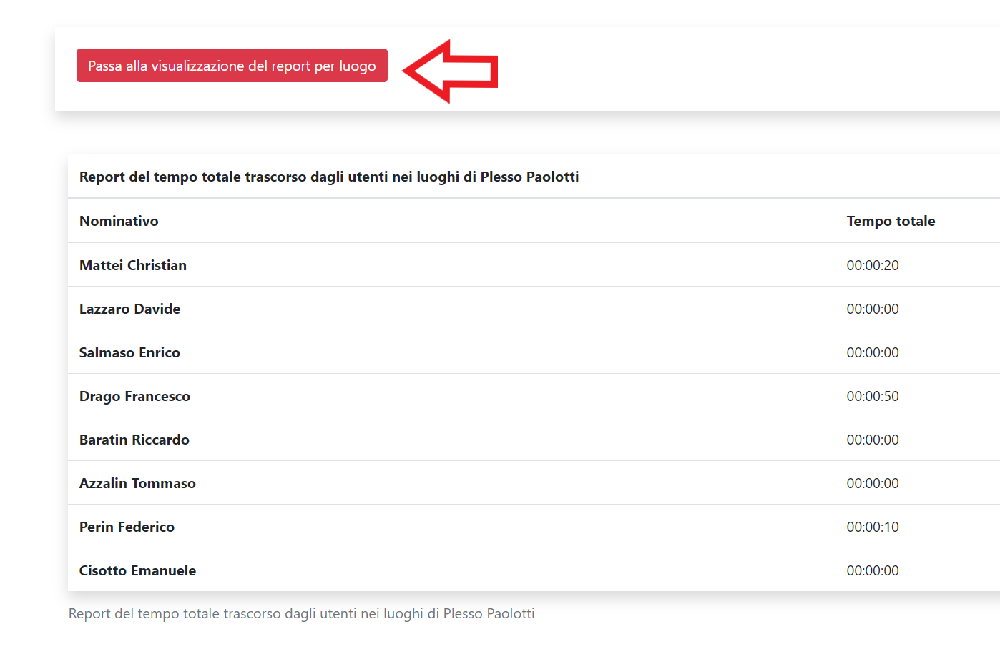
<figcaption align="center"> <em> Passaggio alla visualizzazione dei report per luogo</em> </figcaption>

Per passare alla visualizzazione dei report per singolo luogo sarà sufficiente cliccare sul pulsante **Passa alla visualizzazione del report per luogo**. Per tornare ai report generali sarà sufficiente ripremere lo stesso pulstante.

## 3.18. Creazione di un nuovo amministratore

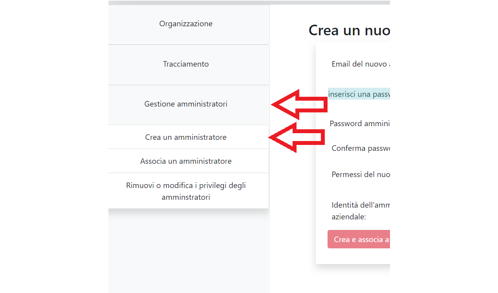
<figcaption align="center"> <em> Accesso alla sezione di creazione di un nuovo amministratore</em> </figcaption>

<figcaption align="center"> <em> Login al server aziendale</em> </figcaption>

Qualora l'organizzazione fosse a tracciamento autenticato e l'amministratore non avesse ancora fatto il login, allora sarà necessario effettuarlo per poter accedere alla creazione di un amministratore. Sarà sufficiente inserire le credenziali nel form visualizzato e quindi cliccare sul pulsante **Login**.

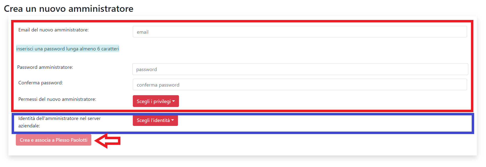
<figcaption align="center"> <em> Creazione di un nuovo amministratore</em> </figcaption>

Per creare un nuovo amministratore sarà necessario compilare tutti i campi presenti nel riquadro rosso. Il campo nel riquadro blu è opzionale ed è presente solo nelle organizzazioni a tracciamento autenticato.
Una volta compilati i campi sarà sufficiente cliccare sul pulsante indicato dalla freccia rossa in figura per creare l'amministratore.

!!!attention
    L'email inserita non deve essere già registrata presso il sistema.

## 3.19. Associazione di un amministratore

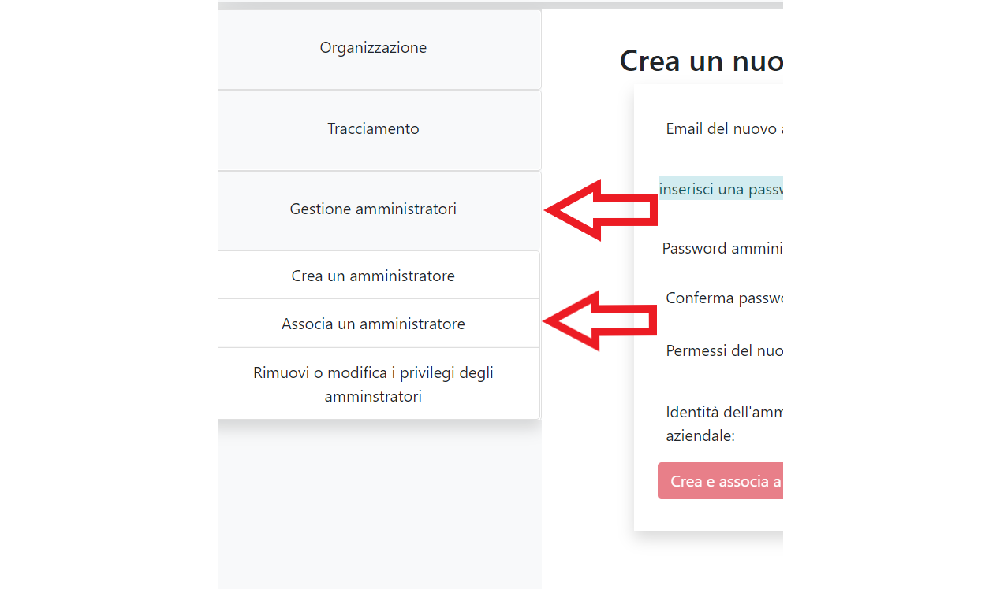
<figcaption align="center"> <em> Accesso alla sezione di associazione di un amministratore</em> </figcaption>

<figcaption align="center"> <em> Login al server aziendale</em> </figcaption>

Qualora l'organizzazione fosse a tracciamento autenticato e l'amministratore non avesse ancora fatto il login, allora sarà necessario effettuarlo per poter accedere alla sezione di associazione di un amministratore. Sarà sufficiente inserire le credenziali nel form visualizzato e quindi cliccare sul pulsante **Login**.

<figcaption align="center"> <em> Associazione di un amministratore</em> </figcaption>

Per associare un amministratore sarà necessario compilare tutti i campi presenti nel riquadro rosso. Il campo nel riquadro blu è opzionale ed è presente solo nelle organizzazioni a tracciamento autenticato.
Una volta compilati i campi sarà sufficiente cliccare sul pulsante indicato dalla freccia rossa in figura per associare l'amministratore.

!!!attention
    L'email inserita deve essere già registrata presso il sistema e l'amministratore identificato da quell'email non deve essere già associato all'organizzazione in questione.

## 3.19. Gestione degli amministratori

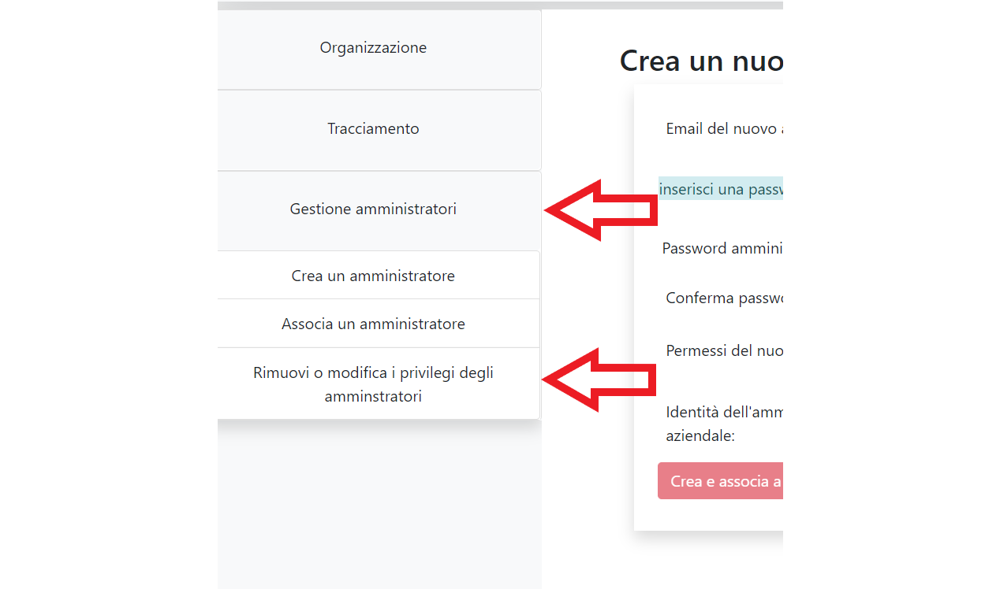
<figcaption align="center"> <em> Accesso alla sezione di gestione degli amministratori</em> </figcaption>

<figcaption align="center"> <em> Login al server aziendale</em> </figcaption>

Qualora l'organizzazione fosse a tracciamento autenticato e l'amministratore non avesse ancora fatto il login, allora sarà necessario effettuarlo per poter accedere alla sezione di gestione degli amministratori. Sarà sufficiente inserire le credenziali nel form visualizzato e quindi cliccare sul pulsante **Login**.

## 3.19.1. Modifica dei privilegi di un amministratore

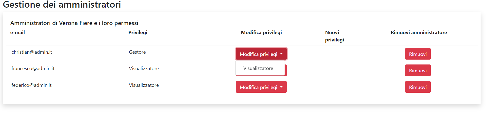
<figcaption align="center"> <em> Scelta dei nuovi privilegi di un amministratore</em> </figcaption>

Cliccare sul menù a tendina delL'amministratore desiderato, cliccare quindi sul nuovo privilegio da assegnare all'amministratore. Dopo aver fatto ciò la situazione sarà quella rappresentata nella figura seguente:

<figcaption align="center"> <em> Conferma delle modifiche</em> </figcaption>

Ora sarà possibile confermare le modifiche scelte cliccando sul pulsante verde indicato dalla freccia rossa nell'immagine precedente. Qualora le modifiche venissero salvate i nuovi privilegi dell'amministratore in questione saranno quelli identificati nel cerchio rosso.

## 3.19.2. Rimozione di un amministratore

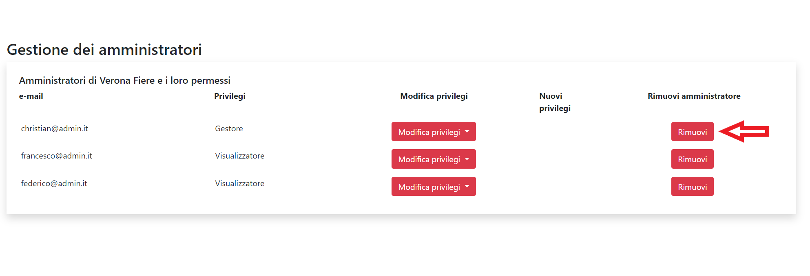
<figcaption align="center"> <em> Rimozione di un amministratore</em> </figcaption>

Per eliminare un amministratore sarà sufficiente cliccare il pulsante **Rimuovi** posizionato sulla relativa riga. L'immagine precedente indica, con la freccia rossa, il pussante per rimuovere l'admin con email *christian@admin.it*. Una volta cliccato il pulsante **Rimuovi** verrà richiesta una conferma di rimozione. Accettando la conferma si rimuoverà definitivamente l'amministratore dall'organizzazione.
