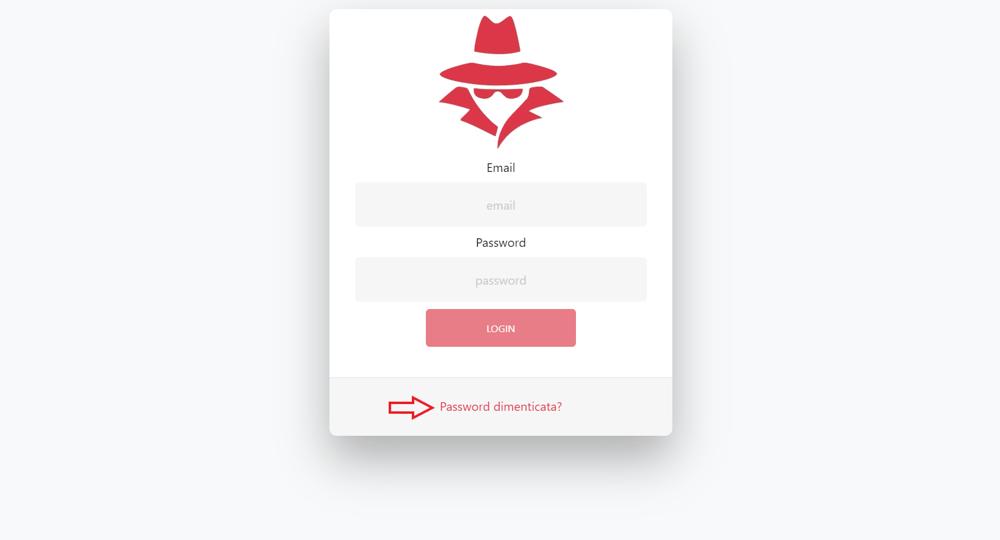
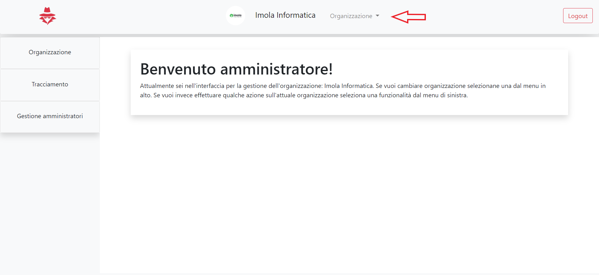
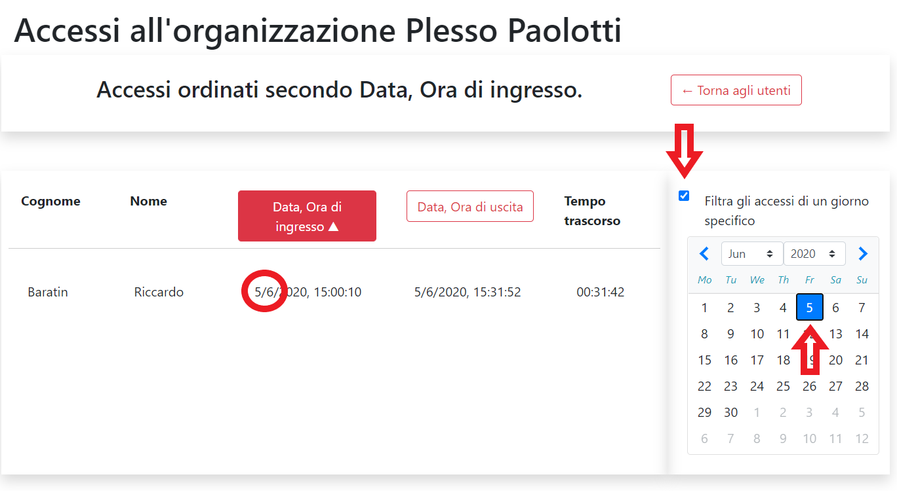
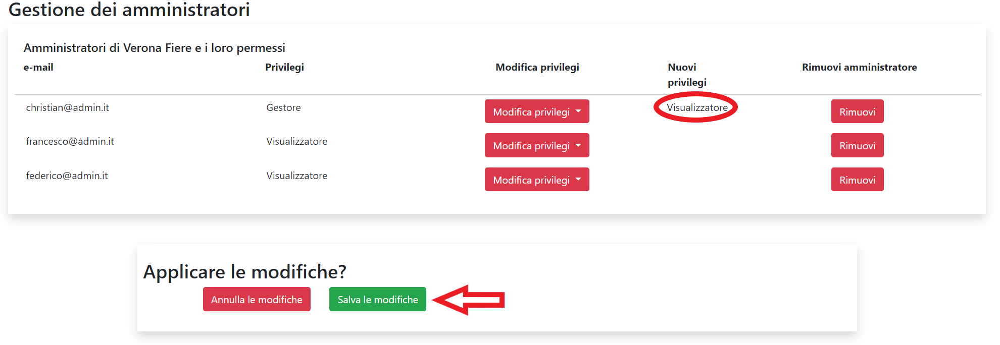

# 3.1 Funzionalità dell'applicazione web per amministratori

L'applicazione web viene utilizzata dagli amministratori che hanno la necessità di tracciare i movimenti di ingresso e uscita dalle organizzazioni e dai luoghi in esse.

All'amministratore, attraverso l'applicazione web, vengono offerte le funzionalità indicate in questa pagina.

## 3.1.1 Login

<figcaption align="center"> <em> Schermata di login </em> </figcaption>

L'amministratore può autenticarsi inserendo la propria e-mail e password. Per farlo deve inserire, nel primo campo di testo, la propria email e nel secondo campo di testo la corrispettiva password. Dopo di che, cliccare sul bottone *Login* per effettuare l'autenticazione. La procedura viene illustrata nel seguente video:

<iframe width="720" src="https://www.youtube.com/embed/jLTYT91HVJs" frameborder="0" style="height: 540px" allow="accelerometer; autoplay; encrypted-media; gyroscope; picture-in-picture" allowfullscreen></iframe>

## 3.1.2 Logout

<figcaption align="center"> <em> Schermata di logout </em> </figcaption>

L'amministratore, una volta effettuata l'autenticazione, può eseguire il logout da qualsiasi pagina della web-app. Sarà sufficiente cliccare sul pulsante in alto a destra denominato *Logout*. I passaggi vengono mostrati nel seguente video:

<iframe width="720" src="https://www.youtube.com/embed/ccjX0b9QQ0I" frameborder="0" style="height: 540px" allow="accelerometer; autoplay; encrypted-media; gyroscope; picture-in-picture" allowfullscreen></iframe>

## 3.1.3 Reset password

<figcaption align="center"> <em> Schermata di reset password </em> </figcaption>

L'amministratore può effettuare il reset della password qualora non se la ricordasse. Per eseguire tale operazione deve cliccare su *Password dimenticata* presente nella pagina di login.

<figcaption align="center"> <em> Schermata di reset password </em> </figcaption>

 Successivamente deve inserire l'email dell'account di cui vuole effettuare il reset della password. Gli verrà dunque inviata una e-mail con un link che porterà a una pagina dove sarà possibile inserire la nuova password, di almeno 8 caratteri. Per annullare la procedura basta cliccare sul pulsante *Back*. I passaggi appena descritti sono mostrati nel seguente video:

<iframe width="720" src="https://www.youtube.com/embed/8le7OiF9kmM" frameborder="0" style="height: 540px" allow="accelerometer; autoplay; encrypted-media; gyroscope; picture-in-picture" allowfullscreen></iframe>

## 3.1.4 Selezione dell'organizzazione

<figcaption align="center"> <em> Schermata di selezione </em> </figcaption>

L'amministratore, nell'home page, può selezionare l'organizzazione che desidera dal menù in alto a sinistra, accedendo alle svariate funzionalità che la web-app offre.

!!!info
    L'amministratore visualizzerà solo le organizzazioni a cui ha accesso.

<iframe width="720" src="https://www.youtube.com/embed/7O5l3fJ19FM" frameborder="0" style="height: 540px" allow="accelerometer; autoplay; encrypted-media; gyroscope; picture-in-picture" allowfullscreen></iframe> 

## 3.1.5 Informazioni sull'organizzazione

<figcaption align="center"> <em> Schermata delle informazioni sull'organizzazione </em> </figcaption> 

L'amministratore ha la possibilità di visionare le seguenti informazioni di una specifica organizzazione:

- Nome;
- Descrizione;
- Via;
- Numero civico;
- Codice postale;
- Città;
- Stato;
- Data di inserimento dell'organizzazione in Stalker;
- Data dell'ultima modifica.

Per poterlo fare, si deve cliccare nel menù laterale a sinistra la voce *Organizzazione* e poi sulla voce *Informazioni sull'organizzazione*. Verrà quindi aperta una finestra con una tabella avente le informazioni descritte in precedenza. Procedura illustrata nel seguente video:

<iframe width="720" src="https://www.youtube.com/embed/RAMu1o1U50o" frameborder="0" style="height: 540px" allow="accelerometer; autoplay; encrypted-media; gyroscope; picture-in-picture" allowfullscreen></iframe>

## 3.1.6 Ritorno alla home page

<figcaption align="center"> <em> Schermata della homepage </em> </figcaption> 

Se l'amministratore si dovesse trovare nella pagina di un'organizzazione e volesse ritornare all'home page deve cliccare sul nome dell'organizzazione nella barra principale in alto nella schermata. Il seguente video ne illustra la procedura:

<iframe width="720" src="https://www.youtube.com/embed/H730w4P49oQ" frameborder="0" style="height: 540px" allow="accelerometer; autoplay; encrypted-media; gyroscope; picture-in-picture" allowfullscreen></iframe>

## 3.1.7 Perimetro di tracciamento dell'organizzazione

<figcaption align="center"> <em> Schermata del perimetro di tracciamento </em> </figcaption> 

L'amministratore ha la possibilità di visionare il perimetro dell'organizzazione tramite una mappa. 

Per farlo si dovrà cliccare nel menù laterale a sinistra sulla voce *Organizzazione* e quindi cliccare sulla voce *Perimetro di tracciamento dell'organizzazione*. Verrà perciò aperta una finestra con una mappa geografica dove verrà mostrata la posizione dell'organizzazione e il suo perimetro di tracciamento. Il seguente video ne mostra la procedure:

<iframe width="720" src="https://www.youtube.com/embed/Q_nwWf6GkxI" frameborder="0" style="height: 540px" allow="accelerometer; autoplay; encrypted-media; gyroscope; picture-in-picture" allowfullscreen></iframe>

## 3.1.8 Perimetro di tracciamento del luogo di un'organizzazione

<figcaption align="center"> <em> Schermata del perimetro di tracciamento </em> </figcaption> 

L'amministratore ha la possibilità di visionare il perimetro del luogo di un'organizzazione tramite una mappa. 

Perciò si dovrà cliccare nel menù laterale a sinistra sulla voce *Organizzazione* e quindi cliccare sulla voce *Perimetro di tracciamento dell'organizzazione*. Dopo di che cliccare sul bottone *Passa alla visualizzazione per luogo* come indicato nell'immagine qui sopra. Verrà perciò aperta una finestra con una mappa geografica, dove verrà mostrata la posizione del primo luogo  dell'organizzazione e il suo perimetro di tracciamento. 

<figcaption align="center"> <em> Schermata del perimetro di tracciamento </em> </figcaption> 

E' possibile, come mostrato nell'immagine qui sopra selezionare un qualsiasi luogo dell'organizzazione selezionando il suo nome nel menù a tendina. Inoltre e possibile ritornare alla visualizzazione del perimetro di tracciamento dell'organizzazione cliccando sul bottone *Torna alla visualizzazione del perimetro dell'organizzazione* . Il seguente video ne mostra la procedure:

<iframe width="720" src="https://www.youtube.com/embed/Q_nwWf6GkxI" frameborder="0" style="height: 540px" allow="accelerometer; autoplay; encrypted-media; gyroscope; picture-in-picture" allowfullscreen></iframe>

## 3.1. Presenze utenti nell'organizzazione

<figcaption align="center"> <em> Schermata del tracciamento</em> </figcaption> 

L'amministratore ha la possibilità di monitorare le presenze degli utenti, in tempo reale, all'interno dell'organizzazione. Per farlo si dovrà cliccare nel menù laterale a sinistra sulla voce *Tracciamento* e dopo di che cliccare sulla voce *presenze attuali nell'organizzazione*. Verrà perciò aperta una finestra con un contatore di presenze. I passi sono mostrati nel seguente video.

<iframe width="720" src="https://www.youtube.com/embed/VuoW2Hc162I" frameborder="0" style="height: 540px" allow="accelerometer; autoplay; encrypted-media; gyroscope; picture-in-picture" allowfullscreen></iframe>

## 3.16. Ricerca accessi degli utenti autenticati

<figcaption align="center"> <em> Accedere agli accessi autenticati</em> </figcaption> 

<figcaption align="center"> <em> Login al server aziendale</em> </figcaption> 

L'amministratore, qualora non lo avesse già fatto, dovrà autenticarsi al server aziendale per accedere alla visualizzazione degli accessi da parte degli utenti autenticati. Sarà sufficiente inserire le credenziali nel form visualizzato e quindi cliccare sul pulsante **Login**. 

<figcaption align="center"> <em> Selezione degli utenti da visualizzare</em> </figcaption> 

L'amministratore potrà ora selezionare gli utenti da visualizzare cliccando sui rispettivi pulsanti **Visualizza accessi**. Una volta selezionati gli utenti desiderati potrà cliccare sul pulsante **Visualizza accessi degli utenti selezionati** per visualizzarne i rispettivi accessi.

<figcaption align="center"> <em> Passaggio alla visualizzazione degli accessi nei luoghi</em> </figcaption> 

Per passare alla visualizzazione degli accessi presso i luoghi sarà necessario premere il pulsante **Passa alla visualizzazione degli accessi ad un luogo** e poi selezionare il luogo desiderato dal menù a tendina a destra.

<figcaption align="center"> <em> Ordinamento per data degli accessi visualizzati</em> </figcaption> 

L'amministratore ha la possibilità di ordinare gli accessi visualizzati o per data di ingresso o per data di uscita, sia in ordine decrescente che decrescente, semplicemente cliccando sui pulsanti posi nella tabella degli accessi. Il pulsante rosso indicherà l'ordinamento attualmente attivo.

<figcaption align="center"> <em> Visualizzazione degli accessi effettuati in uno specifico giorno</em> </figcaption> 

L'amministratore ha inoltre la possibilità di filtrare gli accessi visualizzati secondo un giorno preciso attraverso il calendario posto a destra della tabella. Per filtrare gli accessi sarà sufficiente spuntare la casella affianco alla scritta *Filtra gli accessi di un giorno specifico* e selezionare quindi il giorno desiderato.

<figcaption align="center"> <em> Ritorno agli utenti</em> </figcaption> 

Per tornare alla selezione degli utenti di cui visualizzare gli accessi sarà sufficiente cliccare il pulsante **Torna agli utenti** situato in alto sopra il calendario.

## 3.17. Visualizzazione dei report tabellari

<figcaption align="center"> <em> Accedere agli accessi autenticati</em> </figcaption> 

<figcaption align="center"> <em> Login al server aziendale</em> </figcaption> 

L'amministratore, qualora non lo avesse già fatto, dovrà autenticarsi al server aziendale per accedere alla visualizzazione dei report tabellari. Sarà sufficiente inserire le credenziali nel form visualizzato e quindi cliccare sul pulsante **Login**.

<figcaption align="center"> <em> Passaggio alla visualizzazione dei report per luogo</em> </figcaption> 

Per passare alla visualizzazione dei report per singolo luogo sarà sufficiente cliccare sul pulsante **Passa alla visualizzazione del report per luogo**. Per tornare ai report generali sarà sufficiente ripremere lo stesso pulstante. 

## 3.18. Creazione di un nuovo amministratore

<figcaption align="center"> <em> Accesso alla sezione di creazione di un nuovo amministratore</em> </figcaption> 

<figcaption align="center"> <em> Login al server aziendale</em> </figcaption> 

Qualora l'organizzazione fosse a tracciamento autenticato e l'amministratore non avesse ancora fatto il login, allora sarà necessario effettuarlo per poter accedere alla creazione di un amministratore. Sarà sufficiente inserire le credenziali nel form visualizzato e quindi cliccare sul pulsante **Login**.

<figcaption align="center"> <em> Creazione di un nuovo amministratore</em> </figcaption>

Per creare un nuovo amministratore sarà necessario compilare tutti i campi presenti nel riquadro rosso. Il campo nel riquadro blu è opzionale ed è presente solo nelle organizzazioni a tracciamento autenticato.
Una volta compilati i campi sarà sufficiente cliccare sul pulsante indicato dalla freccia rossa in figura per creare l'amministratore.

!!!attention
    L'email inserita non deve essere già registrata presso il sistema.

## 3.19. Associazione di un amministratore

<figcaption align="center"> <em> Accesso alla sezione di associazione di un amministratore</em> </figcaption> 

<figcaption align="center"> <em> Login al server aziendale</em> </figcaption> 

Qualora l'organizzazione fosse a tracciamento autenticato e l'amministratore non avesse ancora fatto il login, allora sarà necessario effettuarlo per poter accedere alla sezione di associazione di un amministratore. Sarà sufficiente inserire le credenziali nel form visualizzato e quindi cliccare sul pulsante **Login**.

<figcaption align="center"> <em> Associazione di un amministratore</em> </figcaption>

Per associare un amministratore sarà necessario compilare tutti i campi presenti nel riquadro rosso. Il campo nel riquadro blu è opzionale ed è presente solo nelle organizzazioni a tracciamento autenticato.
Una volta compilati i campi sarà sufficiente cliccare sul pulsante indicato dalla freccia rossa in figura per associare l'amministratore.

!!!attention
    L'email inserita deve essere già registrata presso il sistema e l'amministratore identificato da quell'email non deve essere già associato all'organizzazione in questione.

## 3.19. Gestione degli amministratori

<figcaption align="center"> <em> Accesso alla sezione di gestione degli amministratori</em> </figcaption> 

<figcaption align="center"> <em> Login al server aziendale</em> </figcaption> 

Qualora l'organizzazione fosse a tracciamento autenticato e l'amministratore non avesse ancora fatto il login, allora sarà necessario effettuarlo per poter accedere alla sezione di gestione degli amministratori. Sarà sufficiente inserire le credenziali nel form visualizzato e quindi cliccare sul pulsante **Login**.

## 3.19.1. Modifica dei privilegi di un amministratore

<figcaption align="center"> <em> Scelta dei nuovi privilegi di un amministratore</em> </figcaption>

Cliccare sul menù a tendina delL'amministratore desiderato, cliccare quindi sul nuovo privilegio da assegnare all'amministratore. Dopo aver fatto ciò la situazione sarà quella rappresentata nella figura seguente:

<figcaption align="center"> <em> Conferma delle modifiche</em> </figcaption>

Ora sarà possibile confermare le modifiche scelte cliccando sul pulsante verde indicato dalla freccia rossa nell'immagine precedente. Qualora le modifiche venissero salvate i nuovi privilegi dell'amministratore in questione saranno quelli identificati nel cerchio rosso.

## 3.19.2. Rimozione di un amministratore

<figcaption align="center"> <em> Rimozione di un amministratore</em> </figcaption>

Per eliminare un amministratore sarà sufficiente cliccare il pulsante **Rimuovi** posizionato sulla relativa riga. L'immagine precedente indica, con la freccia rossa, il pussante per rimuovere l'admin con email *christian@admin.it*. Una volta cliccato il pulsante **Rimuovi** verrà richiesta una conferma di rimozione. Accettando la conferma si rimuoverà definitivamente l'amministratore dall'organizzazione.
