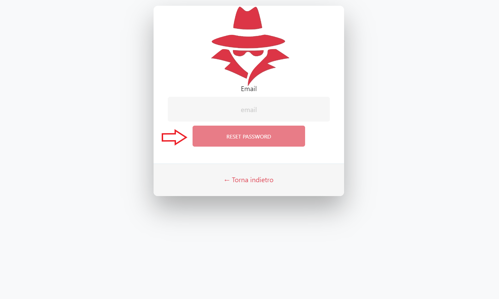

# 3.1 Funzionalità dell'applicazione web per amministratori

L'applicazione web viene utilizzata dagli amministratori che hanno la necessità di tracciare i movimenti di ingresso e uscita dalle organizzazioni e dai luoghi in esse.

All'amministratore, attraverso l'applicazione web, vengono offerte le funzionalità indicate in questa pagina.

## 3.1.1 Login

<figcaption align="center"> <em> Schermata di login </em> </figcaption>

L'amministratore può autenticarsi inserendo la propria e-mail e password. Per farlo deve inserire, nel primo campo di testo, la propria email e nel secondo campo di testo la corrispettiva password. Dopo di che, cliccare sul bottone *Login* per effettuare l'autenticazione. La procedura viene illustrata nel seguente video:

<iframe width="720" src="https://www.youtube.com/embed/jLTYT91HVJs" frameborder="0" style="height: 540px" allow="accelerometer; autoplay; encrypted-media; gyroscope; picture-in-picture" allowfullscreen></iframe>

## 3.1.2 Logout

<figcaption align="center"> <em> Schermata di logout </em> </figcaption>

L'amministratore, una volta effettuata l'autenticazione, può eseguire il logout da qualsiasi pagina della web-app. Sarà sufficiente cliccare sul pulsante in alto a destra denominato *Logout*. I passaggi vengono mostrati nel seguente video:

<iframe width="720" src="https://www.youtube.com/embed/ccjX0b9QQ0I" frameborder="0" style="height: 540px" allow="accelerometer; autoplay; encrypted-media; gyroscope; picture-in-picture" allowfullscreen></iframe>

## 3.1.3 Reset password

<figcaption align="center"> <em> Schermata di reset password </em> </figcaption>

L'amministratore può effettuare il reset della password qualora non se la ricordasse. Per eseguire tale operazione deve cliccare su *Password dimenticata* presente nella pagina di login.

<figcaption align="center"> <em> Schermata di reset password </em> </figcaption>

 Successivamente deve inserire l'email dell'account di cui vuole effettuare il reset della password. Gli verrà dunque inviata una e-mail con un link che porterà a una pagina dove sarà possibile inserire la nuova password, di almeno 8 caratteri. Per annullare la procedura basta cliccare sul pulsante *Back*. I passaggi appena descritti sono mostrati nel seguente video:

<iframe width="720" src="https://www.youtube.com/embed/8le7OiF9kmM" frameborder="0" style="height: 540px" allow="accelerometer; autoplay; encrypted-media; gyroscope; picture-in-picture" allowfullscreen></iframe>

## 3.1.4 Selezione dell'organizzazione

<figcaption align="center"> <em> Schermata di selezione </em> </figcaption>

L'amministratore, nell'home page, può selezionare l'organizzazione che desidera dal menù in alto a sinistra, accedendo alle svariate funzionalità che la web-app offre.

!!!info
    L'amministratore visualizzerà solo le organizzazioni a cui ha accesso.

<iframe width="720" src="https://www.youtube.com/embed/7O5l3fJ19FM" frameborder="0" style="height: 540px" allow="accelerometer; autoplay; encrypted-media; gyroscope; picture-in-picture" allowfullscreen></iframe> 

## 3.1.5 Informazioni sull'organizzazione

<figcaption align="center"> <em> Schermata delle informazioni sull'organizzazione </em> </figcaption> 

L'amministratore ha la possibilità di visionare le seguenti informazioni di una specifica organizzazione:

- Nome;
- Descrizione;
- Via;
- Numero civico;
- Codice postale;
- Città;
- Stato;
- Data di inserimento dell'organizzazione in Stalker;
- Data dell'ultima modifica.

Per poterlo fare, si deve cliccare nel menù laterale a sinistra la voce *Organizzazione* e poi sulla voce *Informazioni sull'organizzazione*. Verrà quindi aperta una finestra con una tabella avente le informazioni descritte in precedenza. Procedura illustrata nel seguente video:

<iframe width="720" src="https://www.youtube.com/embed/RAMu1o1U50o" frameborder="0" style="height: 540px" allow="accelerometer; autoplay; encrypted-media; gyroscope; picture-in-picture" allowfullscreen></iframe>

## 3.1.6 Ritorno alla home page

<figcaption align="center"> <em> Schermata della homepage </em> </figcaption> 

Se l'amministratore si dovesse trovare nella pagina di un'organizzazione e volesse ritornare all'home page deve cliccare sul nome dell'organizzazione nella barra principale in alto nella schermata. Il seguente video ne illustra la procedura:

<iframe width="720" src="https://www.youtube.com/embed/H730w4P49oQ" frameborder="0" style="height: 540px" allow="accelerometer; autoplay; encrypted-media; gyroscope; picture-in-picture" allowfullscreen></iframe>

## 3.1.7 Perimetro di tracciamento dell'organizzazione

<figcaption align="center"> <em> Schermata del perimetro di tracciamento </em> </figcaption> 

L'amministratore ha la possibilità di visionare il perimetro dell'organizzazione tramite una mappa. 

Per farlo si dovrà cliccare nel menù laterale a sinistra sulla voce *Organizzazione* e quindi cliccare sulla voce *Perimetro di tracciamento dell'organizzazione*. Verrà perciò aperta una finestra con una mappa geografica dove verrà mostrata la posizione dell'organizzazione e il suo perimetro di tracciamento. Il seguente video ne mostra la procedure:

<iframe width="720" src="https://www.youtube.com/embed/Q_nwWf6GkxI" frameborder="0" style="height: 540px" allow="accelerometer; autoplay; encrypted-media; gyroscope; picture-in-picture" allowfullscreen></iframe>

## 3.1.8 Perimetro di tracciamento del luogo di un'organizzazione

<figcaption align="center"> <em> Schermata del perimetro di tracciamento </em> </figcaption> 

L'amministratore ha la possibilità di visionare il perimetro del luogo di un'organizzazione tramite una mappa. 

Perciò si dovrà cliccare nel menù laterale a sinistra sulla voce *Organizzazione* e quindi cliccare sulla voce *Perimetro di tracciamento dell'organizzazione*. Dopo di che cliccare sul bottone *Passa alla visualizzazione per luogo* come indicato nell'immagine qui sopra. Verrà perciò aperta una finestra con una mappa geografica, dove verrà mostrata la posizione del primo luogo  dell'organizzazione e il suo perimetro di tracciamento. 

<figcaption align="center"> <em> Schermata del perimetro di tracciamento </em> </figcaption> 

E' possibile, come mostrato nell'immagine qui sopra selezionare un qualsiasi luogo dell'organizzazione selezionando il suo nome nel menù a tendina. Inoltre e possibile ritornare alla visualizzazione del perimetro di tracciamento dell'organizzazione cliccando sul bottone *Torna alla visualizzazione del perimetro dell'organizzazione* . Il seguente video ne mostra la procedure:

<iframe width="720" src="https://www.youtube.com/embed/Q_nwWf6GkxI" frameborder="0" style="height: 540px" allow="accelerometer; autoplay; encrypted-media; gyroscope; picture-in-picture" allowfullscreen></iframe>

## 3.1. Presenze utenti nell'organizzazione

<figcaption align="center"> <em> Schermata del tracciamento</em> </figcaption> 

L'amministratore ha la possibilità di monitorare le presenze degli utenti, in tempo reale, all'interno dell'organizzazione. Per farlo si dovrà cliccare nel menù laterale a sinistra sulla voce *Tracciamento* e dopo di che cliccare sulla voce *presenze attuali nell'organizzazione*. Verrà perciò aperta una finestra con un contatore di presenze. I passi sono mostrati nel seguente video.

<iframe width="720" src="https://www.youtube.com/embed/VuoW2Hc162I" frameborder="0" style="height: 540px" allow="accelerometer; autoplay; encrypted-media; gyroscope; picture-in-picture" allowfullscreen></iframe>

